# Fase 1 - Instal·lació del sistema operatiu

## Pas 1 - Crear màquina virtual amb VirtualBox

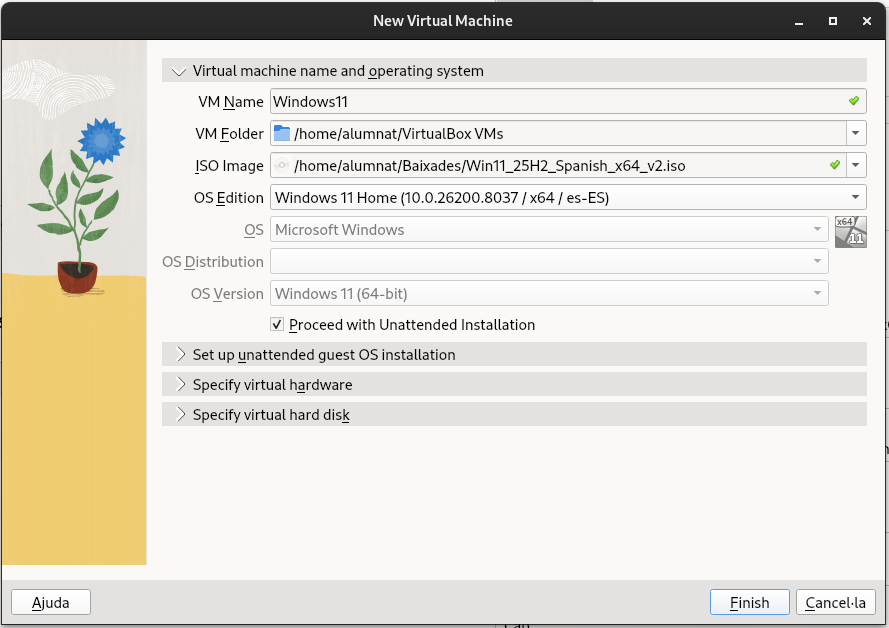

## Pas 2 - Assignar recursos (RAM mínima 4 GB, disc mínim 40 GB)

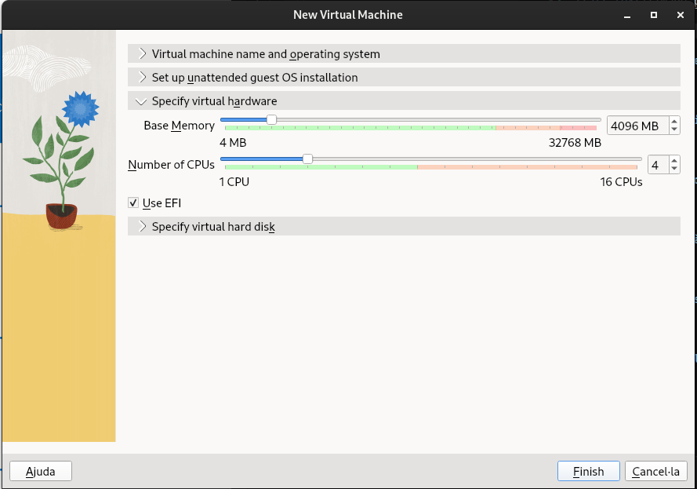

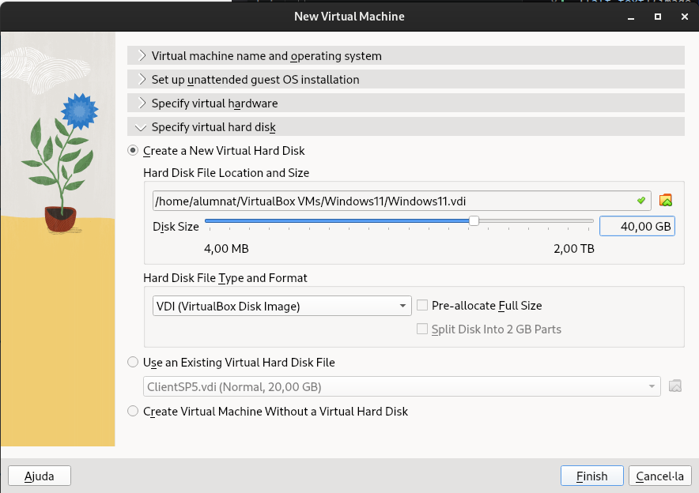

## Pas 3 - Carregar la ISO de Windows 11

## Pas 4 - Instal·lar el sistema (idioma, usuari, contrasenya)

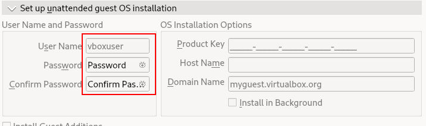

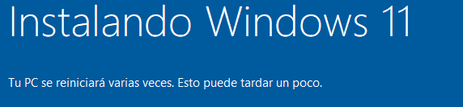

## Pas 5 - Comprovar que arrenca correctament

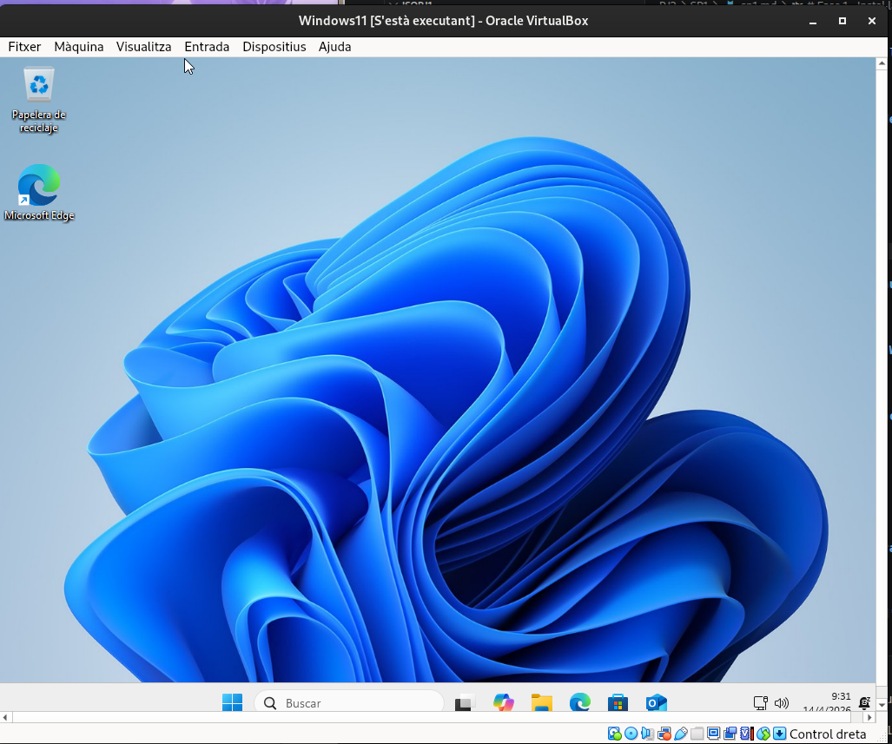

# Fase 2 - Punts de restauració

## Pas 6 – Cercar “Crear un punt de restauració”

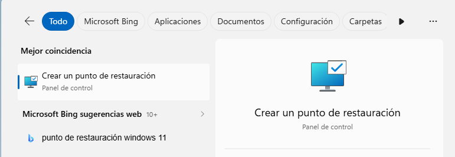

## Pas 7 - Activar la protecció del sistema al disc C:

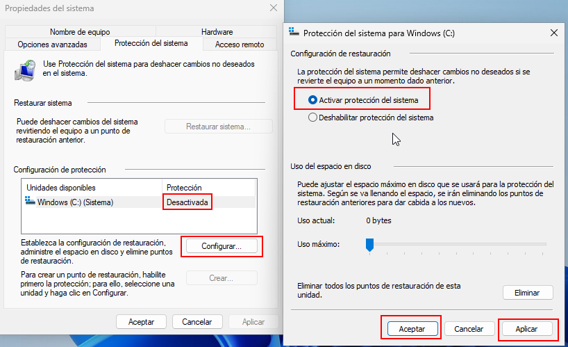

## Pas 8 - Crear un punt manual

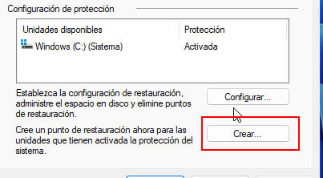

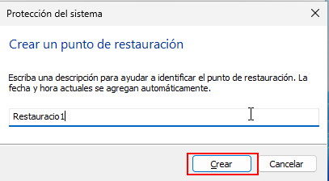

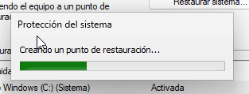

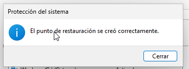

## Pas 9 - Fer un canvi (instal·lar app o configuració)

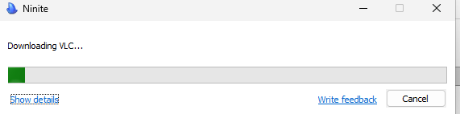

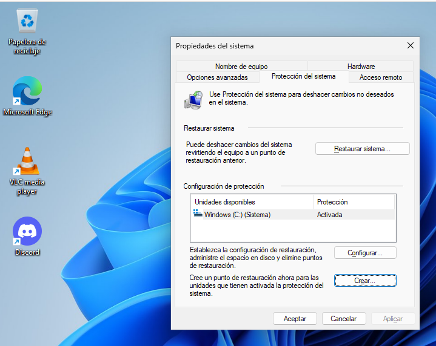

## Pas 10 - Restaurar i comprovar

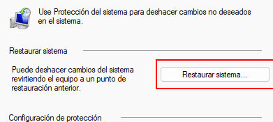

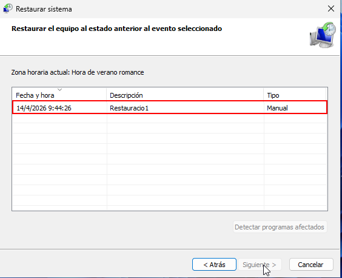

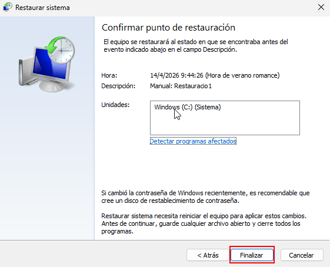

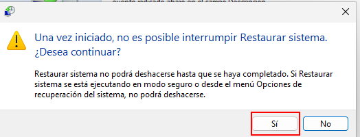

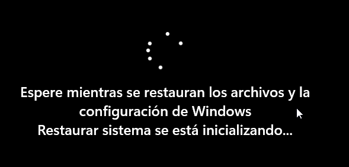

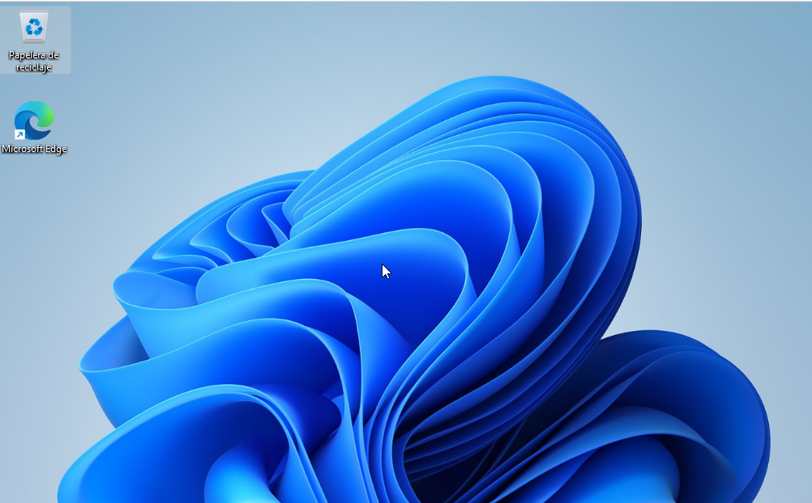

# Fase 3 - Llicències de Windows

## Pas 11 - Obrir Configuració → Sistema → Activació

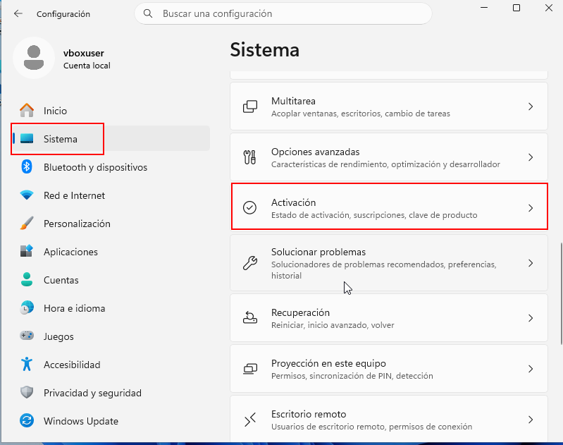

## Pas 12 - Veure si Windows està activat

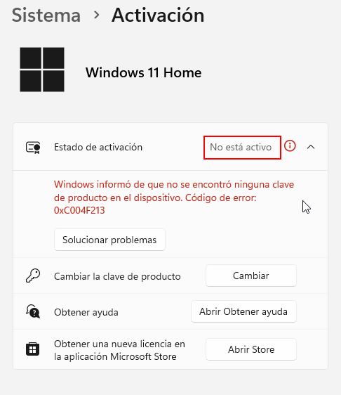

## Pas 13 - Executar al cmd: slmgr /xpr

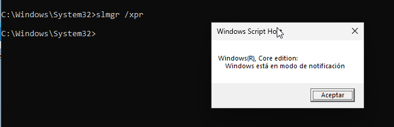

## Pas 14 - Esbrinar llicenciament Windows i explicar breument

| Tipus de Llicència | Descripció |
| :--- | :--- |
| **Retail (FPP)** | Llicència comercial comprada per separat. Pertany a l'usuari i no a la màquina. |
| **OEM** | Preinstal·lada en equips nous. Queda vinculada permanentment a la placa base d'aquell PC. |
| **Volum** | Orientada a empreses i institucions. Permet activar múltiples ordinadors simultàniament. |
| **Digital** | Llicència vinculada al maquinari i al compte de Microsoft, substituint la clau tradicional. |
| **Subscripció** | Pagament mensual o anual per usuari (ex. *Windows 365*), utilitzada principalment al núvol. |

## Pas 15 - Concultar preu aproximat d'una llicència Windows (web oficial o botigues)

| Edició de Windows | Microsoft Store (Oficial / Retail) | Botigues de tercers (Claus OEM / Mercat gris)* |
| :--- | :--- | :--- |
| **Windows 11 Home** | ~ 145 € | 10 € - 20 € |
| **Windows 11 Pro** | ~ 259 € | 15 € - 30 € |

*> *Nota important:** Les claus de 10-30€ que es venen per internet solen ser llicències OEM (excedents d'empreses o equips antics). Són legals a la Unió Europea a causa de la normativa de revenda de programari, però quedaran vinculades a la teva placa base per sempre i no inclouen suport tècnic directe de Microsoft.

# Fase 4 - Gestor d'arrencada

## Pas 16 - Obrir Command Prompt com administrador

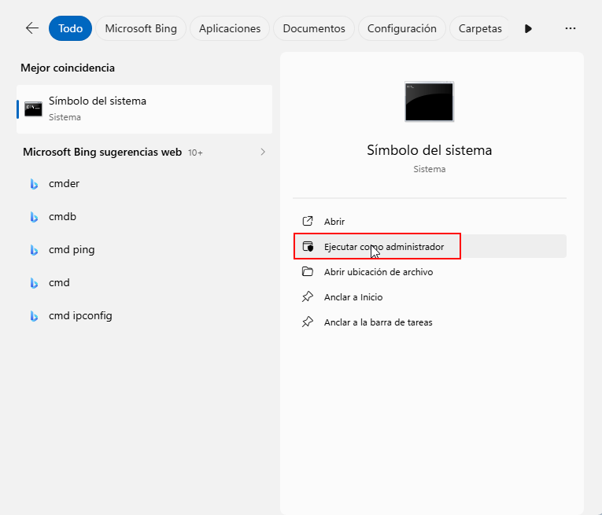

## Pas 17 - Executar bcdedit

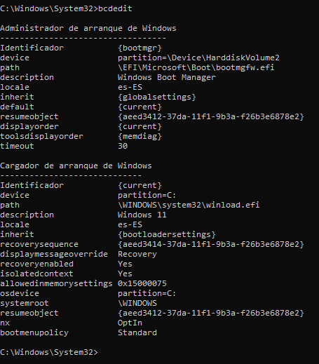

## Pas 18 - Identificar els blocs

### Administrador de arranque de Windows (Boot Manager)

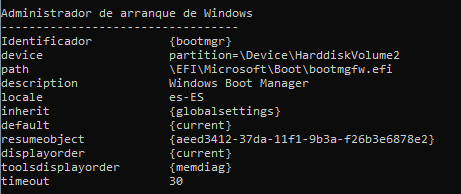

### Cargador de arranque de Windows (Boot Loader)

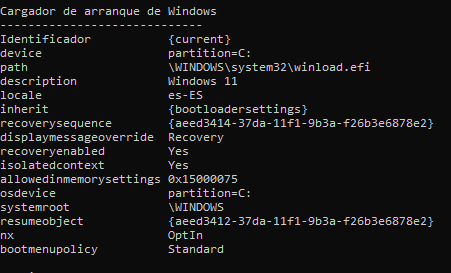

## Pas 19 - Interpretar dades concretes

### Boot Manager

* **`default`**: `{current}` -> Aquest és el sistema que arrenca per defecte.
* **`timeout`**: `30` -> Aquest és el temps d'espera (en segons) abans d'arrencar automàticament.

### Boot Loader

* **`device`**: `partition=C:` -> És la partició on està instal·lat Windows.
* **`path`**: `\WINDOWS\system32\winload.efi` -> És el fitxer que carrega el sistema.
* **`description`**: `Windows 11` -> És el nom del sistema operatiu.

## Pas 20 - Respostes a les preguntes curtes

* **Quin sistema s'està arrencant?**
  S'està arrencant **Windows 11** (es veu al paràmetre `description` del Cargador d'arrencada).

* **A quin disc o partició està instal·lat?**
  Està instal·lat a la **partició C:** (es veu al paràmetre `device` del Cargador d'arrencada).

* **Quant temps espera abans d'arrencar?**
  Espera **30 segons** (es veu al paràmetre `timeout` de l'Administrador d'arrencada).

* **Quin fitxer inicia Windows?**
  L'inicia el fitxer **`\WINDOWS\system32\winload.efi`** (es veu al paràmetre `path` del Cargador d'arrencada).

## Pas 21 - Interpretació final

* **Qui decideix l'arrencada (Boot Manager):** És el gestor principal que llegeix la configuració inicial i decideix quin sistema operatiu s'ha d'executar, basant-se en l'opció per defecte i el temps d'espera.

* **Qui carrega el sistema (Boot Loader):** És el programa específic (com `winload.efi`) que rep l'ordre del Boot Manager i s'encarrega de carregar físicament el nucli de Windows des del disc dur a la memòria RAM per iniciar-lo.

# Fase 5 - Xarxa bàsica

## Pas 22 - Obrir configuració de xarxa

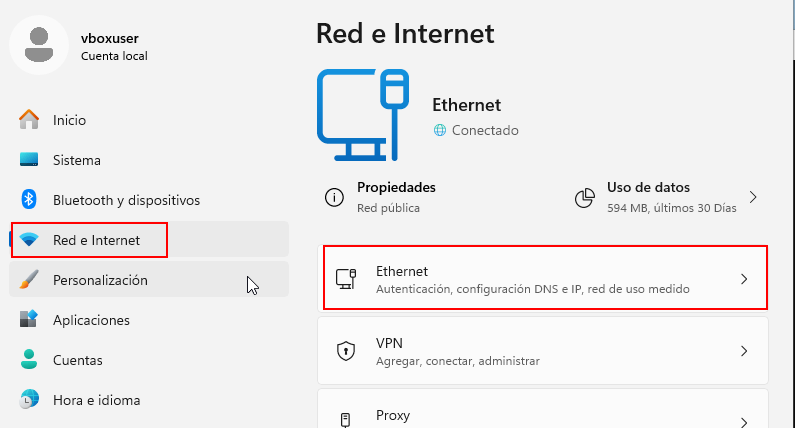

## Pas 23 - Consultar IP amb: ipconfig

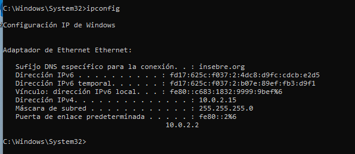

## Pas 24 - Configurar IP dinàmica (DHCP automàtic)

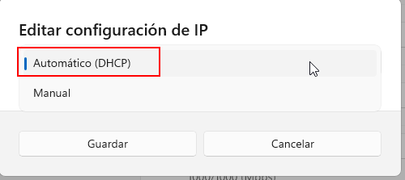

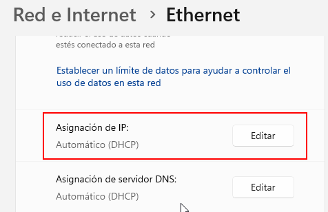

## Pas 25 - Configurar IP fixa (manual: IP, màscara, gateway, DNS)

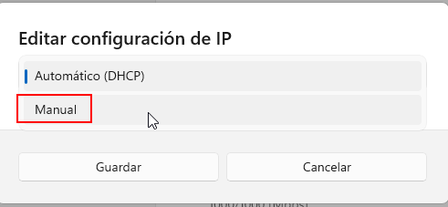

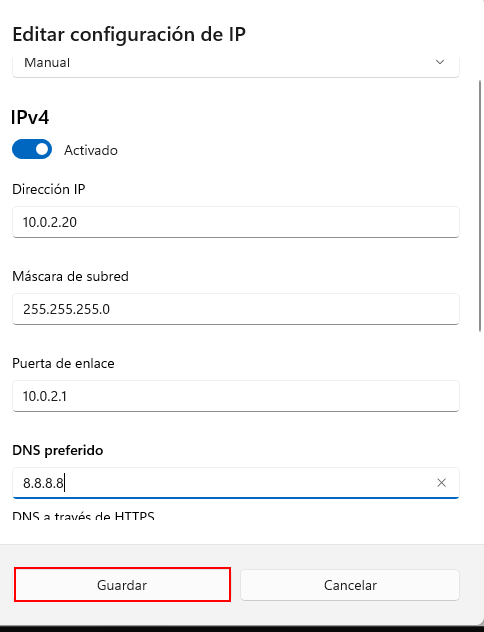

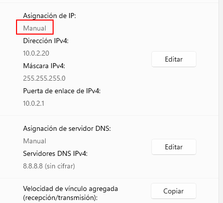

## Pas 26 - Comprovar connexió amb: ping google.com

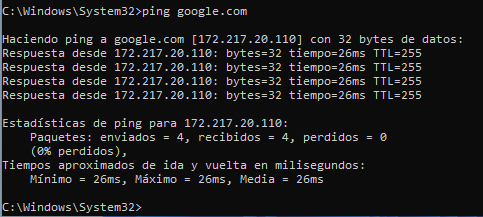

# Fase 6 - Comandes generals

## Pas 27 - Obrir PowerShell

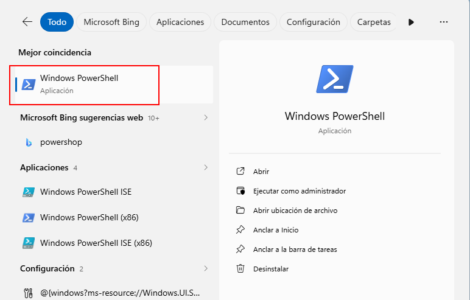

## Pas 28 - Diferenciar cmd i PowerShell

### Detalls de l'arrencada
* **BCD (Boot Configuration Data):** És l'arxiu d'on el Boot Manager llegeix la configuració d'arrencada (el substitut modern de l'antic `boot.ini`).
* **Kernel:** El Boot Loader (`winload.efi`) és qui agafa el nucli de Windows (`ntoskrnl.exe`) i els controladors bàsics i els carrega a la memòria RAM.

### Diferències clau: cmd vs. PowerShell
| Característica | cmd (Símbol del sistema) | Windows PowerShell |
| :--- | :--- | :--- |
| **Dades** | Treballa amb **text pla**. | Treballa amb **objectes** (.NET). |
| **Comandes** | Bàsiques i heretades de DOS (`dir`, `ping`). | Utilitza **Cmdlets** amb format *Verb-Nom* (`Get-Process`). |
| **Ús principal**| Comprovacions ràpides de xarxa o sistema. | Automatització de tasques i scripts per a administradors. |

## Pas 29 - Comandes bàsiques (provar-les)

### dir → veure fitxers

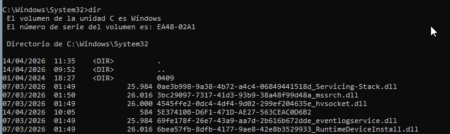

### cd → moure's per carpetes

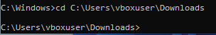

### mkdir prova → crear carpeta

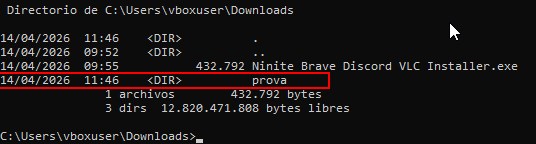

### echo hola > fitxer.txt → crear fitxer

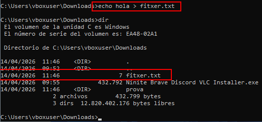

### del fitxer.txt → eliminar fitxer

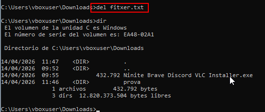

## Pas 30 - Comandes útils del sistema

### tasklist → veure processos actius

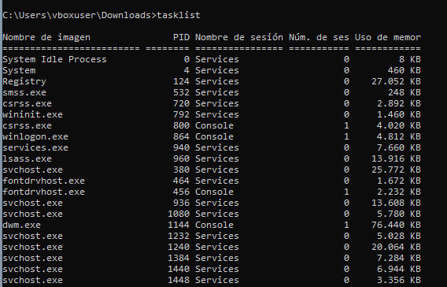

### taskkill /IM notepad.exe /F → tancar un procés

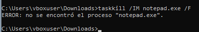

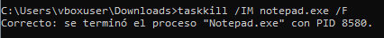

### systeminfo → informació completa del sistema

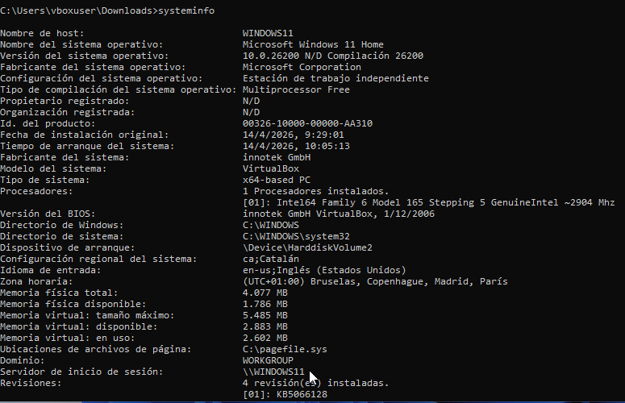

### hostname → nom de l'equip

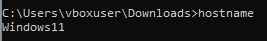

### whoami → usuari actual

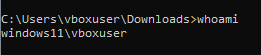

## Pas 31 - Comandes de xarxa

### ipconfig → veure configuració IP

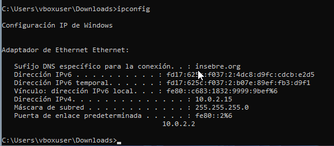

### ping google.com → comprovar connexió

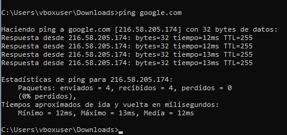

### netstat -an → connexions obertes

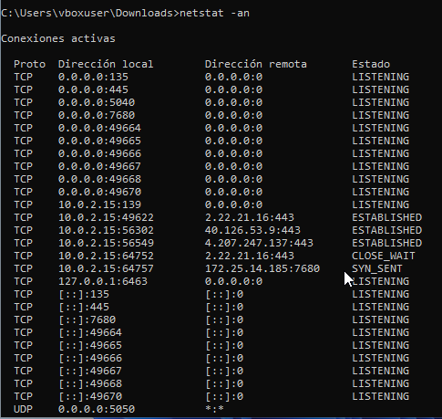

## Pas 32 - Comandes interessants (una mica més avançades)

### tree → veure estructura de carpetes

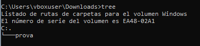

### cls → netejar pantalla

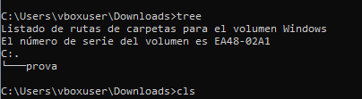

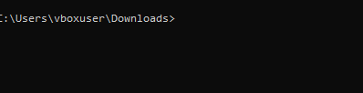

### help → veure ajuda

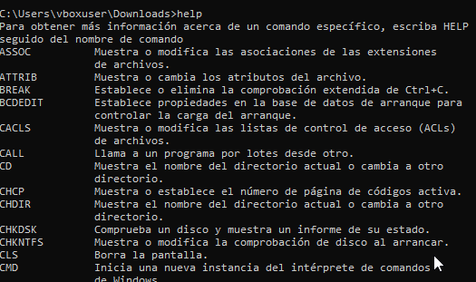

### shutdown /s /t 0 → apagar l'equip

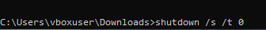

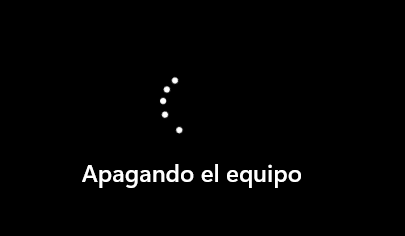

## Pas 33 - Mini interpretació

### tasklist

* **`tasklist`**: Mostra una llista de tots els processos i programes que s'estan executant actualment al sistema.

### ipconfig

* **`ipconfig`**: Mostra la configuració bàsica de xarxa de l'equip (adreça IP, màscara de subxarxa, porta d'enllaç, etc.).

### systeminfo

* **`systeminfo`**: Mostra informació detallada del maquinari i del sistema operatiu (versió de Windows, memòria RAM, processador, temps d'activitat, etc.).

# Fase 7 - Instal·lació d'aplicacions

## Pas 34 - Descarregar un programa des del navegador (ex: Chrome o VS Code)

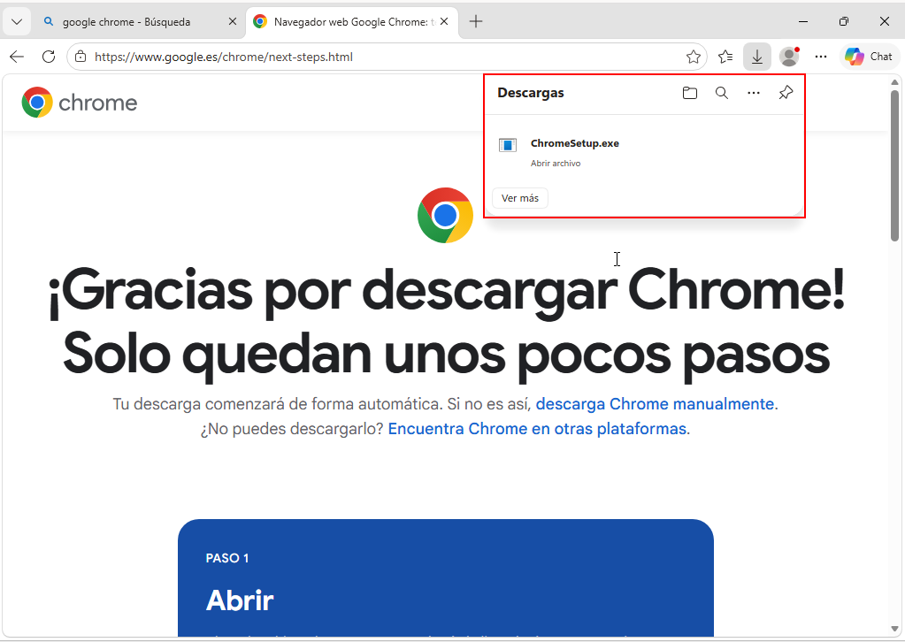

## Pas 35 - Instal·lar-lo seguint l'assistent

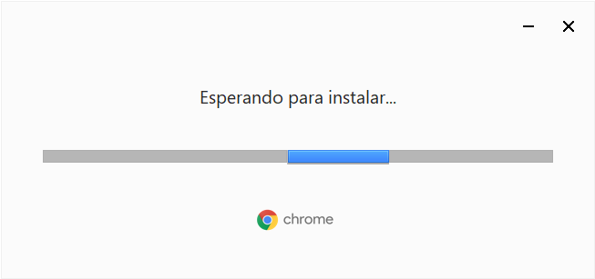

## Pas 36 - Obrir-lo i comprovar que funciona

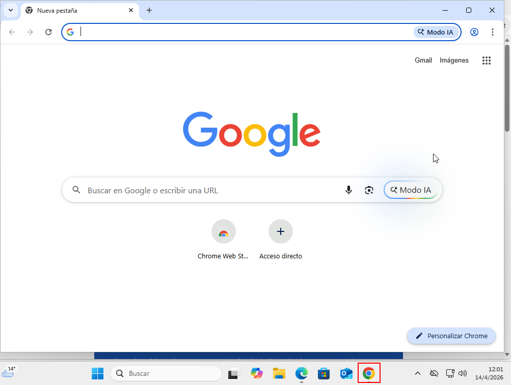

## Pas 37 - Instal·lar una aplicació des de Microsoft Store

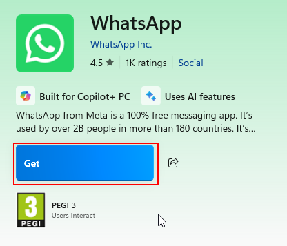

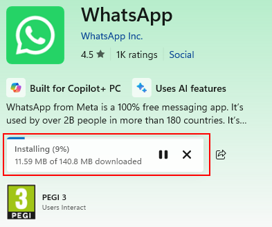

## Pas 38 - Obrir-la i comprovar funcionament

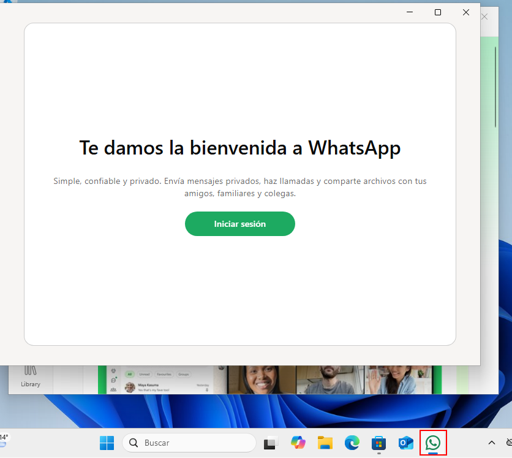

## Pas 39 - Desinstal·lar una aplicació: Configuració → Aplicacions → Desinstal·lar

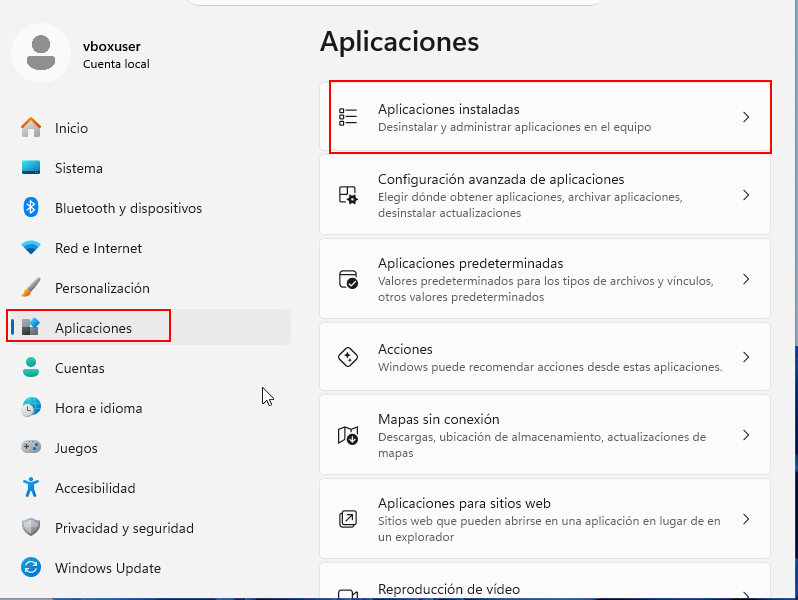

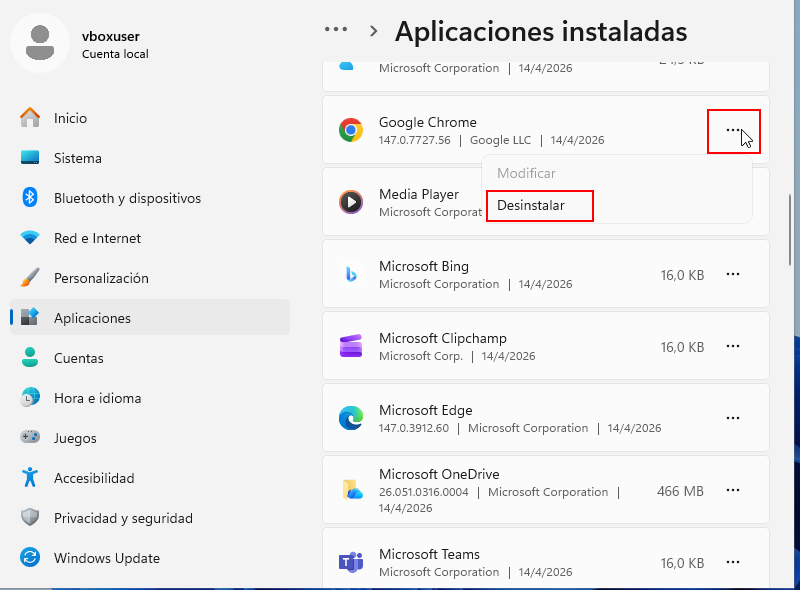

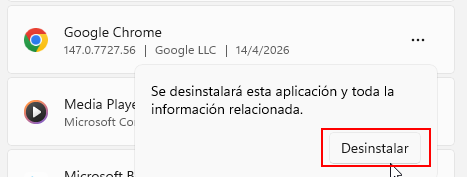

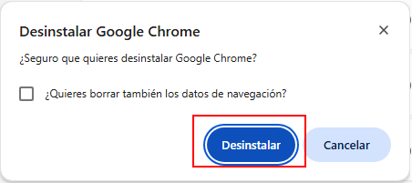

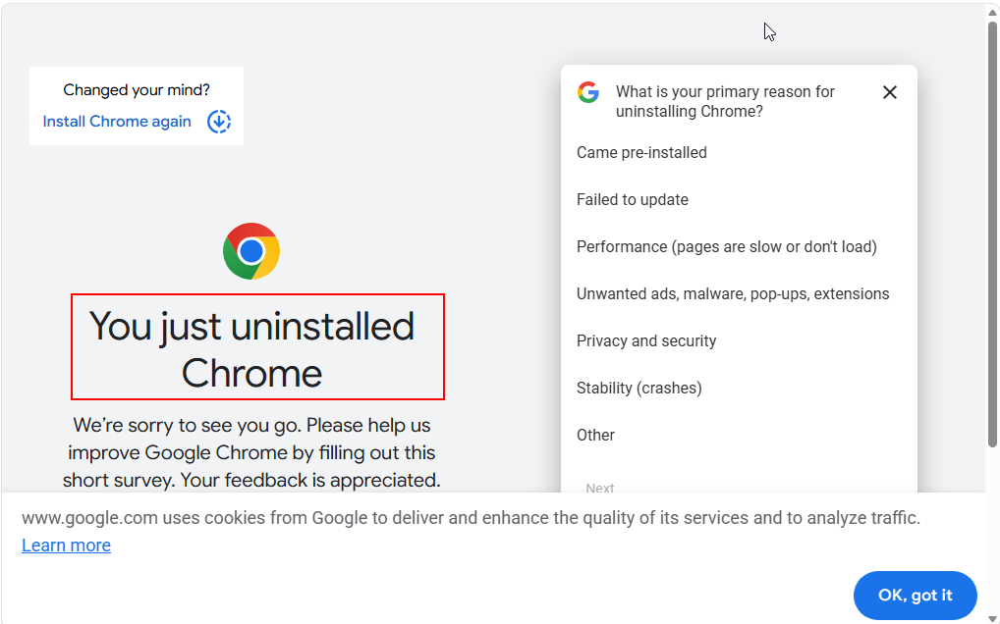

## Pas 40 - Verificació: Comprovar que el programa ja no apareix al sistema

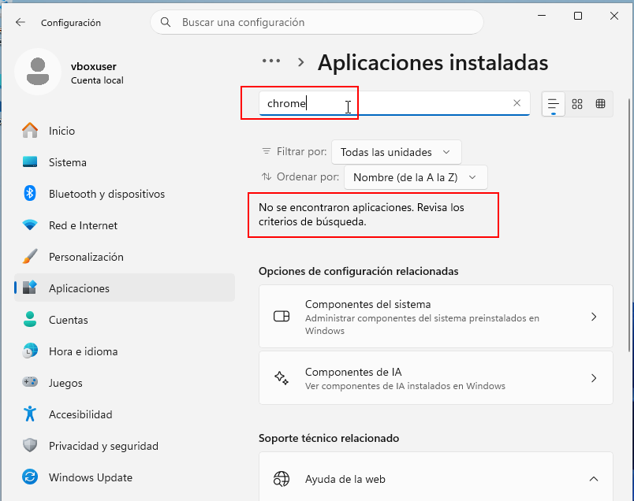

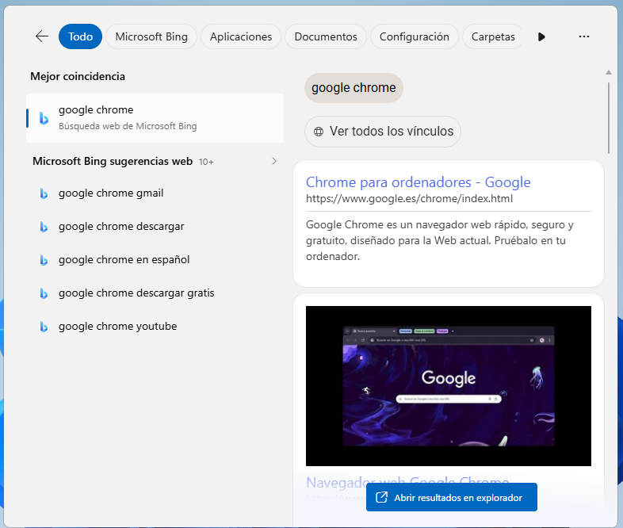
