# Fase 1 – Preparació del sistema

## Pas 1. Afegir un nou disc virtual a la màquina virtual

Des de la configuració de VirtualBox, s'afegeix un segon disc dur virtual (VDI) a la màquina. Es tria la mida adequada i es deixa com a dinàmic.

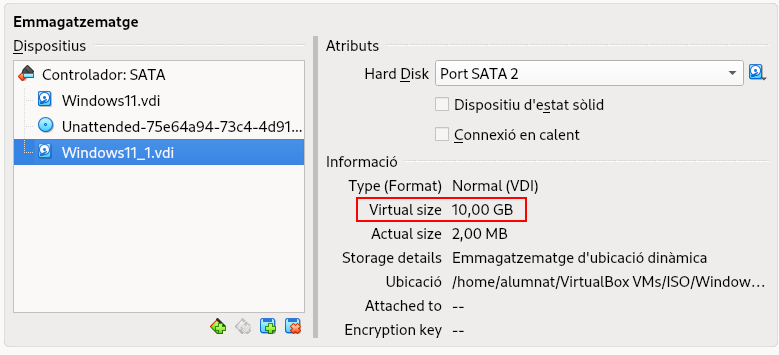

## Pas 2. Iniciar Windows i obrir Gestió de discs

S'arrenca Windows i s'obre `diskmgmt.msc` (Gestió de discs) des de la barra de cerca o amb Win+X. El nou disc apareix com a "No inicialitzat".

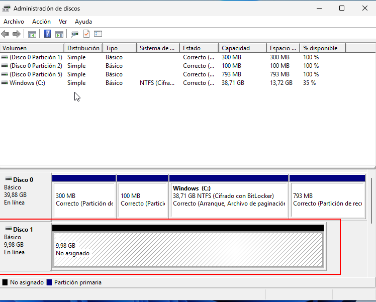

## Pas 3. Inicialitzar el disc, crear dues particions: una anomenada Dades i una en FAT32 anomenada Portable

Es fa clic dret sobre el disc no inicialitzat → Inicialitzar disc (GPT). Després es creen dues particions:
- **Dades**: partició NTFS (necessària per suportar quotes i ACLs).
- **Portable**: partició FAT32 (compatible amb múltiples sistemes operatius).

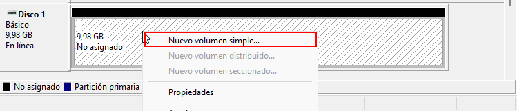

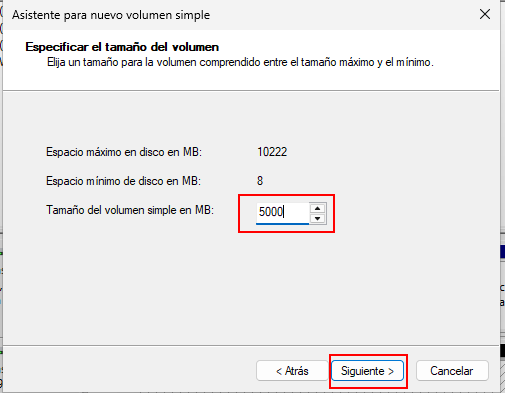

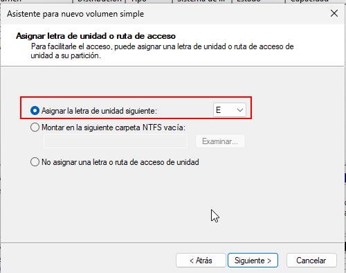

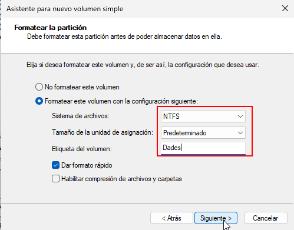

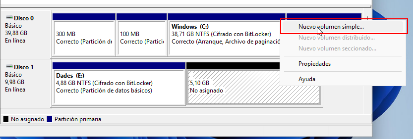

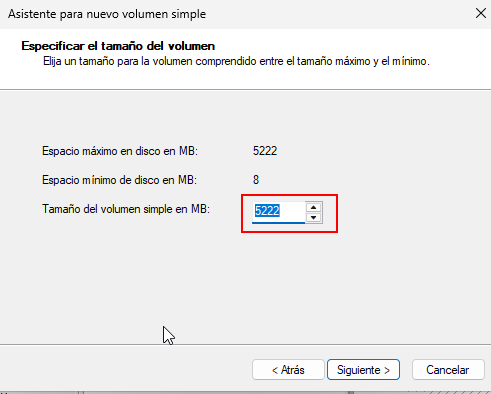

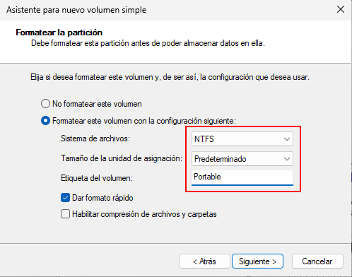

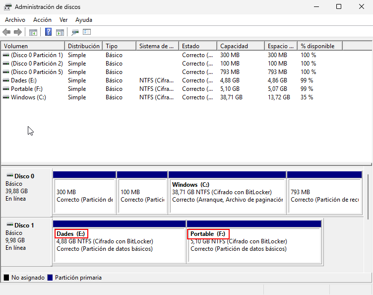

## Pas 4. Assignar lletres i comprovar amb diskpart la configuració

S'assignen lletres d'unitat (p. ex. D: per Dades, E: per Portable). Es verifica la configuració obrint `cmd` com a administrador i executant `diskpart` → `list volume` per confirmar volums, lletres i sistemes de fitxers.

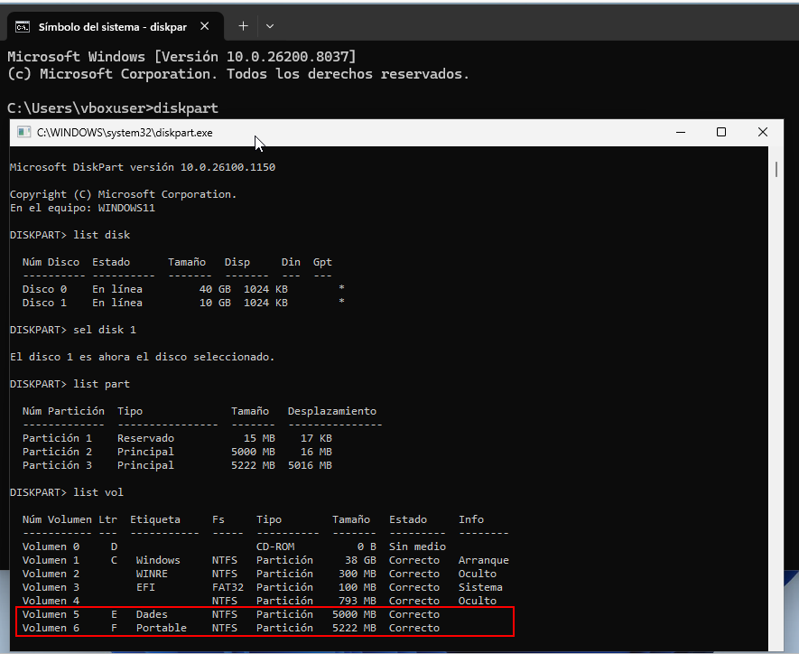

# Fase 2 – Quotes i usuaris

## Pas 5. Activar quotes de disc a la partició Dades (NTFS)

Propietats de la unitat D: → pestanya Quota → "Activar l'administració de quotes". Es marca la casella per denegar espai als usuaris que superin el límit.

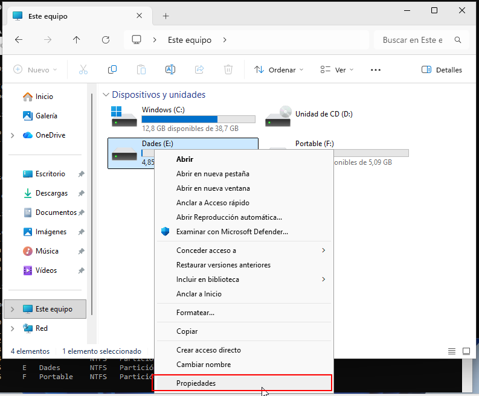

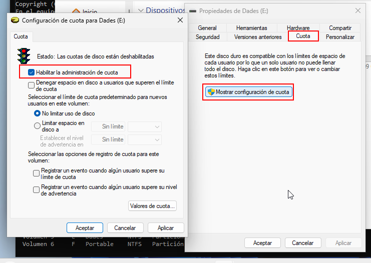

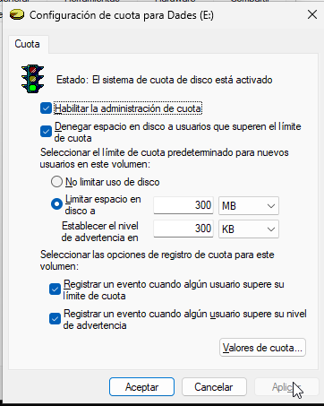

## Pas 6. Establir límit de 300 MB per usuari, amb notificació d'advertència

Dins la mateixa pestanya de quotes, s'estableix un límit de 300 MB i un nivell d'advertència. Això impedirà que cada usuari ocupi més de 300 MB a la partició Dades.

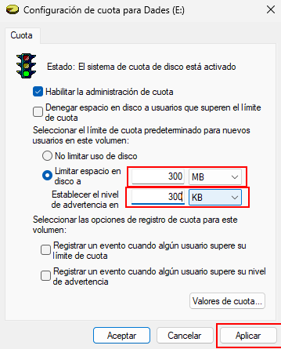

## Pas 7. Crear dos usuaris locals: alumne1 i alumne2

S'obre `lusrmgr.msc` (Usuaris i grups locals) → Usuaris → Nou usuari. Es creen `alumne1` i `alumne2` amb les contrasenyes corresponents. Es desactiva "L'usuari ha de canviar la contrasenya" i s'activa "La contrasenya no caduca".

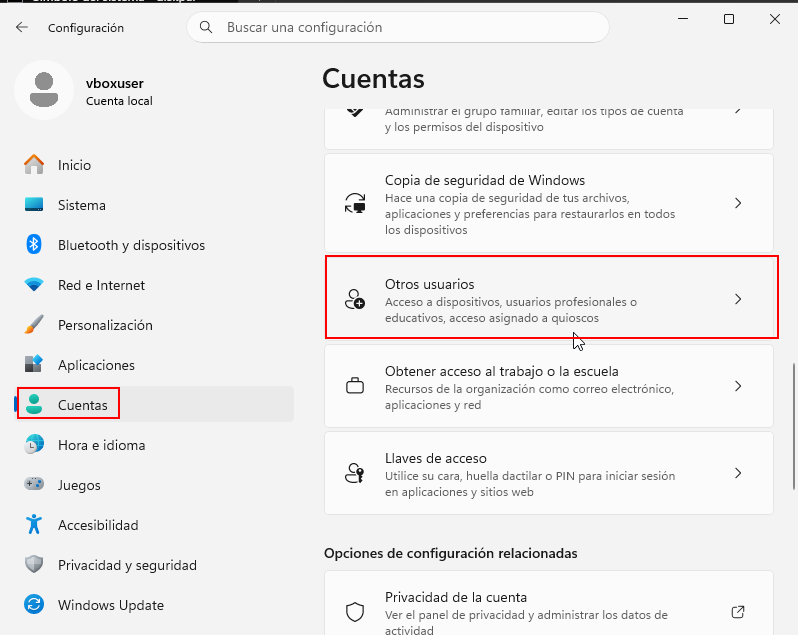

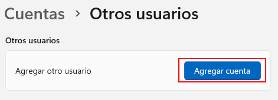

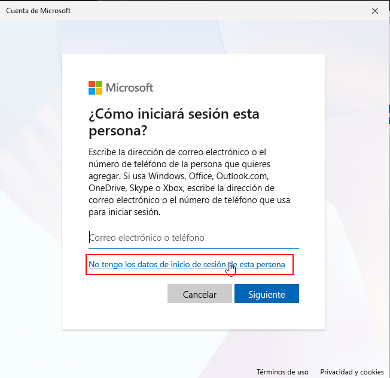

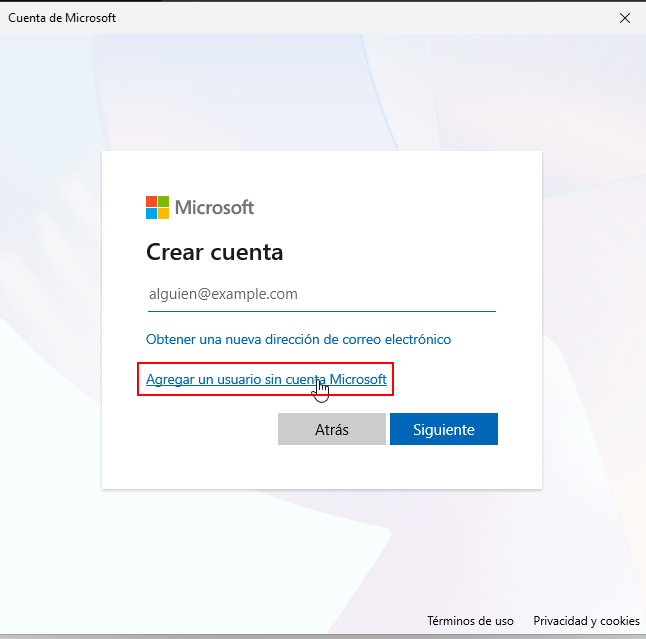

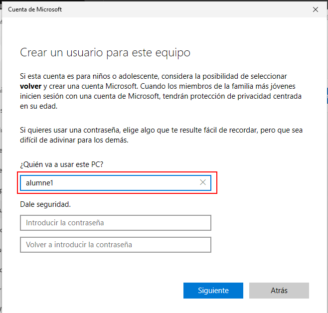

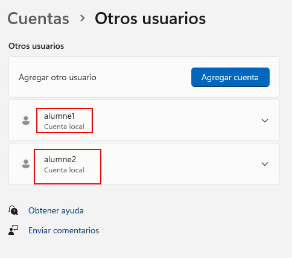

## Pas 8. Afegir-los a un grup nou anomenat Limitats

Es crea el grup `Limitats` dins `lusrmgr.msc` → Grups → Nou grup. S'hi afegeixen `alumne1` i `alumne2` com a membres.

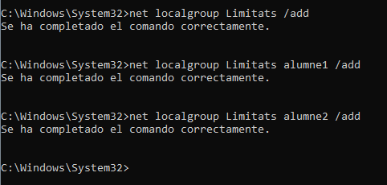

## Pas 9. Provar la còpia de fitxers dins Dades per veure com actuen les quotes (superar límit)

S'inicia sessió com alumne1 i es copien fitxers grans a D:\. Quan s'arriba als 300 MB, Windows bloqueja la còpia i mostra un error d'espai insuficient, demostrant que les quotes funcionen correctament.

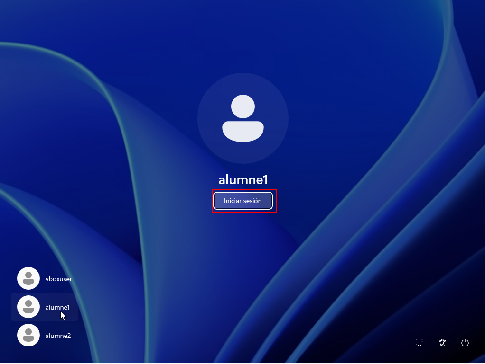

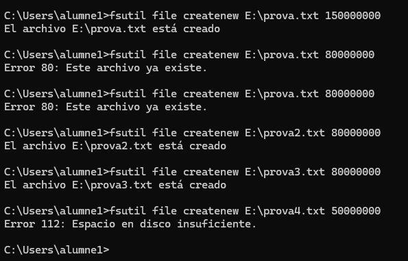

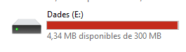

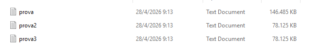

# Fase 3 – Script de còpia i automatització

## Pas 10. Afegir tercer disc virtual, formatar-lo en NTFS com a Backups

Es torna a la configuració de VirtualBox i s'afegeix un tercer disc virtual. Dins Windows, s'inicialitza i es formata com a NTFS amb l'etiqueta "Backups".

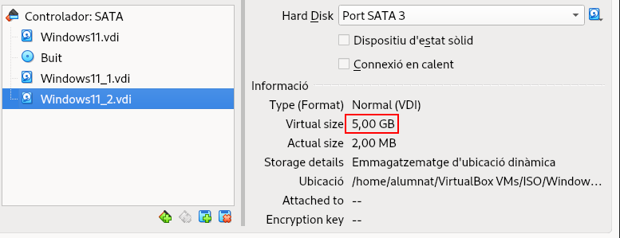

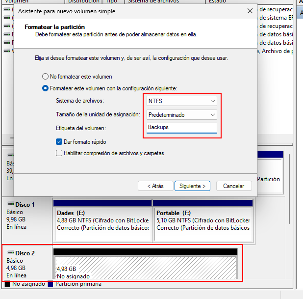

## Pas 11. Crear carpeta CòpiesUsuaris dins Backups

Dins la unitat Backups (E:) es crea la carpeta `CòpiesUsuaris`, que servirà com a destí de les còpies de seguretat automàtiques.

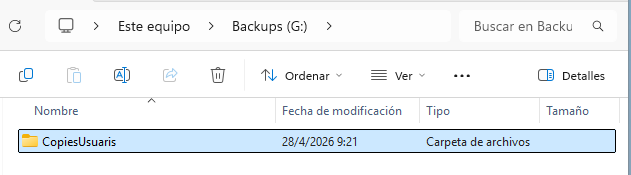

## Pas 12. Crear un script .bat que copiï C:\Users\%USERNAME% a E:\CòpiesUsuaris\%USERNAME%

Es crea un fitxer `.bat` amb el contingut:
```bat
xcopy "C:\Users\%USERNAME%" "E:\CòpiesUsuaris\%USERNAME%" /E /I /Y
```
Això copia tot el perfil de l'usuari al disc de Backups, creant la subcarpeta si no existeix (/I), de forma recursiva (/E) i sobreescrivint (/Y).

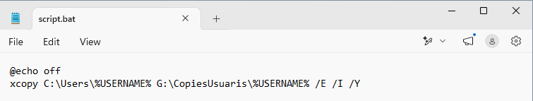

## Pas 13. Obre gpedit.msc → Configuració d'usuari → Scripts → Inici de sessió

S'obre l'editor de polítiques de grup local (`gpedit.msc`) i es navega a:
**Configuració d'usuari → Configuració de Windows → Scripts (Inici/Tancament de sessió) → Inici de sessió**.

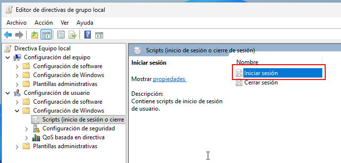

## Pas 14. Assigna l'script perquè s'executi automàticament quan alumne1 o alumne2 inicien sessió

Es fa clic a "Afegir" i es selecciona l'script .bat creat al pas anterior. Així, cada cop que alumne1 o alumne2 iniciïn sessió, es farà una còpia automàtica del seu perfil a Backups.

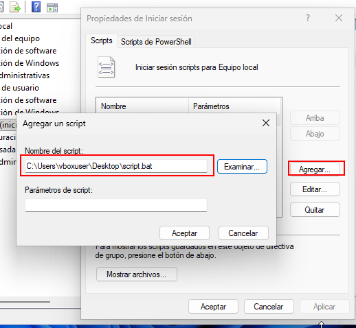

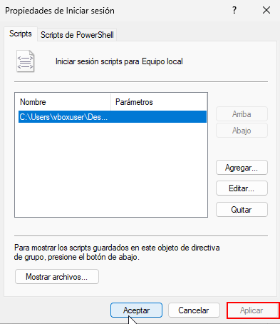

# Fase 4 – Verificació i documentació

## Pas 15. Inicia sessió amb alumne1, comprova que l'script fa la còpia a Backups i que la quota de Dades bloqueja si supera el límit, així com comprovacions que tot el que has configurat funciona correctament

S'inicia sessió com alumne1. Es verifica que:
- La còpia automàtica s'executa (apareix la carpeta `alumne1` dins `E:\CòpiesUsuaris`).
- Les quotes de disc segueixen bloquejant si es superen els 300 MB a D:.
- Tot el sistema configurat funciona correctament.

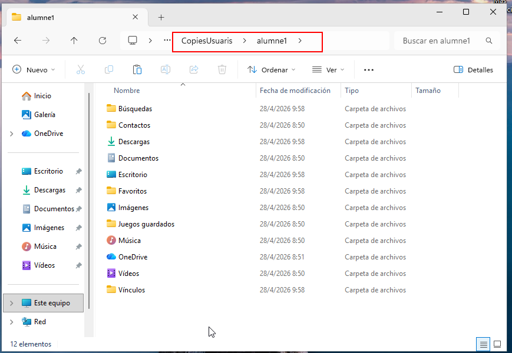

# Fase 5 – Gestió de processos i serveis

## Pas 19. Llistar processos actius

* Inicia sessió com alumne1
* Obre la consola (cmd) com a usuari
* Executa: `tasklist`
* Copia el resultat a un fitxer: `tasklist > C:\Users\%USERNAME%\processos_inici.txt`
* Observa processos típics: explorer.exe, SearchIndexer.exe, OneDrive.exe, etc.

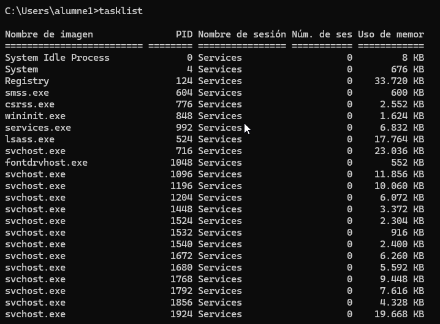

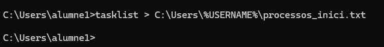

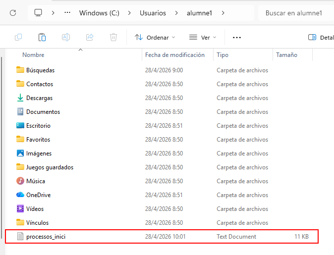

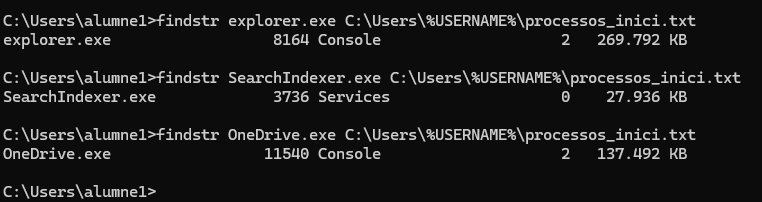

## Pas 20. Identificar processos prescindibles

* Busca processos no essencials per a l'usuari, com: OneDrive.exe, Teams.exe, SkypeApp.exe
* Fes una taula amb:
  * Nom del procés
  * Memòria usada
  * Justificació per eliminar-lo

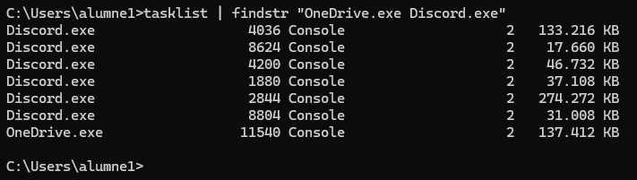

| Nom del procés | Memòria usada | Justificació per eliminar-lo |
| :--- | :--- | :--- |
| Discord.exe | 133.216 KB | Procés secundari de Discord (basat en Electron). Es pot eliminar per forçar el tancament de l'app si s'ha penjat o per alliberar RAM. |
| Discord.exe | 17.660 KB | Subprocés de Discord en segon pla. Eliminar per estalviar recursos menors. |
| Discord.exe | 46.732 KB | Subprocés de Discord. Tancar-lo ajuda a matar l'arbre de processos de l'aplicació completa. |
| Discord.exe | 37.108 KB | Un altre fil d'execució de Discord. Es pot finalitzar per aturar tasques auxiliars de l'app. |
| Discord.exe | 274.272 KB | Aquest és el procés de Discord que consumeix més memòria (probablement el procés principal o de renderitzat de la interfície). Eliminar-lo alliberarà una quantitat significativa de RAM. |
| Discord.exe | 31.008 KB | Subprocés addicional de Discord; eliminar-lo és necessari per a un tancament net i total del programa. |
| OneDrive.exe | 137.412 KB | Aturar la sincronització d'arxius en segon pla per estalviar amplada de banda d'internet, reduir l'ús de CPU/Disc o alliberar memòria RAM. |

## Pas 21. Eliminar processos manualment

* Encara dins de la consola, executa: `taskkill /IM OneDrive.exe /F`
* Comprova amb tasklist si ha desaparegut - Fes una captura abans i després

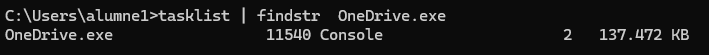

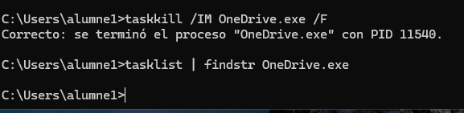

## Pas 22. Automatitzar-ho a l'inici de sessió

* Modifica l'script d'inici de sessió afegint:
  * `taskkill /IM OneDrive.exe /F`
  * `taskkill /IM Teams.exe /F`
* Reengega sessió com alumne2 i comprova que aquests processos no es llencen o es tanquen

## Pas 23. Documentació

### Tasklist i taula justificativa

En els passos anteriors (19-22) s'ha generat el fitxer `processos_inici.txt` amb la llista completa de processos actius i s'ha creat una taula justificativa dels processos prescindibles (Discord.exe, OneDrive.exe). Aquesta informació es documenta aquí com a part de l'entrega amb MkDocs.

### Què passa si mates un procés crític com explorer.exe?

`explorer.exe` és el procés encarregat de la interfície gràfica d'escriptori de Windows: la barra de tasques, el menú Inici, l'escriptori amb les icones i l'explorador de fitxers. Si es mata amb `taskkill /IM explorer.exe /F`:

1. **Desapareix l'escriptori**: la barra de tasques, el menú Inici i totes les icones de l'escriptori desapareixen immediatament. L'usuari veu només el fons de pantalla (o una pantalla negra/buida).
2. **Les finestres obertes continuen**: les aplicacions que ja estaven obertes (com el navegador, el cmd, etc.) segueixen funcionant perquè són processos independents. No obstant, no es pot canviar entre elles fàcilment sense la barra de tasques (es pot fer amb Alt+Tab).
3. **No es pot navegar pels fitxers**: l'explorador de fitxers deixa de funcionar. No es poden obrir carpetes ni gestionar arxius de forma gràfica.
4. **Com recuperar-lo**: s'obre el Gestor de tasques (`Ctrl+Shift+Esc` o `Ctrl+Alt+Del` → Gestor de tasques) → Fitxer → Executar nova tasca → escriure `explorer.exe` → Acceptar. L'escriptori i la barra de tasques reapareixen immediatament.
5. **No és destructiu**: matar `explorer.exe` no causa pèrdua de dades ni danya el sistema. Simplement desactiva la interfície gràfica de l'escriptori fins que es reiniciï el procés. És una prova controlada i segura.

> **Nota**: a diferència d'`explorer.exe`, matar processos veritablement crítics del nucli com `csrss.exe`, `wininit.exe` o `smss.exe` provoca un pantallazo blau (BSOD) i l'aturada immediata del sistema, ja que són essencials per al funcionament del kernel de Windows.

### Com la gestió de processos pot millorar el rendiment

La gestió proactiva de processos és especialment beneficiosa en entorns amb recursos limitats, com ara màquines virtuals (VMs) o equips antics:

- **Alliberament de RAM**: cada procés consumeix memòria. Aplicacions com Discord (que usa Electron i crea múltiples subprocessos) poden consumir centenars de MB. En una VM amb 2-4 GB de RAM, això és molt significatiu.
- **Reducció de l'ús de CPU**: processos de sincronització en segon pla (OneDrive, Teams, indexadors) consumeixen cicles de CPU constantment, tot i que l'usuari no els utilitzi. Eliminar-los allibera CPU per a les tasques reals.
- **Menys I/O de disc**: serveis com OneDrive o el Windows Search Indexer fan lectures/escriptures constants al disc. En VMs on el disc virtual és un fitxer dins del disc amfitrió, aquest I/O extra ralentitza tot el sistema.
- **Automatització**: l'ús de scripts `.bat` a l'inici de sessió (com s'ha configurat al Pas 22) permet automatitzar el tancament de processos innecessaris sense intervenció manual, garantint un entorn net cada vegada.
- **Temps d'inici de sessió més ràpid**: menys processos arrencant = menys temps esperant que l'escriptori estigui operatiu.

En resum, identificar i eliminar processos no essencials és una pràctica fonamental d'administració de sistemes que permet optimitzar el rendiment del sistema sense necessitat de millorar el maquinari.

# Fase 6 – Gestió de permisos (ACLs)

## Què són les ACLs i com funcionen a Windows

### Definició

Una **ACL (Access Control List)**, o Llista de Control d'Accés, és un mecanisme de seguretat del sistema de fitxers NTFS de Windows que defineix, de forma granular, quins usuaris o grups tenen accés a un recurs (fitxer, carpeta, clau de registre, etc.) i quin tipus d'accés tenen.

### Tipus d'ACL

A Windows existeixen dos tipus d'ACL:

| Tipus | Nom complet | Funció |
| :--- | :--- | :--- |
| **DACL** | Discretionary Access Control List | Controla **qui pot accedir** al recurs i **quins permisos** té. És la més comuna i la que es configura habitualment. |
| **SACL** | System Access Control List | Controla **l'auditoria**: registra al visor d'esdeveniments quan algú accedeix (o intenta accedir) al recurs. S'usa per monitorització i seguretat. |

Quan parlem d'ACLs en el context d'administració de fitxers, normalment ens referim a la **DACL**.

### Què és una ACE (Access Control Entry)

Cada entrada individual dins d'una ACL es diu **ACE** (Access Control Entry). Una ACE conté:

- **Tipus**: Permís (Allow) o Denegació (Deny).
- **Identitat (Trustee)**: l'usuari, grup o entitat de seguretat afectada (p. ex. `alumne1`, `Limitats`, `SYSTEM`).
- **Permisos específics**: quines accions es permeten o deneguen (lectura, escriptura, execució, eliminació, canvi de permisos, etc.).
- **Herència**: si l'ACE s'aplica a subcarpetes i fitxers fills o només a l'objecte actual.

### Permisos estàndard vs. permisos avançats

Windows ofereix dos nivells de granularitat:

**Permisos estàndard** (els que es veuen a la pestanya "Seguretat"):

| Permís | Descripció |
| :--- | :--- |
| Lectura (R) | Veure contingut del fitxer/carpeta |
| Escriptura (W) | Crear fitxers, escriure dades |
| Lectura i execució (RX) | Llegir i executar programes |
| Modificar (M) | Lectura + Escriptura + Eliminació |
| Control total (F) | Tots els permisos, inclòs canviar permisos i propietari |

**Permisos avançats** (dins de "Seguretat → Avançat"):
Són 14 permisos individuals que componen els estàndard, com ara: Travessar carpeta, Llistar carpeta, Llegir atributs, Crear fitxers, Crear carpetes, Escriure atributs, Eliminar subcarpetes, Eliminar, Llegir permisos, Canviar permisos, Prendre possessió, etc.

### Herència de permisos

Per defecte, a Windows els permisos es **hereten** de la carpeta pare:
- Si es dona Control total al grup `Limitats` sobre `D:\Projectes`, totes les subcarpetes i fitxers dins `Projectes` hereten automàticament aquest permís.
- Es pot **desactivar la herència** per assignar permisos específics a un objecte concret sense afectar ni ser afectat pels pares.
- Quan es desactiva la herència, Windows pregunta si es volen **copiar** els permisos heretats (convertint-los en explícits) o **eliminar-los** (deixant l'objecte sense permisos).

### Ordre d'avaluació dels permisos

Windows avalua els permisos en un ordre específic:

1. **Denegació explícita** → sempre guanya. Si un usuari té un Deny explícit, no podrà accedir encara que un grup li doni permís.
2. **Permís explícit** → s'aplica si no hi ha denegació.
3. **Permisos heretats** → s'apliquen si no hi ha permisos explícits.
4. **Si no hi ha cap ACE** que apliqui → accés denegat per defecte.

> **Important**: una denegació (Deny) sempre té prioritat sobre un permís (Allow). Per això, en el Pas 27 quan assignem només lectura a alumne2 amb `/grant:r`, estem substituint el seu permís heretat del grup, no afegint una denegació.

### Eines per gestionar ACLs a Windows

| Eina | Tipus | Ús |
| :--- | :--- | :--- |
| Propietats → Seguretat | Gràfica | Consultar i modificar permisos per interfície gràfica |
| Propietats → Seguretat → Avançat | Gràfica | Gestionar herència, permisos avançats, auditoria i propietari |
| `icacls` | Comanda (cmd) | Consultar i modificar permisos des de la línia de comandes. Exemple: `icacls "D:\Projectes"` per veure els permisos |
| `cacls` | Comanda (cmd) | Versió antiga d'icacls, obsoleta però encara funcional |
| `Get-Acl` / `Set-Acl` | PowerShell | Gestionar ACLs amb PowerShell de forma avançada |

### Per què ACLs i no permisos de compartició?

Els permisos de **compartició** (Share Permissions) només s'apliquen quan s'accedeix a una carpeta per xarxa. Els permisos **ACL/NTFS** s'apliquen **sempre** (localment i per xarxa), són molt més granulars i permeten configuracions per fitxer individual. En un sistema ben configurat, les ACLs són la capa principal de seguretat.

---

Volem controlar qui pot accedir i modificar la carpeta Projectes, creada dins la partició Dades. El grup Limitats tindrà accés total, però alumne2 tindrà només lectura, tot i formar part del grup.

## Pas 24. Crear la carpeta

Inicia sessió com a administrador i crea la carpeta `D:\Projectes`.

## Pas 25. Assignar permisos normals al grup

1. A les propietats de la carpeta `D:\Projectes`, ves a la pestanya Seguretat
2. Fes clic a Avançat → Desactiva la herència i conserva els permisos existents
3. Elimina Users o Everyone si hi apareixen
4. Afegeix el grup Limitats i dona-li Control total
5. Aplica els canvis

Ara qualsevol usuari del grup Limitats té accés complet.

## Pas 26. Comprovar accés amb alumne1

1. Inicia sessió com alumne1
2. Crea un fitxer dins `D:\Projectes`, modifica'l i elimina'l
3. Tot hauria de funcionar (perquè té permisos heretats del grup Limitats)

## Pas 27. Aplicar excepció per alumne2

Torna a iniciar sessió com administrador i executa:
`icacls "D:\Projectes" /grant:r alumne2:(R)`
Això substitueix qualsevol permís anterior d'alumne2 i li dona només lectura.

## Pas 28. Comprovar l'excepció amb alumne2

1. Inicia sessió com alumne2
2. Intenta obrir un fitxer dins `D:\Projectes` → ha de poder llegir-lo
3. Intenta editar-lo o crear-ne un de nou → ha de rebre un missatge de denegació

## Pas 29. Consultar els permisos aplicats

Torna a la consola com a admin i escriu: `icacls "D:\Projectes"` i veuràs alguna cosa com:
```text
D:\Projectes Limitats:(OI)(CI)(F) 
             alumne2:(R)
```
On:
- **(OI)** = Object Inherit → els fitxers fills hereten el permís
- **(CI)** = Container Inherit → les subcarpetes filles hereten el permís
- **(F)** = Full control (Control total)
- **(R)** = Read (Només lectura)