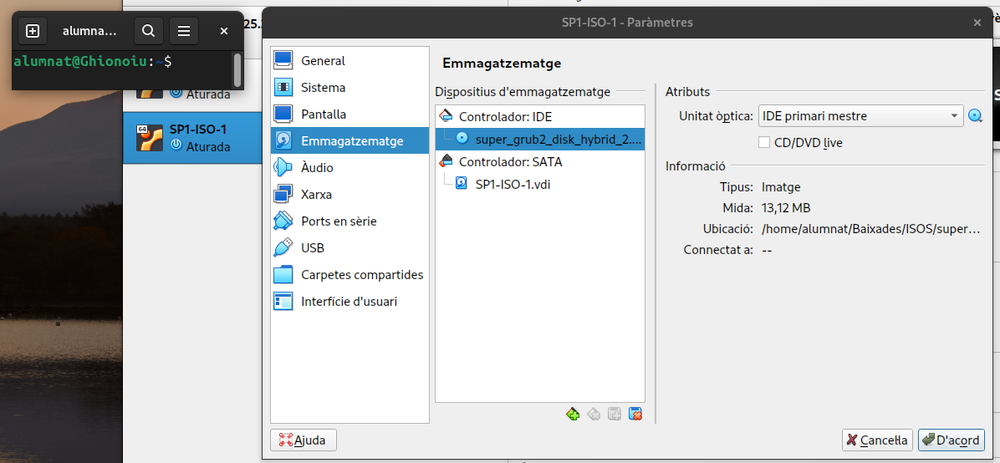

# Virtualització i instal·lació del SO Ubuntu
Per iniciar a instal·lar el sistema operatiu que volem a una màquina virtual, hem de buscar els requisits mínims per tindre un bon funcionament de la màquina.

En aquest cas, es farà servir el SO Ubuntu 22.04.3, amb uns requisits mínims de:

- CPU: 2 vCPUs
- RAM: 2 GB
- Almacenament: 25 GB

Una vegada tenim la nostra imatge del SO i sabem els requisits mínims, podem començar a instal·lar la nostra imatge virtual. 
Per a fer aquesta virtualització es farà servir VirtualBox.

Primerament, amb el VirtualBox iniciat, tenim una interfície bastant intuïtiva per a poder començar a instal·lar la nostra imatge.

A partir d'aquí començarem a seguir els següents passos:

- Farem clic a la part superior, on hi ha una icona que fica "Nova".

- Una vegada donat, li fiquem el nom que volem tenir a la nostra màquina virtual i elegirem la imatge ISO del nostre SO on la tinguéssim descarregada.
  
- Per a poder fer la instal·lació és recomanable activar l'opció de saltar la instal·lació desavenguda, ja que així podrem elegir nosaltres la configuració que volem al SO i les particions del disc dur. Així que li donem a la casella de "Skip Unattended Installation".

- En continuar endavant, haurem d'elegir la quantitat de recursos que li volem donar al maquinari. Com he dit, necessitarem saber els requisits mínims del SO. En el meu cas, per a fer un ús còmode i fluid, faré servir 4GB de RAM i 4 vCPUs. 

- Continuant amb la configuració, en el meu cas faré servir 80 GB de almacenament virtual, ja que així podré dedicar-li 40 GB a Ubuntu i 40 GB lliures.

- Per a poder fer servir la Xarxa NAT, hem de crear una xarxa primer, i això es fa anant al VirtualBox, on diu "Eines -> NAT Networks" i després li donem a "Crea".

- Ara, haurem d'entrar a les opcions de la nostra màquina virtual, "Paràmetres -> Xarxa", i canviarem el que ja surt per defecte, "NAT" a "Xarxa NAT", ja que la Xarxa NAT és una xarxa virtual compartida que permet que diverses màquines virtuals es vegin entre elles i tinguin accés a internet i l'opció "Nom" ficarem la que hem creat.

- Una vegada ja tenim tota la preparació prèvia, iniciem la màquina virtual. Quan ja hagi carregat, ens sortirà la següent pantalla i li premem ENTER a la primera opció "Try or Install Ubuntu".

- Seguidament ens sortirà per a provar o instal·lar. Elegim instal·lar.

- Elegirem les opcions que volem.

- En aquest cas, com volem crear nosaltres les particions, elegim la segona opció.

- Per a crear les noves particions, li donem a "New partition table", escollirem "free space" i després li donem al signe "+" per a crear-la.

- Les particions que faré servir seran les següents:
  - EXT4 / -> 20GB
  - EXT4 /home -> 15GB
  - EXT4 /boot -> 1GB
  - Swap -> 4GB (Si no tens la partició swap i el sistema es queda sense memòria RAM, podria començar a tenir    problemes, com ara lentitud o inclús falles. Però, si tens 8 GB de RAM o més, pots prescindir d'aquesta partició, especialment si no tens pensat dur a terme tasques molt exigents respecte a memòria).

  Especialment en aquest cas, per a poder fer la instal·lació m'està demanant que agregui una partició per a la EFI i una altra per al boot (biosgrub).
  - EFI -> 400MB
  - Biosgrub -> 1MB

- Elegim la nostra regió.

- Configurem el nom d'usuari i contrasenya, si escau.

- Finalment, li donarem a continuar i esperarem que s'instal·li. Una vegada instal·lat, ens demanarà reiniciar i ja tindrem la màquina funcionant.

# Llicenciament

## Llicència d'Ubuntu

### 1. Ubuntu és programari lliure i de codi obert

- Ubuntu està basat en Linux i altres programaris que són lliures i de codi obert.
- Això vol dir que pots usar-lo, copiar-lo, modificar-lo i distribuir-lo lliurement.

### 2. Quina llicència fa servir?

Ubuntu es distribueix sota la llicència **GPL** i inclou un amplíssim catàleg de programes de programari lliure que permeten realitzar qualsevol tipus de tasca.

La **GPL** és una llicència de programari lliure creada per la **Free Software Foundation**.

La versió més habitual per Ubuntu és la **GPLv3** (versió 3), encara que molts projectes també usen la versió 2 o versions posteriors.

Principis bàsics de la **GPL (GNU General Public License)**:

**1. Llibertat per usar el programari**
   - Pots fer servir el programari per a qualsevol propòsit, personal o comercial.

**2. Llibertat per estudiar i modificar el codi font**
   - Tens accés al codi font complet, i pots modificar-lo per adaptar-lo a les teves necessitats.

**3. Llibertat per distribuir còpies**
   - Pots distribuir còpies del programa, tant la versió original com la modificada.

**4. Distribució amb la mateixa llicència (copyleft)**
   - Si distribueixes una versió modificada, has de fer-ho sota la mateixa llicència GPL.
   - Això assegura que totes les versions futures continuïn sent programari lliure.
   - Aquesta és la part “forta” de la GPL, coneguda com a copyleft.

### 3. Què significa per a l’usuari?

- Pots descarregar Ubuntu i utilitzar-lo sense cap cost.
- Pots instal·lar-lo en tants equips com vulguis.
- Pots modificar-lo o adaptar-lo per a les teves necessitats, sempre respectant les condicions de les llicències dels components.
- Pots compartir còpies amb altres persones.

### 4. La marca i el nom “Ubuntu”

Tot i que el programari és lliure, la marca “Ubuntu” i el logotip estan protegits per Canonical (l’empresa que publica Ubuntu). Això significa que si fas una distribució modificada i la vols anomenar “Ubuntu”, has de complir amb les normes de Canonical, però si només uses o distribueixes el sistema tal qual, no tens problema.

## Text legal complet
[Ubuntu llicència](https://canonical.com/legal/intellectual-property-policy)

# Gestors d'arrencada per a instal·lacions DUALS

Per aquest apartat, tenim dos escenaris;

- Escenari 1: Instal·lar Windows 10 i Ubuntu en un mateix disc.
- Escenari 2: Instal·lar Windows 10 i Ubuntu en diferents discs.

Per falta de temps, farem només l'escenari 1.

## Escenari 1

- Primerament, hem d'entrar als paràmetres de la nostra màquina virtual i entrar al apartat "Sistema" i activar l'opció de "Activa EFI (només SO especials)", ja que aquesta opció fara que puguesim instal·lar Windows 10 en el mateix disc.
   - Si no activem aquesta opció, no ens deixará instal·lar-lo, ja que Windows fa servir un sistema MBR Bios i es incompatible amb el sistema GPT Uefi de Ubuntu.

- Per a insertar l'imatge de Windows al mateix disc, estant als paràmetres, hem d'anar a l'apartat "Emmagatzematge". Ens apareixerà el primer disc "Buit". Li farem clic i a l'icona que té d'un disc blau, li donem per a buscar la nostra imatge del SO.

- Una vegada ho hem fet, podem iniciar la màquina virtual per a començar a instal·lar el Windows 10. Per a fer l'instal·lació li hem de donar a la instal·lació personalitzada.

- Aquí li hem de donar al disc dur que tenim lliure i podem fer-li una nova partició.

- Quan ja s'ha reiniciat la màquina, podem seguir amb l'instal·lació com un Windows normal.

- Ja el tindrem instal·lat.

- Ara, com ja el tenim instal·lat, podem tancar la màquina virtual. En aquest cas, tenim que entrar una altra vegada als paràmetres i eliminar el disc que hem agregat anteriorment, ja que si no ho fem, tornarà dins de l'instal·lació de Windows.

- Una vegada eliminat, hem de agregar un nou disc buit, per a que no estigui sense.

- Aqui, el que hem de fer, es tenir instal·lat la iso que ens permetrà recuperar el grub, en aquest cas, "super_grub2_disk_hybrid_2.02s3.iso"

- Per poder entrar a esta iso, quan entrem a la màquina virtual, hem de espitxar la tecla "ESC" per a poder entrar a la pantalla de boot. Entrem a "Boot Manager".

- Com hem ficat la iso al disc, hem d'entrar a l'opció de CD-ROM.

- Ara ens apareixerà l'inici de la iso, que utilitzarem per a poder entrar al ubuntu i instal·lar el grub. Escollim l'opció "Detect and show boot methods".

- Una vegada dins, hem de buscar l'opció que apareix a la següent imatge.

- Ens iniciara l'ubuntu, haurem d'entrar a la terminal i ficar les següents comandes:
   - sudo grub-install /dev/sda
   - sudo update-grub2

- Com es pot observar al final de la comanda del update, ens apareix una línea que ens diu que hem de revisar "GRUB_DISABLE_OS_PROBER". Per a poder arreglar aquest error (si ho deixem així, ens iniciarà l'Ubuntu sense opció d'escollir el Windows), hem d'entrar i editar un arxiu del grub.
   - Hem d'entrar en mode sudo (sudo su) i ficar la següent comanda:
      - nano /etc/default/grub

- Aquí, si no ens apareix la línea "GRUB_DISABLE_OS_PROBER=false", o estará comentada, i l'haurem de descomentar, o no estara i l'haurém d'agregar. Guardarem els cambis i podrem fer un update-grub.

- Ara quan reiniciem la màquina virtual ens apareixerà la pantalla per a escollir quin SO volem iniciar. Entrarem als dos SO per a comprobar que funcionen.

- Entrem a Windows i veem que funciona.

- Entrem a Ubuntu i també funciona.

# Punts de restauració
Un punt de restauració serveix per desar l'estat del sistema operatiu en un moment concret.

La seva funció principal és revertir canvis i solucionar problemes.

Si després de crear un punt de restauració instal·les un programa, un controlador (driver) o una actualització que fa que l'ordinador funcioni malament, pots "tornar enrere" a aquest punt.

# Gestor de paquets
Per a realitzar instal·lacions de paquets, farem servir dpkg, apt, aptitude i des de repositoris.

## DPKG
Dpkg és l’eina de gestió de paquets bàsica de sistemes basats en Debian (com Ubuntu). Permet instal·lar, eliminar i gestionar paquets .deb directament des del sistema, sense necessitat de connexió a Internet.

Comandes utilitzades amb dpkg:
- **Instal·lar un paquet:** sudo dpkg -i paquet.deb
- **Eliminar un paquet:** sudo dpkg -r paquet
- **Purgar un paquet:** sudo dpkg -P paquet
- **Mostrar informació del paquet:** sudo -s paquet

### Instal·lació amb DPKG

Utilitzem la comanda "joe" per a veure si s'ha instal·lat (ja que el paquet que hem descarregat és el joe).

### Eliminar un paquet amb DPKG

Utilitzem aquesta comanda per a eliminar el paquet amb dpkg i l'intentem obrir per a veure que s'ha eliminat correctament.

### Purgar un paquet amb DPKG

Aquesta comanda es fa servir per a eliminar el paquet i tot el que està relacionat amb aquest.

### Mostrar informació del paquet amb DPKG

## APT

És una utilitat de línia de comandes usada en sistemes basats en Debian (com Ubuntu) per gestionar paquets de programari.

Comandes bàsiques utilitzades amb apt:
- **Instal·lar un paquet:** sudo apt install paquet
- **Eliminar un paquet:** sudo apt remove paquet
- **Purgar un paquet:** sudo apt purge paquet

### Instal·lació amb APT

Per a veure que funciona, utilitzem la comanda "vlc" per a veure si s'ha instal·lat (ja que el paquet que hem descarregat és el vlc).

### Eliminar un paquet amb APT

Utilitzem aquesta comanda per a eliminar el paquet amb apt i l'intentem obrir per a veure que s'ha eliminat correctament.
Si l'obrim, podem veure que no està eliminat, ja que hi han dependencies que no s'han eliminat, fem un sudo apt autoremove i ja no podrem obrir-lo més.

### Purgar un paquet amb APT

Aquesta comanda es fa servir per a eliminar el paquet i tot el que està relacionat amb aquest.

## Aptitude

Aptitude és una interfície per al sistema de gestió de paquets APT de Debian/Ubuntu.

La seva funció principal és permetre a l'usuari visualitzar, instal·lar, actualitzar i eliminar paquets de programari de manera eficient.

Comandes bàsiques utilitzades amb aptitude:
- **Instal·lar un paquet:** aptitude install paquet
- **Eliminar un paquet:** aptitude remove paquet
- **Purgar un paquet:** aptitude purge paquet

Primerament, haurém d'instal·lar aptitude al nostre SO.

### Instal·lació amb aptitude

Per a veure que funciona, utilitzem la comanda "vlc" per a veure si s'ha instal·lat (ja que el paquet que hem descarregat és el vlc).

### Eliminar un paquet amb aptitude

Utilitzem aquesta comanda per a eliminar el paquet amb aptitude i l'intentem obrir per a veure que s'ha eliminat correctament.
Aptitude, al contrari de APT, elimina totes les dependències i no ens farà falta fer un autoremove com amb APT.

### Purgar un paquet amb aptitude

Aquesta comanda es fa servir per a eliminar el paquet i tot el que està relacionat amb aquest, si ens fixem, ho fa igual que amb el remove i no podrem obrir l'aplicació.

## Repositoris PPA

De vegades, un paquet no està als repositoris oficials o volem una versió més nova. En aquests casos, podem afegir un repositori extern, sovint un PPA.

Escollirem el paquet que volem instal·lar, en aquest cas, VLC.

### Instal·lació per repositori VLC

- Primerament, buscarem per internet el paquet que volem instal·lar, seguit de "repositori PPA", és una forma de trobar-ho més facilment.
- Una vegada tenim com fer-ho, seguim els passos;

- Per últim, fem un distr-upgrade per a poder actualitzar les dependències necessàries de la distro.

- Revisem que funciona el paquet instal·lat.

# Configuració de la xarxa

