# Sistemes de fitxers i particions

## Mides

### Mida sector

És la unitat mínima d'emmagatzematge físic al disc dur. Ve determinada pel fabricant del hardware i no la pots canviar fàcilment.

- Com funciona: El disc està dividit físicament en petites caselles anomenades sectors.
- Mida estàndard: Tradicionalment eren 512 bytes, però els discos moderns utilitzen el "Format Avançat" de 4096 bytes (4KB) per ser més eficients.

### Mida block

És la unitat mínima d'assignació que utilitza el sistema de fitxers (NTFS, EXT4, FAT32) per guardar dades.

- Com funciona: El sistema operatiu agrupa diversos sectors físics per crear un "Cluster" (en Windows) o "Bloc" (en Linux). Quan guardes un fitxer, el sistema li assigna un o més clusters sencers. Un fitxer mai pot compartir un cluster amb un altre fitxer.
- Mida habitual: Normalment 4KB (4096 bytes), però pot variar (512B, 64KB, etc.) segons com formatis el disc.

### Comprobacions

Si fem **fdisk -l** podem veure la mida del sector a la nostra partició.

Per mirar la mida del bloc de la nostra partició utilitzem **tune2fs** i el filtrem per Block

## Fragmentacions

### Fragmentació interna

Ocorre quan un fitxer és més petit que la mida del cluster, o quan l'últim tros d'un fitxer no omple del tot el seu últim cluster. Com que un cluster no es pot compartir, l'espai sobrant es perd.

Per exemple:
- Tenim un cluster de 4 KB i guardem un fitxer de text petit de només 1 KB. El fitxer ocupa tot el cluster de 4 KB.
- Resultat: Hem malgastat 3 KB d'espai. Això és fragmentació interna.

Això ho podem comprobar fent un **echo "Bon dia" > Hola**, que és crear un arxiu de text amb una línea de text que diu Bon dia.

Podem veure a la captura que la mida del fitxer es de 4 KB, que és la mida de un bloc.

 

### Fragmentació externa

Ocorre quan l'espai lliure al disc no és contigu (està separat en trossets petits) o quan un fitxer gran es guarda en trossos separats físicament pel disc perquè no hi havia un forat prou gran per posar-lo tot junt.

Per exemple:
- Volem guardar un vídeo gran, el sistema operatiu busca espai, però només troba forats petits entre altres fitxers. Per això, el sistema parteix el vídeo en 5 trossos i els posa en diferents llocs del disc.

Això ocorre especialment als discs mecànics HDD, ja que ha de moure el capçal lector d'un lloc a l'altre per llegir el fitxer sencer. Això alenteix molt el sistema.

Per altra banda, en els discos SSD, la fragmentació externa no afecta tant el rendiment perquè no tenen parts mòbils.

Per a veure si una partició necessita fragmentació externa utilitzem la comanda **e4defrag** i ens ho dirà.

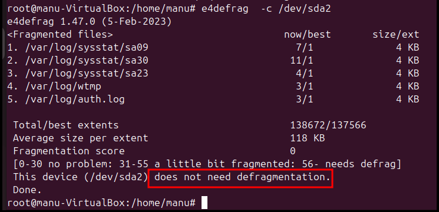

## Tipus de formateig

- **Baix nivell:** Borra sistema de fitxers, borra formateig, etc. És a dir, que borra totes les dades i el deixa com a nou.
Des del sistema operatiu no es pot formatar, es necessiten programes adients.

- **Mig nivell:** Només borra sistema de fitxers pero si hi han sectors defectuosos els marca pero no els arregla.

- **Alt nivell:** El format d'alt nivell només borra el sistema de fitxers.

## Gestió de particions

La gestió de particions és l'acció de modificar l'estructura lògica d'un disc dur o SSD un cop ja està en funcionament o quan el preparem per primera vegada.¡

### GPARTED

GParted (GNOME Partition Editor) és una eina per gestionar particions.

#### Característiques Clau:

**Visual i intuïtiu:** Mostra el disc com una barra horitzontal de colors. Cada color representa una partició diferent, i l'espai gris és l'espai buit. Això fa molt fàcil entendre com està organitzat el disc.

**Universal:** Entén gairebé tots els sistemes de fitxers existents:
- Windows: NTFS, FAT32.
- Linux: EXT4, Btrfs, XFS.
- Apple: HFS+ (i parcialment APFS).

***Fes sempre una còpia de seguretat (Backup) abans d'obrir GParted.***

### Comandes

Amb la comanda **fdisk** podem crear particions i modificarles a través de linea de comandes a la nostra terminal.

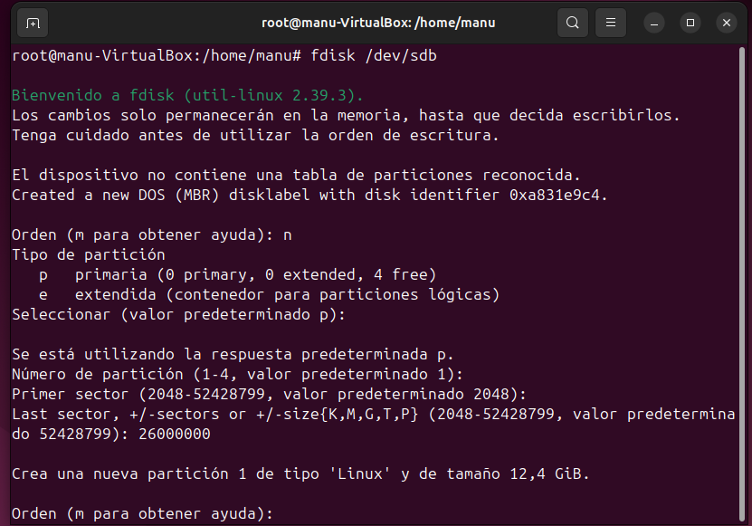

Ara premem la tecla "n" i després premem enter (per a deixar-ho en default) i després fiquem la mitat de la mida del disc per a fer la partició, en aquest cas, 26000000.

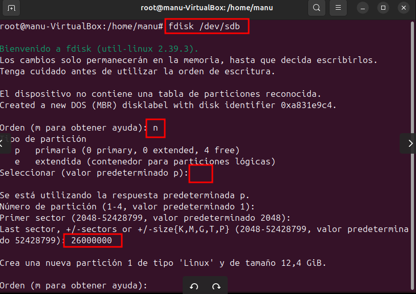

Acte seguit, ficarem "n" i li premem enter a totes les opcions. Finalment escrivim "w" per a començar a escriure la partició.

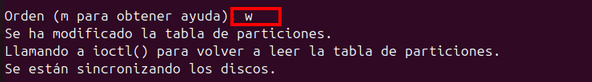

Ara hem de formatar amb una mida de block diferent la primera partició amb **mkfs.ext4 -b 2048 /dev/sdb1**.

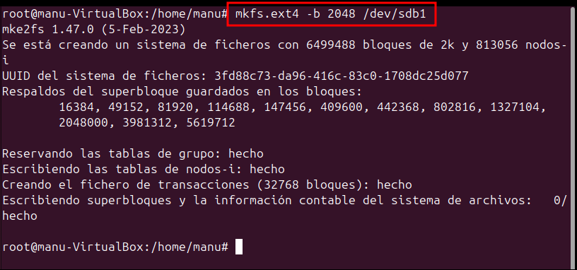

Ho comprobem fent **tune2fs -l /dev/sdb1 | grep Block**.

La segona partició la fem en format NTFS amb la comanda **mkfs.ntfs /dev/sdb2**

Comprobem tots aquestos passos al GPARTED.

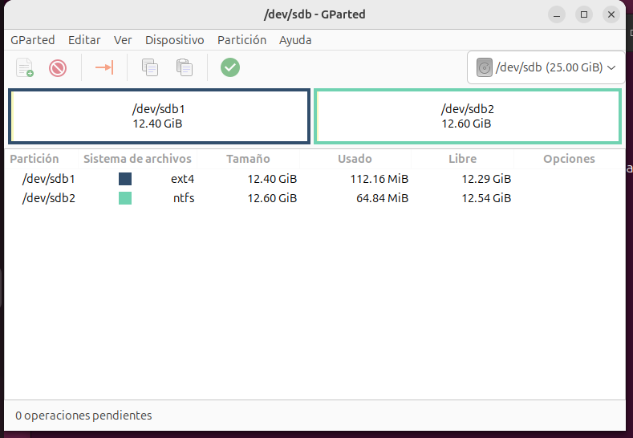

### Muntatge

Per a poder fer servir aquestes particions que hem creat, les haurem de montar. Si ara creem una carpeta i creem un arxiu dins i montem la partició, veurem que el arxiu creat ja no es trobarà.

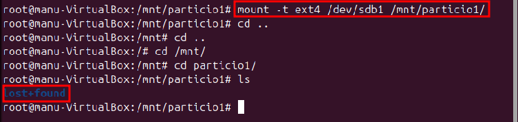

Per a fer que estos cambis que fem siguin permanents, hem d'entrar al fitxer ***/etc/fstab*** i editarlo amb la següent linea.

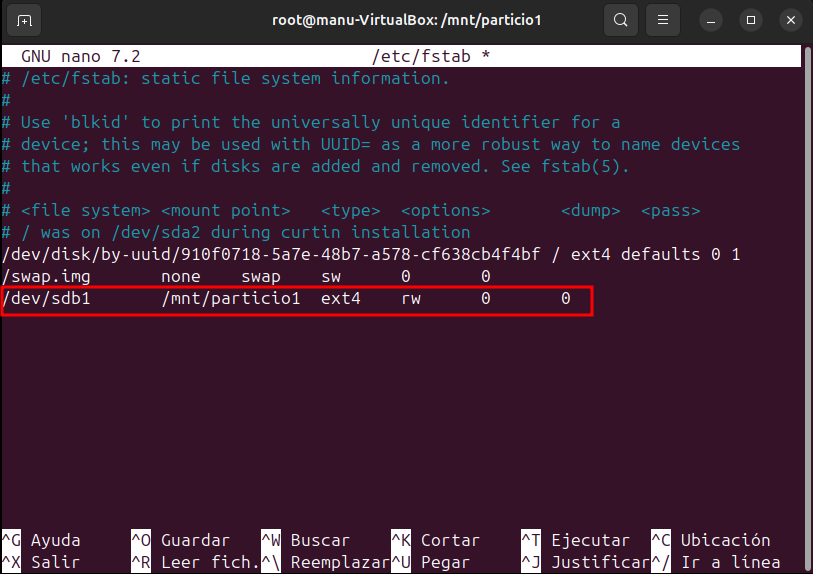

Si ara reiniciem i mirem la carpeta, els arxius segueixen allí.

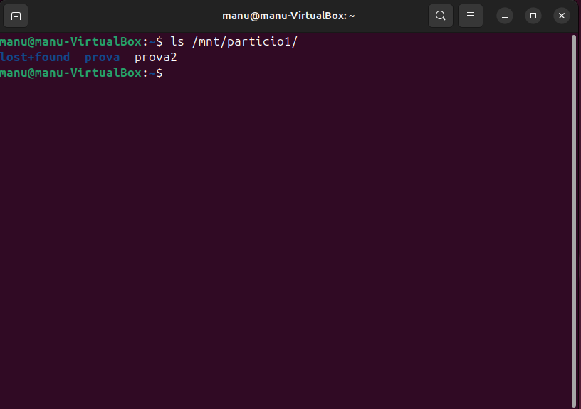

# Gestió de procesos

# Gestió d'usuaris i grups i permisos

### Usuari

Un ***usuari*** és qualsevol entitat que pot executar processos (programes) i ser propietària de fitxers.

El sistema operatiu no t'identifica pel teu nom (ex: "Joan"), sinó per un número únic anomenat UID.

Podem classificar-los en tres nivells segons el seu poder i el seu UID:

- **Root (Superusuari)**
    - **UID:** 0
    - **Descripció:** Té control total, pot llegir/esborrar qualsevol fitxer i aturar qualsevol procés.
- **Usuaris del sistema**
    - **UID:** 1 - 999
    - **Descripció:** Són usuaris creats perquè els serveis funcionin. Exemple: l'usuari "Jesus". No poden fer "login" (no tenen pantalla).
- **Usuaris Normals**
    - **UID:** 1000+
    - **Descripció:** Són usuaris creats per a les persones. Tenen una carpeta personal (/home/joan) i no poden modificar fitxers del sistema sense permís.

Tots aquests usuaris es llisten al fitxer de text ***/etc/passwd***.

### Grup

Un ***grup*** és una col·lecció lògica d'usuaris que comparteixen certs permisos. Els grups s'identifiquen internament amb un GID (Group ID). La funció dels grups és facilitar l'administració.

Tipus de grups per a un usuari:

- Quan crees un usuari, aquest pot pertànyer a diversos grups alhora:
    - **Grup principal:**
        - És obligatori.
        - Normalment té el mateix nom que l'usuari. Si crees l'usuari Cire, es crea automàticament el grup Cire.
        - Quan Cire crea un fitxer nou, aquest fitxer pertanyerà automàticament al grup Cire.
    - **Grups secundaris:**
        - Són opcionals.
        - Serveixen per donar privilegis extra.
        - ***Exemple:*** Si vols que Cire pugui usar l'ordre sudo, l'afegeixes al grup sudo. Si vols que pugui usar Docker, l'afegeixes al grup docker.

La definició de grups està al fitxer ***/etc/group***.

## Directoris i fitxers importants

### Directoris

#### /etc/skel

El nom ve de "Skeleton" (Esquelet). És la plantilla base per als nous usuaris.

- **Com funciona:** Quan crees un usuari nou (amb l'ordre useradd -m usuari), el sistema no crea la seva carpeta /home/usuari buida. El que fa és copiar automàticament tot el contingut de /etc/skel dins de la nova carpeta de l'usuari.
    - Si mirem a dins, normalment veurem fitxers ocults de configuració:
        - ***.bashrc:*** Configuració de la terminal (colors, àlies).
        - ***.profile:*** Variables d'entorn.
        - ***.bash_logout:*** Què passa quan tanques la sessió.

Modificar /etc/skel només afecta els usuaris futurs. Els usuaris que ja existeixen no rebran els canvis.

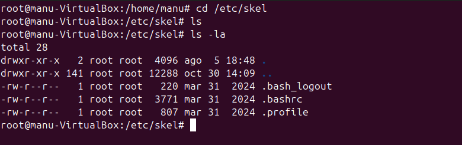

Quan fem un adduser agafa aquests directoris.

Si creem una carpeta compartida dins de /etc/skel, podem veure que als nous usuaris que creem, la carpeta també es crea.

### Fitxers importants

#### /etc/passwd

És un fitxer de text pla que conté la llista de tots els comptes creats al sistema.

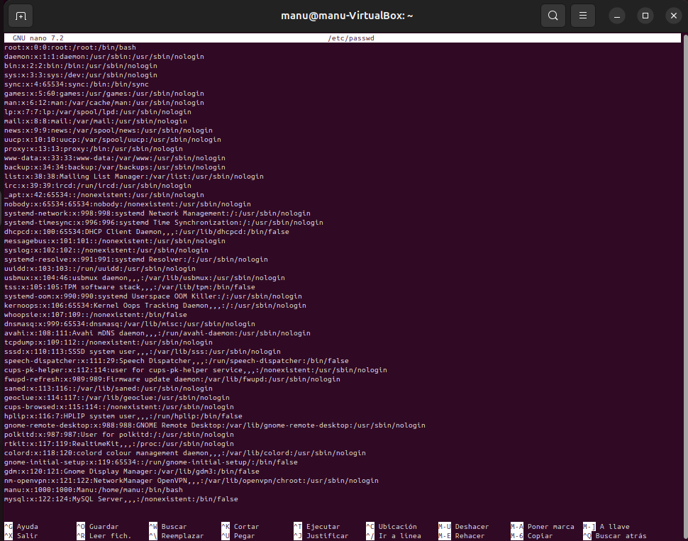

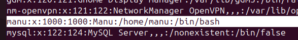

Cada línia del fitxer correspon a un usuari. Els camps estan separats per dos punts ( : ).

***manu(nomusuari):x(contra):1000:1000(identificador de grup principal):manu:/home/manu:/bin/bash***

Per a explicar més detalladament cada punt, tenim que:

- **Nom d'usuari (manu):** És el nom que fem servir per fer login.
- **Contrasenya (x):** Indica que la contrasenya està encriptada i guardada a /etc/shadow. Si aquí no hi hagués una x, l'usuari no tindria contrasenya.
- **UID (1000):** El "User ID". El DNI numèric de l'usuari, explicat abans.
- **GID (1000):** El "Group ID". Identifica el grup principal d'aquest usuari.
- **GECOS / Comentari (Manu):** És un camp de text lliure. Normalment s'hi posa el nom complet de la persona, però pot contenir el número de telèfon o despatx.
- **Directori Personal (/home/manu):** És la carpeta de l'usuari quan entra al sistema. Si canviem això, l'usuari anirà a parar a un altre lloc en fer login.
- **Shell (/bin/bash):** És el programa que s'executa quan l'usuari entra.
    - Per a usuaris normals sol ser /bin/bash o /bin/zsh.
    - Per a usuaris de sistema sol ser /usr/sbin/nologin o /bin/false.

#### /etc/shadow

Aquest fitxer conté la informació de les contrasenyes i la seva caducitat. La diferència clau amb l'anterior és que només l'usuari root el pot llegir.

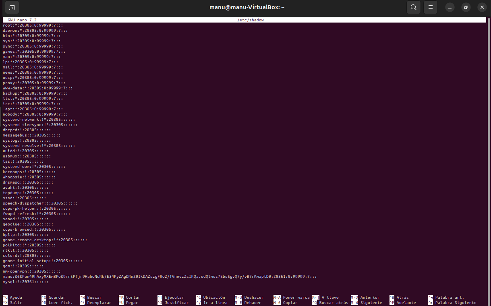

Per a explicar més detalladament cada punt, tenim que:

- **Nom d'usuari (manu):** La clau per enllaçar amb /etc/passwd.
- **El hash de la contrasenya:** Aquest és el camp llarg i estrany que comença per $. Això **NO** és la contrasenya, és el resultat d'una operació matemàtica sobre ella.
- **Camps de caducitat (La resta de números):**
    - Quan es va canviar la contrasenya per últim cop (des de 1970).
    - Dies mínims abans de poder canviar-la de nou.
    - Dies màxims abans que caduqui (obligar a canviar-la).
    - Dies d'avís abans que caduqui.

#### /etc/group

Aquí estan tots los grups del sistema i a quin grup el usuari está.

Per a explicar més detalladament cada punt, tenim que:

- **Nom del grup:** Tal i com diu, el nom identificatiu del grup.
- **Contrasenya de grup (x):**
    - La x indica que, si n'hi hagués, estaria guardada de forma segura a /etc/gshadow.
    - Serveix perquè un usuari que no és del grup pugui entrar-hi temporalment amb la comanda newgrp si sap la clau.
- **GID:** L'identificador numèric únic. És el que fa servir el nucli (Kernel) de Linux internament.
- **Llista de membres:**
    - És una llista d'usuaris separats per comes (sense espais).

#### /etc/gshadow

Veem qui forma part del grup i qui es l'administrador. Igual que /etc/shadow, aquest fitxer només el pot llegir l'usuari root.

Per a explicar més detalladament cada punt, tenim que:

- **Nom del grup:** L'enllaç amb /etc/group.
- **Contrasenya encriptada:**
    - Si aquí hi ha un hash, el grup té contrasenya.
    - Si hi ha un ! o un *, el grup no té contrasenya (está bloquejat), que és el més habitual.
- **Administradors del grup:**
    - Aquesta llista d'usuaris té permís per afegir o treure gent d'aquest grup concret utilitzant la comanda gpasswd.
- **Membres del grup:**
    - Llista d'usuaris que pertanyen al grup (igual que a /etc/group).

## Comandes bàsiques

En Linux, podem gestionar els usuaris amb interfície gràfica o comandes.

### Interfície gràfica

Des de configuració, podem entrar a creació d'usuaris i afegir un usuari nou.

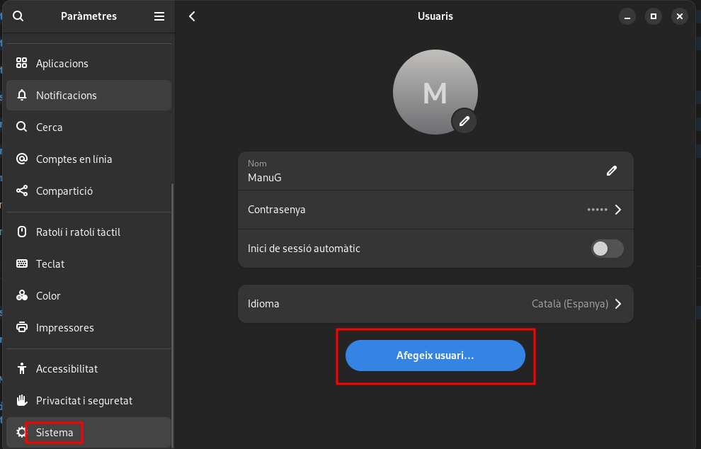

A la següent pantalla podem fer ja el nou usuari, afegint **nom, nom d'usuari, contraseña** i si volem que sigui **administrador**.

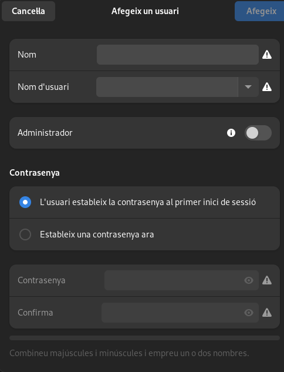

Una altra opció per a crear usuaris i que també podem gestionar grups, amb interfície gràfica, és amb el ***gnome-system-tools***.

*Hem d'instal·lar l'aplicació amb: **sudo apt install gnome-system-tools***

Una vegada instalada, la tindrém al nostre tauler d'aplicacions. L'iniciem.

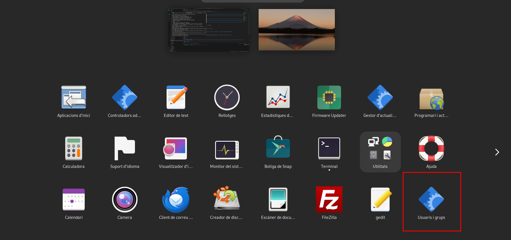

Com es pot veure en totes les opcions que apareixen, podem fer tot el que necessitem amb interfície gràfica.

### Comandes Usuaris

#### adduser

La forma més comú de crear un usuari amb comandes, es fa amb la comanda ***adduuser***. Aquesta comanda ens demanarà la *contrasenya, nom complet, num de habitació, etc*.

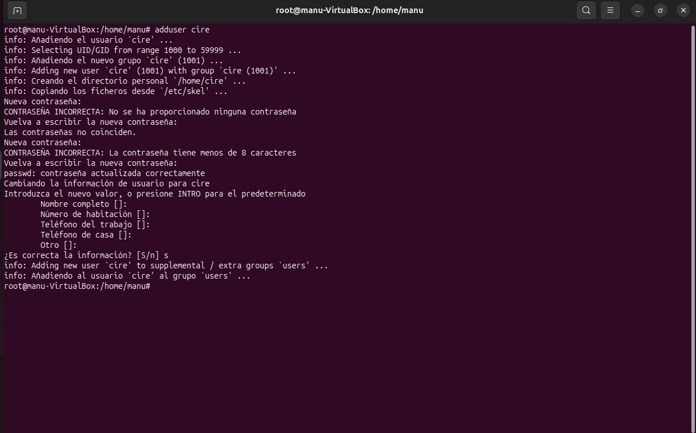

Podem fer la comprobació de l'usuari creat, mirem tots els arxius que hem mencionat amb anterioritat per a veure tots els seus valors, a part de la creació de la carpeta home de l'usuari que hem creat.

A part, una vegada creat l'usuari, podem entrar per interfície gràfica a l'usuari.

#### useradd

A banda de la comanda anterior, aquesta comanda ens deixa agregar l'usuari sense preguntar cap paràmetre, ja que els haurem d'anar afegint. S'ha de crear la carpeta home, cambiar de permisos, afegir contrasenya i cambiar d'interpret, ja que l'interpret que li fica de base és l'antic *SH*.

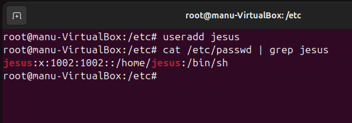

Per a cambiar l'interpret, de *SH* a *BASH*, hem d'utilitzar la comanda ***usermod*** amb el paràmetre ***-s***.

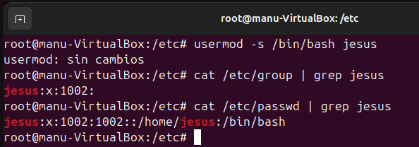

Per a poder iniciar sessió gràficament, haurém d'afegir la carpeta ***/home*** i cambiar els permisos i després establir una contrasenya.

Per a crear la carpeta home hem de fer les següents dos comandes:

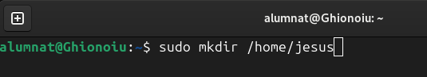

Ara creem la contrasenya:

Comprobem que a ***/etc/shadow*** apareix que ja té contrasenya.

Una vegada fet això, comprobem que l'usuari apareix.

#### deluser

Si volem eliminar un usuari que hem creat amb anterioritat, podem fer servir aquesta comanda, la part negativa és que la carpeta /home de l'usuari quedarà intacta. Pot fer-se servir si no volem eliminar els seus arxius per si creem l'usuari de nou en un futur.

#### userdel

A diferència de l'anterior, per a poder eliminar també la carpeta /home d'aquell usuari, fem servir la comanda ***userdel -r***, és important afegir el **-r**, ja que, si el deixem igual, no eliminaria tampoc la carpeta de l'usuari.

#### Bloqueijar i desbloqueijar un usuari

Una cosa que podem fer per a poder gestionar un usuari, és poder bloqueijar un usuari per a que no pugui iniciar sessió.

Amb la comanda **usermod -L "usuari"** podem bloqueijar l'usuari. Si ens fixem, a la contrasenya nova hi ha un **!** davant de la contrasenya, mostrant que l'usuari no podrà entrar al seu usuari. 

Amb la comanda **usermod -U "usuari"** podem desbloqueijar l'usuari.

### Comandes Grups

#### addgroup

Aquesta és la forma més fàcil de crear un grup, fent un ***addgroup nomgrup***.

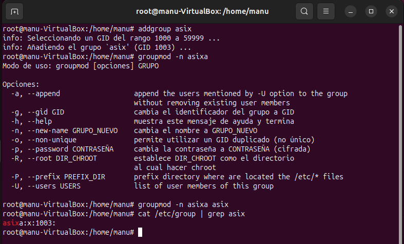

A part, podem cambiar el nom del grup, tal i com es veu, amb la comanda ***groupmod -n nomgrup nomgrupnou***.

#### delgroup

Per eliminar un grup, és tan simple com fer un ***delgroup nomgrup***.

#### groupadd

Aquesta comanda és igual que el *addgroup*, pero aquí podem especificar més coses, com ara, si fiquem un *-g*, podrem especificar un GID específic per al grup (>1000).

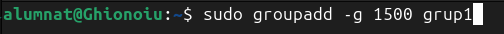

Si fiquem un *-r*, direm que aquell grup serà de sistema. GID <1000.

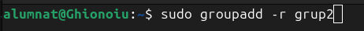

#### adduser

Per a poder afegir un usuari a un grup que tenim creat, tal i com hem vist a la creació d'usuaris, aquesta comanda té la mateixa sintaxi, però, després del nom de l'usuari (que ja estigui creat), fiquem el nom del grup (ja creat amb anterioritat).

Aquestes són 3 formes d'afegir un usuari a un grup.

Com podem veure, l'usuari Cire, ja està al grup que l'hem afegit.

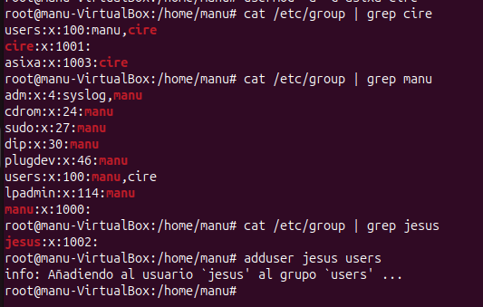

### Chage

Aquesta comanda ens permet visualitzar i modificar la caducitat i expiració d'un usuari.

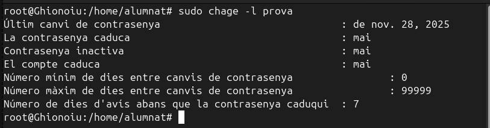

Com veem, la cuenta no caduca mai, podem ficar un ***-E 0*** per afegir que la cuenta hagi caducat, ja que ficarà la data més anterior.

Si intentem entrar a l'usuari, no ens deixarà.

Per a traure la caducitat, fem un ***-E -l***.

## Permissos

### UGO

A Linux, tot fitxer i directori té 3 nivells d'accés definits per a 3 tipus de persones.

- Quan mirem els permisos, sempre s'apliquen en aquest ordre estricte:
    - **U - User (Propietari):** L'amo del fitxer. Té els permisos més alts.
    - **G - Group (Grup):** El grup assignat al fitxer. Tots els usuaris que formin part d'aquest grup compartiran aquests permisos.
    - **O - Others (Altres):** Tota la resta. Qualsevol usuari del sistema que no sigui el propietari ni pertanyi al grup.

Per a poder veure quins permisos tenen els arxius, fem un ***ls -l***.

Tal i com està separat, tenim que:

- **1r caràcter:** El tipus d'aquell arxiu.
    - **d =** Directori
    - **- =** Fitxer
- **2n, 3r i 4t caràcter:** Usuari
    - El que pot fer el propietari.
- **5è, 6è i 7è caràcter:** Grup
    - El que pot fer el grup.
- **8è, 9è i 10è caràcter:** Altres
    - El que pot fer la resta.

Ara bé, que vol dir cada lletra? Tenim les següents:

**Lletra_____Valor_____Significat en FITXER_______________Significat en CARPETA**

**R (Read)**_____4_______Pots obrir i llegir el contingut._______Pots llistar els fitxers de dins (ls).

**W (Write)**____2_______Pots modificar i desar el fitxer._______Pots crear i esborrar fitxers a dins.

**X (Execute)**___1_______Pots executar-lo com a programa.____Pots entrar a la carpeta (cd).

**-**____________0_______Cap permís._______________________Cap permís.

Per a canviar els permisos, podem aplicar la matemàtica, ja que serà mes fàcil una vegada féssem ús de la comanda *chmod* per a canviar els permisos.

Tenim que:
- **R =** 4
- **W =** 2
- **X =** 1

Exemple:
- **7 (4+2+1) =** rwx (Tot permès: Llegir, escriure i executar)
- **6 (4+2) =** rw- (Permès llegir i escriure, però no executar)
- **5 (4+1) =** r-x (Permès llegir i executar, però no escriure)
- **4 (4) =** r-- (Només llegir)
- **0 =** --- (Accés denegat al arxiu)

#### Canviar permisos

##### CHMOD

Per a canviar permisos en chmod, tenim dues formes:

- **Mode numèric**
    - Aquest és el més rapid, ja que podrem canviar tots els permisos (Usuari, grup i altres) en una mateixa comanda.
        - Exemple: ***chmod 750 fitxer***

            Tenim aquest fitxer, amb els permisos base que es creen amb la màscara d'usuari (ho veurém mes endavant: *umask*).
            
            

            Una vegada apliquem la comanda abans dita tenim:

            

            Com podem veure, hem aplicat que per als primers 3 dígits (7 - Tots els permisos al administrador), següents 3 (5 - Llegir i executar per al grup) i els últims 3 (0 - Cap permís per a altres).

- **Mode simbòlic**
    - Aquest pot ser un poc més fàcil de recordar, ja que podem afegir permisos i treure a uns en concret amb les lletres respectives.
        - Exemple: ***chmod u+r fitxer***

            **u =** user |
            **g =** group |
            **o =** others |
            **a =** all

            En aquest exemple afegim al usuaris el permís de llegir.

            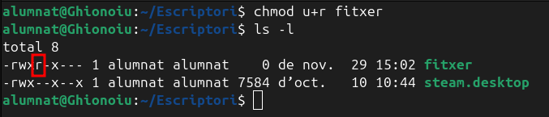

##### CHOWN

Aquesta comanda el que fa és canviar el propietari i el grup del fitxer.

La comanda és: ***chown usuari:grup fitxer***

Si, a part fiquem abans de "usuari:grup" un *-R*, farem que aquest canvi sigui recursiu, és a dir, que tots els arxius de dins de la carpeta també s'apliqui així.

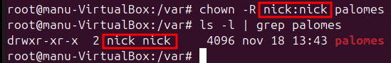

#### Exemple d'ús

Primerament, creem la carpeta palomes i el fitxer prova, tenim els següents permisos:

Si fem a un dels nostres usuaris, la comanda ***chown -R nick prova***, ficara l'usuari que hem ficat (nick) com a propietari, pero el grup queda igual.

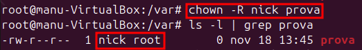

Ara, si fem ***chown -R nick:nick prova*** canviarem l'usuari i el grup a nick.

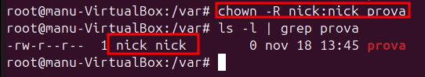

Fem el mateix per a la carpeta palomes.

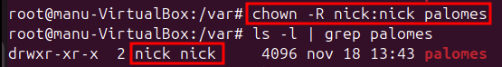

Ara, el que fem es un ***chgrp -R paloma palomes***, per a canviar el grup de la carpeta *palomes* a *paloma*.

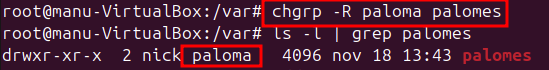

Afegim l'usuari *cire* al grup paloma i fiquem els permisos 750 a la carpeta *palomes*.

Traem de la carpeta *palomes*, del *other* el permís *read*.

Ens connectem amb l'usuari *nick* i fem les comprobacions adients, veem que podem entrar a la carpeta, fer un *ls* i crear un fitxer.

Però, si ara entrem amb l'usuari *cire*, veem que el que no podem fer es ni crear un arxiu ni borrar, és a dir, modificar.

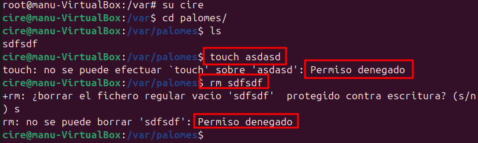

Ara, si intentem entrar a la carpeta palomes amb un usuari que no està al grup paloma, no podrem veure res d'aquesta carpeta.

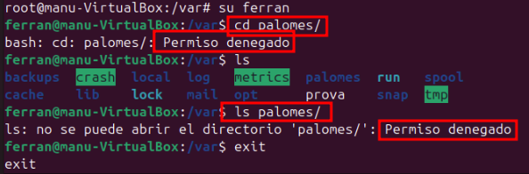

### Especials

#### SUID

Permet a usuaris normals fer tasques d'administrador puntualment.

S'aplica amb ***chmod 4777 fitxer***, ja que el SUID té com a bit per devant un 4.

El fitxer acabaría amb aquests permisos: rw**s**rwxrwx

#### SGID

Aquest permís és diferent per a directoris i fitxers. S'aplica amb ***chmod 2777 arxiu***, ja que el bit és 2.

- **Directoris:**
    - Si activem aquest permís, qualsevol fitxer nou creat dins d'aquest directori, heretarà el grup de la carpeta pare, no de l'usuari que ha creat el fitxer.

- **Fitxers:**
    - És paregut a la SUID, però en lloc d'executar-se com el propietari, s'executa amb els permisos del grup. 

El fitxer o directori acabaría amb aquests permisos: rwxrw**s**rwx

#### Sticky bit

L'sticky bit és necessari per evitar que els usuaris esborrin fitxers que no són seus en carpetes compartides, per això, s'afegeix aquest permís especial.

Encara que en la carpeta compartida tinguis permís 777, si té el sticky bit, només podrás esborrar o reanomenar els fitxers que siguin teus.

Per afegir aquest permís fem ***chmod +t carpeta***

I per a treure'l ***chmod -t carpeta***

Però, també podem afegir-lo de forma numérica, ja que el valor del Sticky Bit és 1: ***chmod 1777 carpeta***

##### Exemple d'ús

Hem afegit al exemple que hem fet amb anterioritat l'usuari *deivy* i l'usuari *ferran* a la carpeta *paloma*.

Primerament, comprobem que, si creem un fitxer amb un usuari (deivy) i ens connectem amb un altre usuari (ferran) i intentem eliminar-lo, funciona perfectament i l'elimina.

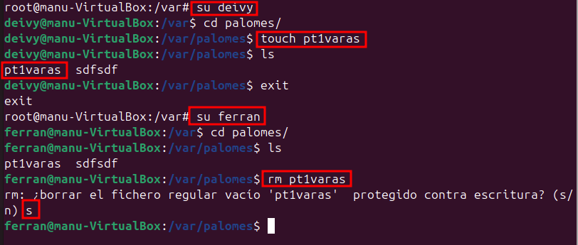

Ara, si afegim a la carpeta l'sticky bit, amb la comanda vista anteriorment, ens quedarà el directori tal que així:

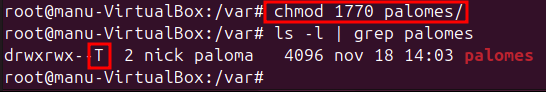

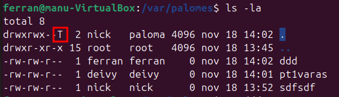

Una vegada afegit el sticky bit, entrem amb l'usuari deivy i creem de nou el fitxer pt1varas, com abans. Si tornem a entrar amb l'usuari ferran i intentem eliminar-lo ens dirà el següent:

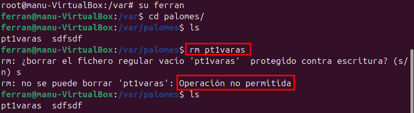

Però, si creem el fitxer en el mateix usuari i intentem eliminar aquell mateix fitxer, el podrem eliminar, obviament, ja que és del mateix usuari.

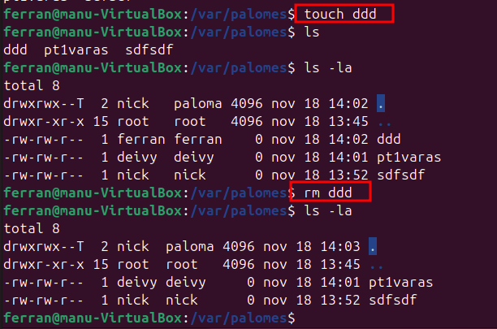

### ACLs

L'ACL és una llista detallada per a veure d'un fitxer o directori per superar les limitacions dels permisos básics de Linux.

#### Comandes

- Tenim dues comandes:
    - **setfacl:** Posar/modificar ACLs.
    - **getfacl:** Veure els ACLs.

##### Getfacl

##### Setfacl

Per a modificar un fitxer, la comanda és: ***setfacl -m u/g/o:usuari:permisos fitxer***

Un exemple de modificació, fem que l'usuari *segon* no tingui cap permís:

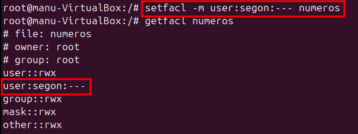

Si entrem amb l'usuari *primer*, veem que si que ens deixa entrar a la carpeta i crear un fitxer dins, però amb l'usuari *segon* no.

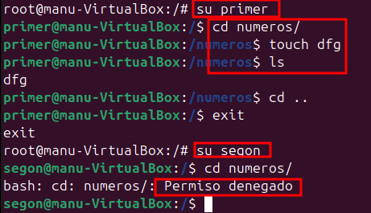

Si fem un ***setfacl -b fitxer***, deixem el fitxer com estava de base, reseteijant els permissos.

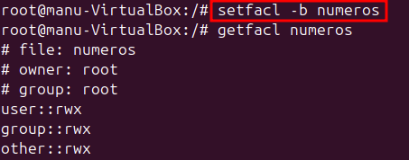

### Màscara

L'umask (User Mask) serveix per definir els permisos inicials per defecte.

Linux aplica per als directoris i per als fitxers els permisos màxims sempre, però es l'umask el que fa que canvii aquests permisos al crear-los.

- **Directoris:** 777 (rwxrwxrwx)
- **Fitxers:** 666 (rw-rw-rw)

Usualment, la màscara d'un usuari normal és 002 i la del root 022, ho podem mirar d'aquesta forma:

Una vegada creem els directoris o fitxers, el nostre sistems fa una operació amb l'umask per a sapiguer quins permisos finals tindrá.

L'operació és: **Base - Umask = Resultat Final** (per exemple; 777 - 022 = 755)

També podem fer l'operació en binari, com per exemple:

Permís base = 777 = 111 111 111

Hem de fer el NOT del permís Umask, és a dir, si l'umask és = 022 = 000 010 010, NOT Umask sería = 111 101 101

Calculem amb un AND del permís base i el NOT Umask.

- **PB =** 111 111 111
- **NU =** 111 101 101
- **AND =** 111 101 101

El **Resultat final** será = 111 101 101 = 755

En el següent exemple creem un directori i un fitxer amb la màscara d'usuari (002).

Com podem veure, el directori té els permisos ***rwxrwxr-x***, ja que ha aplicat: 777 - 002 = 775 = rwx(7)rwx(7)r-x(5)

I el fitxer té els permisos ***rw-rw-r--***, ja que ha aplicat: 666 - 002 = 664 = rw-(6)rw-(6)r--(4)

En el cas del *root*, faría els següents càlculs:
- **Directori:** 777 - 022 = 755 = rwx(7)r-x(5)r-x(5)
- **Fitxer:** 666 - 022 = 644 = rw-(6)r--(4)r--(4)

A part, podem canviar l'umask temporalment, fent un ***umask x*** (x = número de màscara desitjada).

Si creem un directori i un fitxer de nou, com abans, ens quedarà amb els següents permisos:

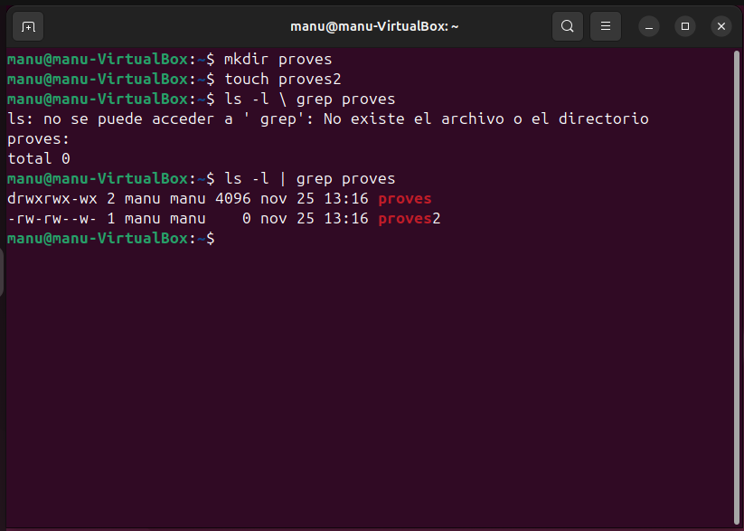

**Directori:** 777 - 004 = 773 = rwx(7)rwx(7)-wx(3)

**Fitxer:** 666 - 004 = 662 = rw-(6)rw-(6)-w-(2)

Altres formes de canviar la màscara, però de forma permanent, és:

**login.defs**

En aquest fitxer, si ho modifiquem, el que farà será canviar la màscara a tots els usuaris que es creein des d'aquell moment.

**.profile**

Si entrem a aquest fitxer i editem l'umask aquí, el que farà és canviar la màscara permanentment per aquell usuari.

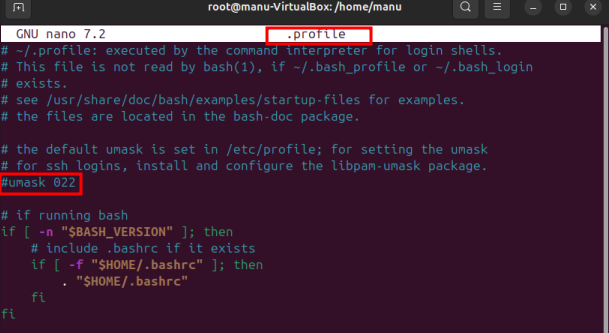

## EXERCICIS EXTRA

### USERADD - ASIGNAR HOME PASSWORD ETC EN NOMÉS UNA COMANDA

Podem afegir un usuari amb useradd, amb tot el que necessitem des de una mateixa comanda, que és la següent:

***sudo useradd -m -d /home/max_personal -s /bin/bash -c "Max Power, Departament IT, 666-555-444" -u 2050 -g users -G sudo,docker,adm -e 2025-12-31 -k /etc/skel_especial -p $(openssl passwd -6 contrasenya) max***

- **-m:** Crea el directori Home.
- **-d /home/max_personal (Directory):** Opcional. Per defecte la carpeta home seria /home/max, pero amb això podem modificar-la.
- **-s /bin/bash:** Definim que faigui servir l'interpret Bash.
- **-c "..." (Comment/GECOS):** Omple el camp 5 de /etc/passwd. Podem posar el que vulguem.
- **-u 2050 (UID):** Per defecte, Linux assigna el següent número lliure (ex: 1001, 1002...). Amb aquesta opció forcem un número concret.
- **-g users (Grup principal):** Defineix el grup primari (GID).
    - Si no ho poses, es crea un grup nou anomenat max.
    - Si poses -g users, l'usuari pertanyerà al grup genèric "users" i no tindrà grup propi.
- **-G sudo,docker,adm (Grups secundaris):** 
    - sudo: Per ser administrador.
    - docker: Per usar contenidors.
- **-e 2025-12-31 (Expire Date):** Seguretat. El compte es bloquejarà automàticament en aquesta data (format AAAA-MM-DD).
- **-k /etc/skel_especial (Skeleton):** En lloc de copiar els fitxers base de /etc/skel, copiarà els fitxers d'una altra carpeta que haguem creat amb anterioritat.
- **-p $(openssl passwd -6 la_meva_contrasenya):** Definim la contrasenya. El que passa aqui, és que per a poder afegir la contrasenya, ha de ser encriptada, en *hash*. Requereix tenir el Openssl instal·lat per generar el hash al moment.

### QUINA COMANDA O QUINES COMANDES HE D'UTILITZAR QUAN VULL CAMBIAR UN NOM D'USUARI "CORRECTAMENT" (tot lo relacionat)

- Per cambiar el nom d'usuari: ***sudo usermod -l usuari usuariNou***
- Per cambiar el nom del grup: ***sudo groupmod -n grup grupNou***
- Per cambiar la carpeta personal i moure el contingut a la vegada: ***sudo usermod -d /home/usuari -m usuariNou***

# Gestió de processos

Un procés es defineix com una instància d'un programa en execució que conté un context (registres de CPU, pila, mapes de memòria i descriptors de fitxers).

## Eines per veure processos

### top / htop / btop

Mostren l'activitat del sistema en temps real. `btop` és més visual i interactiu.

`top`

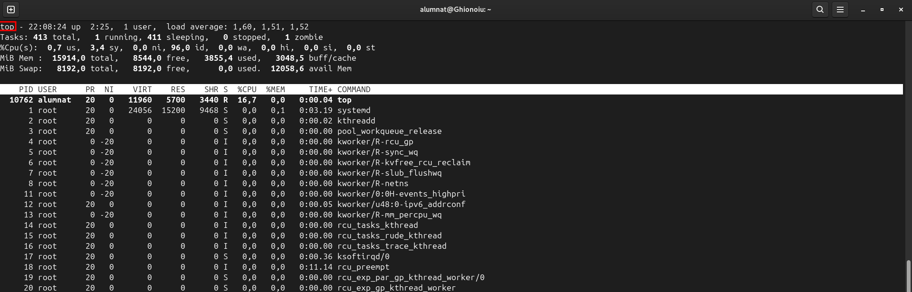

`htop`

`btop`

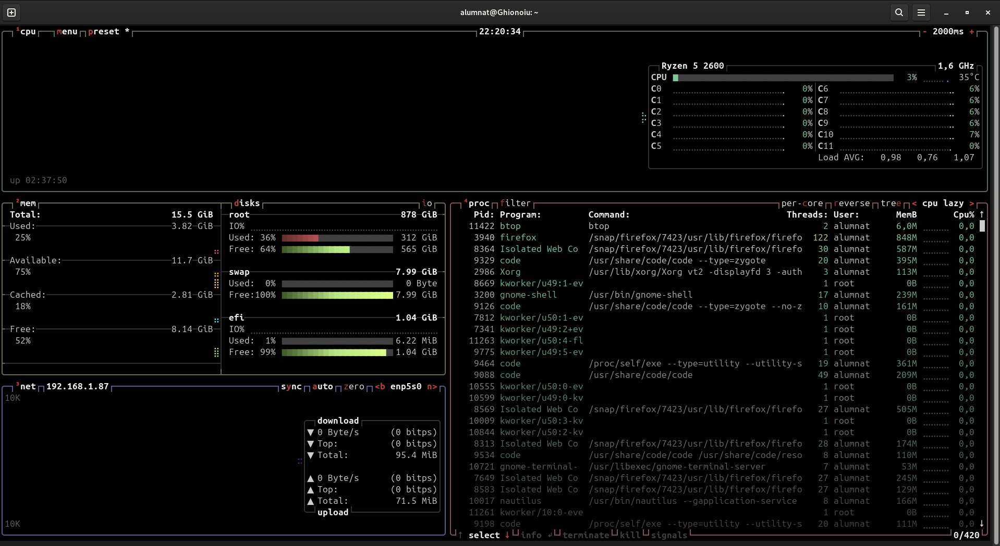

#### PR i NI

Quan mirem en una d'aquestes eines, veiem dues columnes relacionades amb la prioritat:

| Columna | Nom | Descripció |
| :---: | :--- | :--- |
| **NI** | **Nice** | És el valor que **l'usuari pot modificar**. Indica com d'"amable" és el procés amb els altres. |
| **PR** / **PRI** | **Priority** | És la prioritat **real** que utilitza el Nucli. L'usuari no la toca directament; el Nucli la calcula basant-se en el *Nice*. |

##### L'escala de valors "Nice"

El rang de valors NI funciona a la inversa:

* **-20:** Màxima Prioritat (Menys "amable", vol tota la CPU per a ell).
* **0:** Prioritat per defecte (La majoria de programes).
* **+19:** Mínima Prioritat (Molt "amable", només usa CPU si ningú més la vol).

> Com més baix és el número, més prioritat té el procés.

###### nice i renice

- **`nice -n [valor] [procés]`**: Iniciar un procés en especific amb prioritat modificada.
- **`renice -n [valor] -p PID`**: Modificar un procés que ja està en execució.

### pstree

Mostra la jerarquia de processos en format d'arbre. Útil per veure qui ha executat què.

| Paràmetre | Descripció |
| :--- | :--- |
| **-p** | Mostra PIDs. |
| **-u** | Mostra usuaris. |
| **-h** | Ressalta el procés actual. |

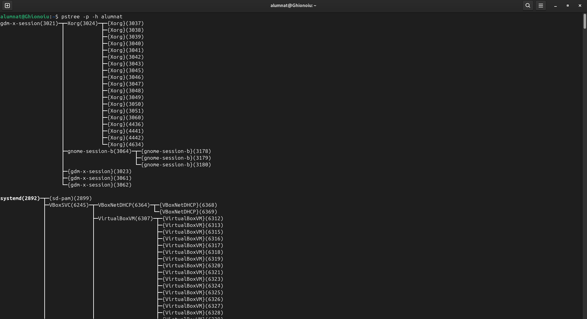

Si ho executem en root, ens apareixerà els processos de root.

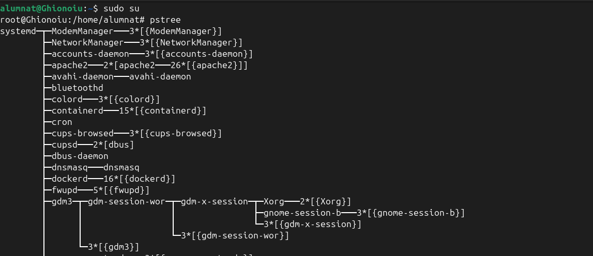

També podem filtrar per usuari o per procés en concret amb `grep`.

### ps

És la forma més completa de veure tots els processos amb detall de recursos (CPU/Memòria).

- **a:** Mostra processos de tots els usuaris que tinguin un terminal (TTY) associat.
- **u:** Mostra el format orientat a l'usuari (columnes %CPU, %MEM, START).
- **x:** Inclou processos que no tenen terminal (serveis, dimonis, processos en arrencada).

| Columna | Descripció Tècnica |
| :--- | :--- |
| **USER** | L'usuari propietari del procés (determina els permisos d'accés). |
| **PID** | **Process ID**. Identificador numèric únic del procés. |
| **%CPU** | Percentatge de temps de CPU utilitzat des de l'última actualització. |
| **%MEM** | Percentatge de memòria física (RAM) realment utilitzada. |
| **VSZ** | **Virtual Memory Size**. Mida total de memòria que el procés pot accedir (inclou swap i llibreries no carregades). És una "promesa" de memòria. |
| **RSS** | **Resident Set Size**. Memòria física (RAM) que ocupa ara mateix. És la memòria "real". |
| **TTY** | Terminal associat al procés (`?` indica un dimoni/servei sense terminal). |
| **STAT** | Codi d'estat del procés (R, S, D, Z, T...). |
| **START** | Hora o data exacta en què es va iniciar el procés. |
| **TIME** | **Temps de CPU acumulat**. Suma total de minuts/segons que el processador ha treballat per al procés (no és el temps des de l'inici). |
| **COMMAND** | La comanda exacta i els arguments que han iniciat el procés. |

#### Taula d'Estats (STAT)
Els estats s'identifiquen a la columna `STAT` quan utilitzem eines com `ps` o `top`.

| Codi | Nom de l'Estat | Descripció |
| :---: | :--- | :--- |
| **`R`** | **Running** / Runnable | El procés s'està executant a la CPU o està a la cua d'execució (*runqueue*) esperant torn. |
| **`S`** | **Interruptible Sleep** | El procés "dorm" esperant un esdeveniment (input d'usuari, dades de xarxa, timers). |
| **`D`** | **Uninterruptible Sleep** | Espera crítica d'Entrada/Sortida (I/O) de maquinari. El nucli bloqueja la interrupció per evitar corrupció de dades. |
| **`Z`** | **Zombie** (Defunct) | El procés ha finalitzat l'execució (`exit`), però el pare encara no ha llegit el codi de sortida. No consumeix memòria, només ocupa un PID. | 
| **`T`** | **Stopped** | L'execució s'ha suspès manualment (ex: `Ctrl+Z`) o per un depurador. |

## Senyals de control (kill)

A Linux, la comanda `kill` no serveix només per "matar", sinó per enviar qualsevol dels 64 senyals disponibles al nucli. Aquests són els més comuns per a l'administració de sistemes:

| ID | Nom POSIX | Efecte Principal | Descripció Tècnica i Ús |
| :---: | :--- | :--- | :--- |
| **1** | `SIGHUP` | **Recarregar Config** | *Signal Hang Up*. S'usa per dir que recarreguin els seus fitxers de configuració sense aturar el servei. |
| **2** | `SIGINT` | **Interrupció** | *Signal Interrupt*. És el senyal que s'envia quan fem `Ctrl+C` a la terminal. |
| **3** | `SIGQUIT` | **Sortida amb Error** | *Signal Quit*. Similar a `SIGINT` (s'activa amb `Ctrl+\`), però força el procés a generar un fitxer **Core Dump** (bolcat de memòria) abans de morir, útil per a depuració. |
| **9** | `SIGKILL` | **Matar Forçosament** | *Signal Kill*. **No es pot ignorar ni capturar.** El nucli elimina el procés immediatament de la CPU i la memòria. El procés no té temps de guardar dades ni tancar fitxers. |
| **15** | `SIGTERM` | **Terminació Suau** | *Signal Terminate*. És el **senyal per defecte** de la comanda `kill`. Demana al procés que es tanqui, donant-li temps per guardar l'estat i alliberar recursos. |
| **18** | `SIGCONT` | **Continuar** | *Signal Continue*. Reprèn l'execució d'un procés que estava aturat (en estat `T`). |
| **19** | `SIGSTOP` | **Pausar** | *Signal Stop*. Atura l'execució del procés (el posa en estat `T`) sense matar-lo. **No es pot ignorar.** Equival a prémer `Ctrl+Z`, però enviat programàticament. |

### Exemples d'ús:

`Ctrl+C`, `Ctrl+Z` i `q` en `top`

Mentre estem executant `top` (o la majoria de programes interactius), les tecles de control envien senyals diferents al sistema:

#### 1. `Ctrl + C` (Terminate)
* **Senyal:** Envia **`SIGINT`** (Interrupció).
* **Efecte:** Finalitza el procés immediatament.
* **Resultat:** El programa `top` es tanca i s'elimina de la memòria. Tornes a la línia d'ordres (*shell*).

#### 2. `Ctrl + Z` (Suspend)
* **Senyal:** Envia **`SIGSTOP`**.
* **Efecte:** **NO tanca el programa.** El "congela" (pausa) i l'envia al segon pla (*background*).
* **Resultat:**
    * Sembla que has sortit, però el procés `top` continua ocupant memòria RAM.
    * Si fas un `ps aux`, veurem el procés en estat **`T`** (Stopped).

    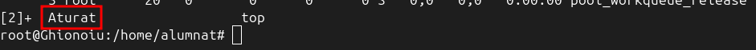

    També tenim que podem iniciar un procés en segon pla, afegint un `&`al final.

    
    
* **Com recuperar-lo?**
    1. Executa `jobs` per veure els processos aturats.

    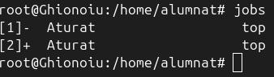

    2. Executa `fg` (*foreground*) per tornar a obrir el `top` on el vas deixar.
    

#### 3. Tecla `q` (Quit)
* **Efecte:** És la forma estàndard i neta de sortir de `top`.
* **Resultat:** El programa es tanca internament de forma controlada, sense necessitat d'enviar senyals externs d'interrupció.

#### 4. kill -9 PID

L'ús de l'opció `-9` envia el senyal **SIGKILL**. A diferència del `kill` normal, el `-9` és una ordre directa al nucli del sistema per eliminar el procés immediatament.

Tinc VirtualBox obert, i amb la comanda `top` puc veure quin PID té.

Ara veem que la instància de VirtualBox ja no la tinc iniciada, ja que l'hem matat.

# Còpies de seguretat i automatització de tasques

## Còpies de seguretat

Les copies de seguretat garanteixen la continuïtat i la integritat de la informació davant de qualsevol desastre.

### Objectiu

L'objectiu principal és la recuperació. Una còpia de seguretat no serveix de res si no es pot restaurar. Ens protegeixen contra:
- **Errades de maquinari:** Discos durs trencats, servidors cremats.
- **Error humà:** Esborrar fitxers accidentalment.
- **Ciberatacs:** Ransomware o virus.
- **Desastres físics:** Incendis, inundacions o robatoris.

### Tipus de còpies

No totes les còpies funcionen igual. L'elecció depèn de l'espai que tinguis i de la rapidesa amb què necessitis recuperar les dades.

#### Còpia Completa (Full Backup)

És una còpia exacta de totes les dades seleccionades.
- **Avantatge:** La restauració és la més ràpida (només necessites l'últim fitxer complet).
- **Desavantatge:** Ocupa molt espai i triga molt a fer-se.

#### Còpia Incremental

Copia només les dades que han canviat des de l'última còpia de qualsevol tipus (sigui completa o incremental).
- **Avantatge:** És molt ràpida i ocupa molt poc espai.
- **Desavantatge:** La restauració és lenta. Necessites l'última còpia completa + totes les incrementals posteriors fins al dia d'avui. Si falla una intermèdia, es trenca la cadena.

#### Còpia Diferencial

Copia totes les dades que han canviat des de l'última còpia completa.
- **Avantatge:** Restauració més ràpida que la incremental (només necessites la Completa + l'última Diferencial).
- **Desavantatge:** Ocupa més espai que la incremental, ja que cada dia copia de nou tots els canvis acumulats des de l'inici del cicle.

## Comandes Backups

### Teoria

Tenim 3 comandes per a poder aconseguir fer còpies.

#### `cp` (Copy)

És la comanda més bàsica. Funciona a nivell de sistema de fitxers. Llegeix un fitxer, crea un de nou al destí i hi escriu les dades.

**Com funciona:** El sistema operatiu mira el fitxer A, llegeix el seu contingut i l'escriu al lloc B. Si el fitxer B ja existeix, normalment el sobreescriu completament, sense comprovar si és igual o diferent.

#### `rsync` (Remote Sync)

Aquesta és l'eina estàndard per a còpies de seguretat de fitxers. Funciona amb un algorisme de "Delta Encoding".

**Com funciona:** Primerament compara l'origen i el destí.
- Revisa la mida i la data de modificació.
- Si el fitxer ha canviat, calcula quina part (blocs) del fitxer és diferent.
- Només transfereix les parts noves o canviades a través de la xarxa o el disc.

#### `dd` (Disk Dump)

Mentre `cp` i `rsync` treballa en fitxers i carpetes, `dd` treballa a nivell de blocs (bits i bytes).

**Com funciona:** `dd` llegeix el dispositiu d'entrada bit a bit i l'escriu al dispositiu de sortida. Ho copia tot. Si tens un disc dur de 500 GB però només estàs usant 50 GB de dades, dd copiarà els 500 GB (incloent-hi l'espai buit i fitxers esborrats que encara són magnèticament al disc).

### Pràctica

#### Preparació màquina

A la nostra màquina virtual, afegim dos discs de 1 GB cadascuna. 

Entrem a la terminal i fem un `fdisk -l` i busquem els discs.

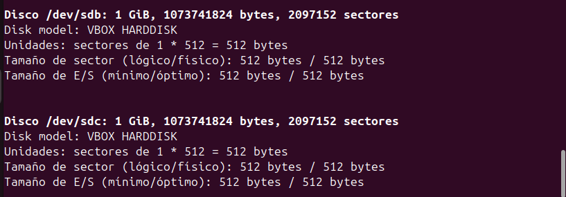

Li fem una partició completa a cada disc i lis donem format ext4 als dos.

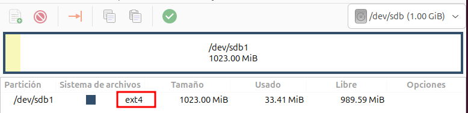

Creem una carpeta anomenada ***prova*** i creem un arxiu anomenat ***prova2***.

Ara anirem al directori */var* i crearem un directori anomenat ***copies***, on montarem la unitat sdb1.

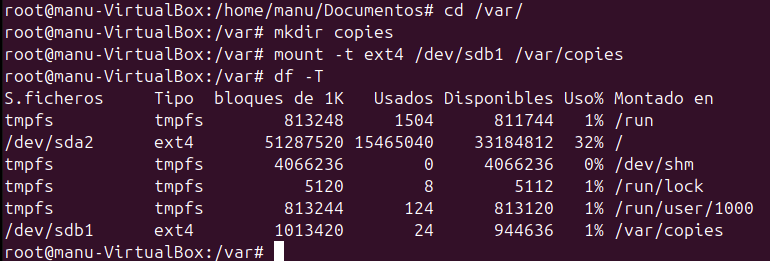

Ara ja podem veure les següents comandes.

#### `cp` (Copy)

En aquest cas, farem una còpia recursiva de les dades de la carpeta Documents. Veem que es fa una còpia ràpida de tot el que tenim, i si eliminem la carpeta de la ruta de on copiem i creem un altre fitxer, i després tornem a fer un `cp -R`, a la carpeta copies, segueix estant tots els arxius copiats anteriorment i el de després.

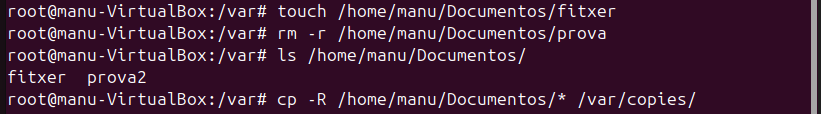

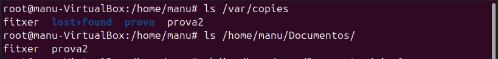

#### `rsync` (Remote Sync)

Amb aquesta comanda el que fem és sincronitzar les carpetes, és a dir, actualitzant només les dades que s'han modificat.

#### `dd` (Disk Dump) 

Aquí clonem la partició sdb1 a sdc1 i verifiquem amb md5sum que tenen el mateix hash, mostrant que són còpies.

## Programes backups

### Duplicity

Duplicity és una eina de excel·lent per fer còpies de seguretat. Té dues característiques clau que la fan molt potent:
- **Xifratge GPG:** Totes les dades es xifren abans de sortir del teu ordinador (ningú les pot llegir sense la clau).
- **Eficiència (Rsync):** Utilitza l'algoritme rsync per desar només les parts dels arxius que han canviat, estalviant molt espai i ample de banda.

#### Guia d'ús

Primerament, hem de preparar l'instància. Per això, he fet ús de una de les particions que tenia d'1GB. La he formatat a mkfs4 i he creat la carpeta /backup.

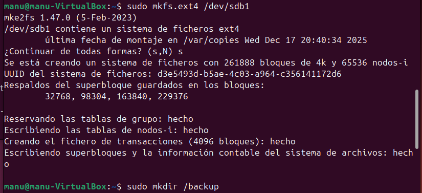

Una vegada creada la carpeta, hem d'entrar a fstab i afegir el directori que hem creat.

Ara si, instal·lem duplicity

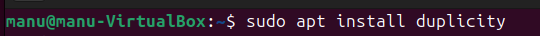

Ara ja podem fer la còpia, que la farem de la carpeta Documentos i li ficarem destinació al escriptori.

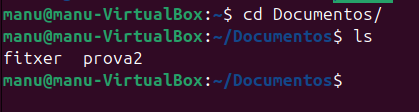

Com que Duplicity xifra les dades, necessita una clau o contrasenya. Per no haver d'escriure-la cada vegada, la definim com a variable d'entorn, això farà que no ens demani la contrasenya ja que la ficarà automàticament.

Si no, ho podem fer manualment, ens demanarà la contrasenya sempre.

La comanda és la següent: `duplicity [origen] [destí]`

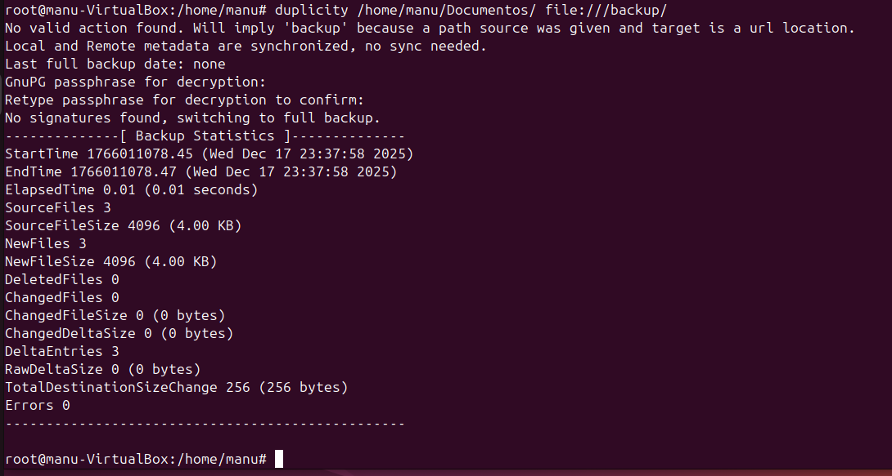

Si ara mirem la carpeta /backup, veurem que s'ha creat diversos fitxers. Aquest és el nostre backup.

Finalment, per recuperar dades, simplement inverteim l'ordre: `duplicity restore [origen_backup] [destí_on_recuperar]`.

Si volem restaurar un únic fitxer: `duplicity restore --file-to-restore [document] --time 3D [origen_backup] [destí_on_recuperar]`.

##### Protocols

Duplicity suporta molts destins diferents. Només hem de canviar el prefix de la URL de destí:

- **Local:** file://
- **SSH/SCP:** scp:// o sftp://
- **Amazon S2:** s3://
- **Google Drive:** gdocs://
- **WebDAV:** webdav://

### Deja-Dup

En realitat, ***Déjà Dup*** és *duplicity*, però amb una interfície gràfica. Ell s'encarrega de totes la comandes, xifratge, anacron, etc.

Instalem deja-dup.

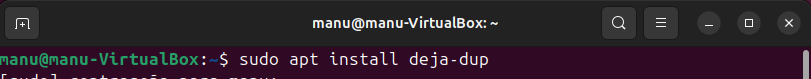

Ens instalará una aplicació, no s'anomenará Déjà Dup, si no, depenent de l'idioma de la màquina, en aquest cas *Respaldos*.

Li donem a *Cree su primer respaldo*.

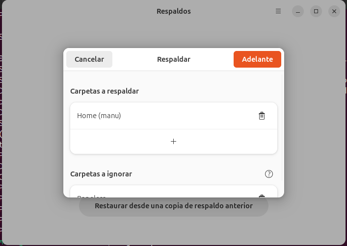

Aqui ja podem escollir quines carpetes volem fer la còpia i de quines ignorar-ho. Li donem a següent i veem que podem escollir on fer aquesta còpia, ho farem en local i que ho faigui al escriptori, per a veure com ho fa.

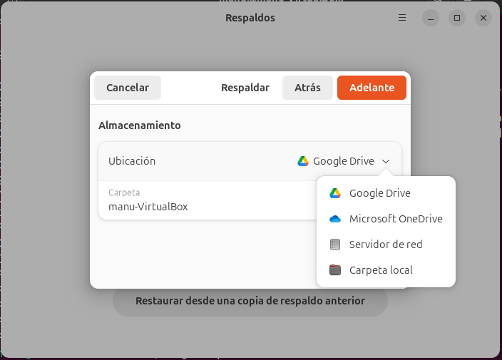

Ara veem que ens demanarà la contrasenya per a tenir-ho xifrat. Fiquem la contrasenya que volem i *endavant*.

Veem que ja està creant-se la còpia.

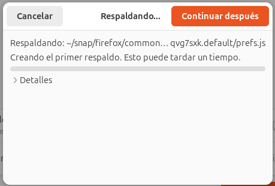

Ara veem que a l'escriptori s'han creat els arxius de còpia.

Més opcions d'aquesta aplicació és crear una còpia periòdica.

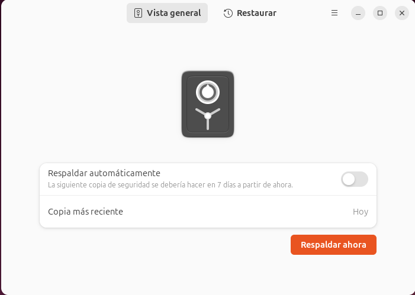

A part, també podem restaurar arxius i directoris.

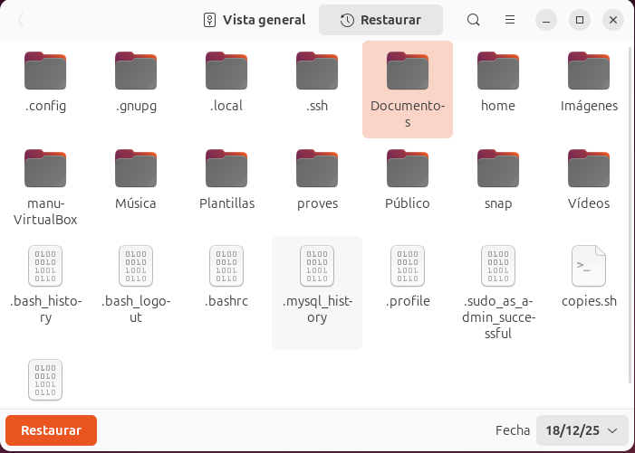

## Automatització scripts

### Teoria

#### Cron

Executa tasques programades en una data i hores específiques. Si el sistema està apagat, la tasca es perd. És ideal per a tasques en dates i hores concretes i per accions especifiques d'un usuari.

#### Anacron

És ideal per executar tasques periòdiques, on no cal una data i una hora específica. Normalment s'utilitza per a tasques de manteniment del sistema. No requereix que el sistema estigui obert, perque quan s'obrigue ja s'executarà.

### Practica

#### Cron

Hi han dos documents que podem editar per afegir tasques programades. El crontab d'usuari (el teu propi fitxer) i el crontab del sistema.

***Crontab del sistema:*** Especifiquem quin usuari executa la comanda (per exemple, root). Als crontabs d'usuari no cal, perquè s'executa com l'usuari que el crea.

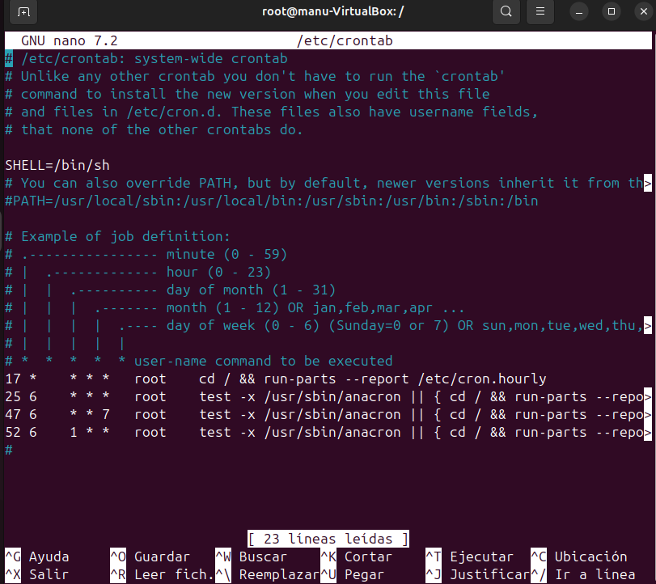

***Crontab de l'usuari:*** Per editar el crontab d'un usuari en específic fem: `crontab -e -u [usuari]`.

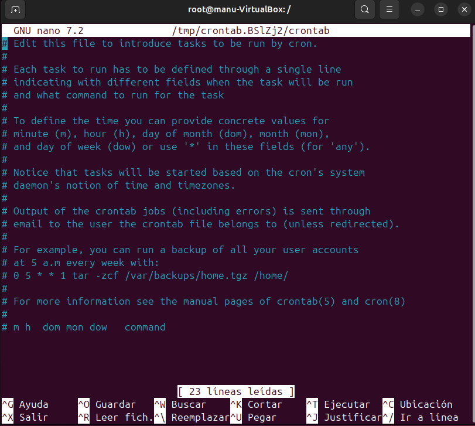

#### Anacron

L'únic document necessari en anacron és /etc/anacrontab.

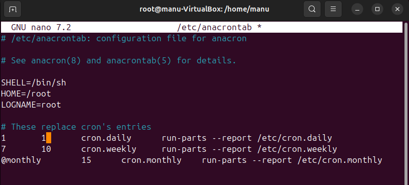

Per a mostrar la seva funcionalitat, creem un script que ens crei un fitxer comprimit del directori Imágenes, on creem dos fitxers de prova.

Creem un fitxer anomenat ***copies.sh***, on ficarem el script que volem. Hem ficat que el nom del fitxer tingui el TIMESTAMP de quan s'ha creat.

Ara li donem permís d'execució al fitxer i veem amb `ls -l` que si que els té.

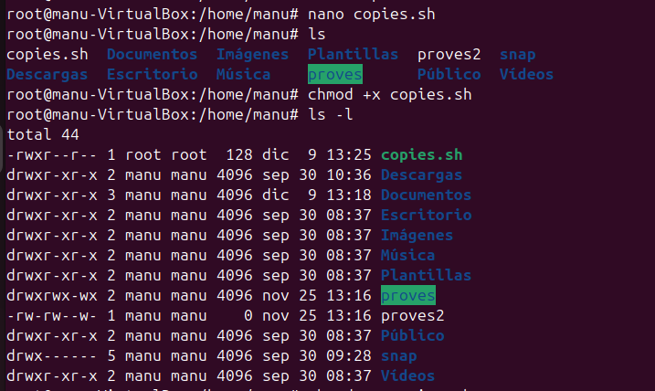

El que hem de fer ara és entrar a l'arxiu de crontab, mostrat a l'apartat de *Cron* i afegir a l'última línea, la tasca que volem realitzar.

Ara esperem fins l'hora que hem ficat i veem que ens ha creat l'arxiu i si entrem, estàn els arxius que hem demanat que faigui la còpia.

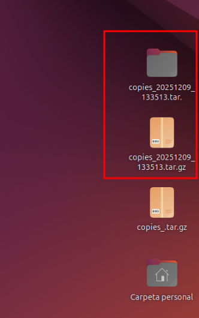

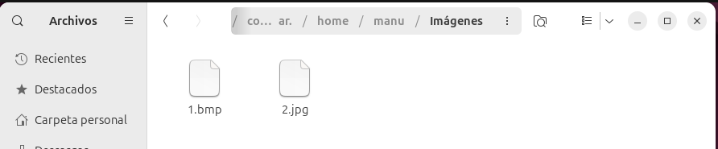

Finalment, per acabar provant un altre métode, és dir-li que cada día que obrim la màquina, ens cree l'arxiu. Això ho fem gràcies a l'arxiu cron.daily (tenim més arxius així, que podem fer servir per si volem setmanalment per exemple).

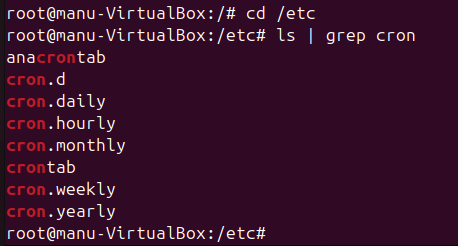

Per a fer-ho, copiem el script que hem fet a la carpeta */etc/cron.daily/copies*.

Com ja hem iniciat la màquina, si fem reboot, no ens crearà el fitxer, ja que és només quan inicies per primera vegada en aquell día. Per això, hem d'editar el fitxer cron.daily i eliminar l'entrada que té i deixar-ho buit.

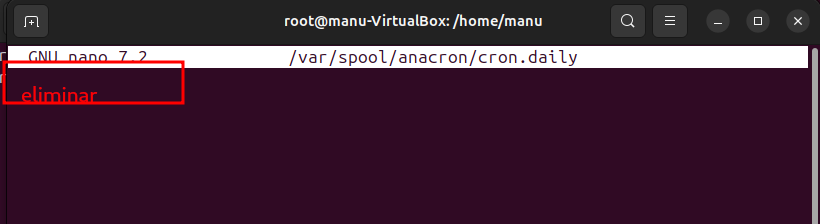

Fem reboot i esperem un minut. 

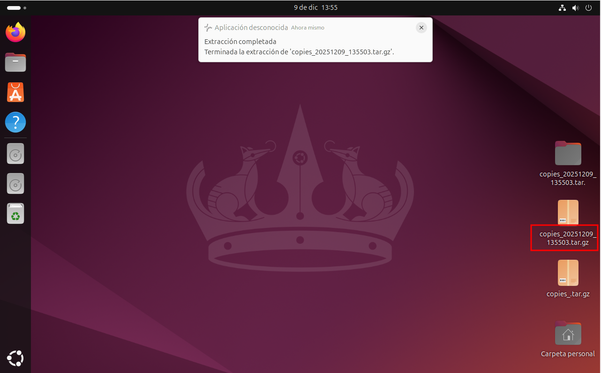

Veem que ens ha creat correctament el fitxer.

# Quotes d'usuari

Les quotes d'usuari (o disk quotas) són un mecanisme que permet als administradors limitar la quantitat d'espai de disc o el nombre d'arxius que un usuari (o un grup) pot utilitzar.

Hi ha dos tipus de recursos que es controlen amb les quotes:
- **Límit de Blocs (Espai):** Limita la quantitat de dades (en KB, MB o GB).
- **Límit d'Inodes (Arxius):** Limita la quantitat d'arxius i directoris, independentment de la seva mida.

## Tipus de límits

- **Soft Limit:** L'usuari pot superar aquest límit temporalment, però rebrà avisos que s'està acostant al màxim. Si no redueix l'espai abans que passi el període de gràcia (habitualment 7 dies), el sistema li bloquejarà l'escriptura.
- **Hard Limit:** L'usuari no pot superar aquest límit. Si intenta guardar un fitxer que superi aquest límit, rebrà l'error `Disk quota exceeded` immediatament i l'escriptura fallarà.

## Practica

Instal·lem quota.

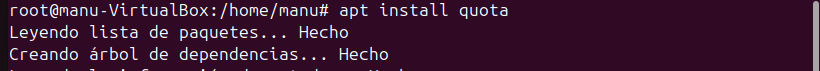

Entrem a /mnt/ i creem uun directori.

Per a fer aquest procediment, he fet servir el 2n disc d'1GB que he afegit a la màquina.

Ara, el que fem és editar el fitxer fstab. `nano /etc/fstab`. Afegint els paràmetres que demana.

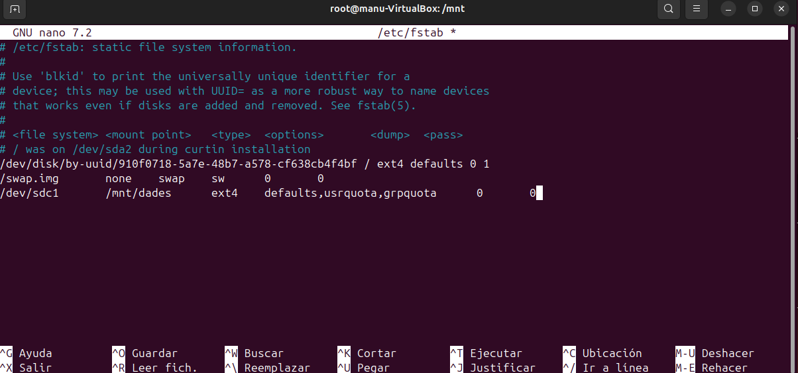

Una vegada fet, veem que si fem un `ls` a la ruta on es troba el directori que hem creat i afegit al fstab, no ens apareix els fitxers que en teoria deurien sortir una vegada afegit les quotes. 

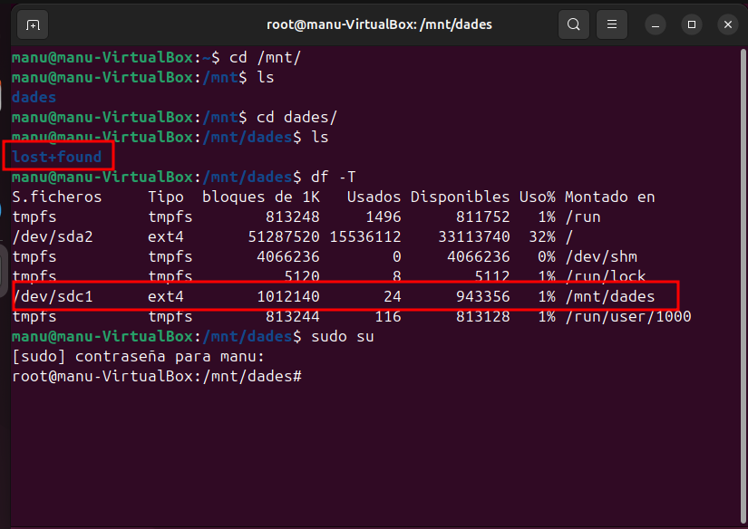

Per això, el que fem, és fer un `quotacheck -cug /mnt/dades`. Ara ja podem veure que s'han creat els fitxers.

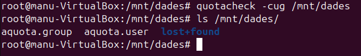

Per si acas, per assegurar-mos del bon funcionament, podem fer un `quotaon /mnt/dades`, però deuria estar activat (per desactivar-lo, fem el mateix pero en `quotaoff`).

Amb un usuari que tinguessim creat, o que podem crear ara per provar, podem veure quines quotes té aquell usuari en aquell directori.

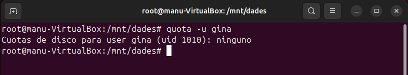

Ara, per editar la quota d'aquest usuari, utilitzem `edquota -u usuari`.

Com he explicat abans amb el ***Hard Limit*** i ***Soft Limit***, podem editar aquests paràmetres per a blocs o inodes. En aquest cas, editem per a blocs el *Soft Limit* a 1024 i el *Hard Limit* el configurem a 2048.

Ara podem començar a fer proves per a veure si funciona les quotes.

Crearem un fitxer de 800 KiB amb la comanda `dd` i veem que ens apareix que tenim usat 800, encara està dins del rang.

Tornem a crear un altre fitxer igual. Veem que ja l'espai utilitzat és 1600, sobrepassa el *Soft Limit* i ens apareix que tenim un període de gracia de 6 dies restants.

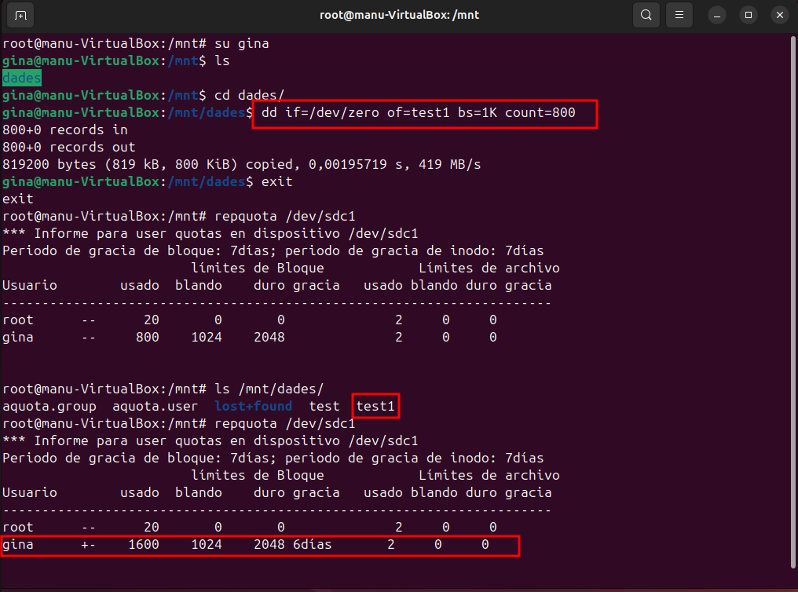

Repetim el procediment i finalment, veem que ens apareix l'error ***Se ha excedido la cuota de disco***. En alguns casos, el fitxer es creara buit, 0 KiB, pero en aquest cas, me l'ha creat fins omplir els 2048 KiB que tenia afegits al *Hard Limit*.

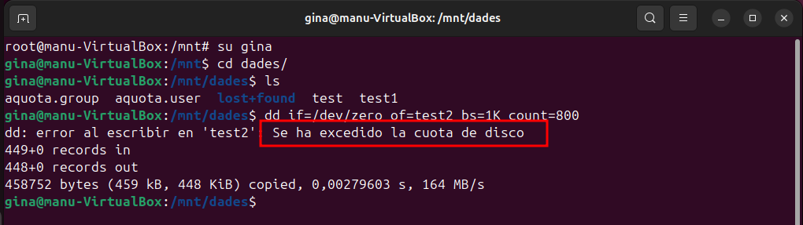

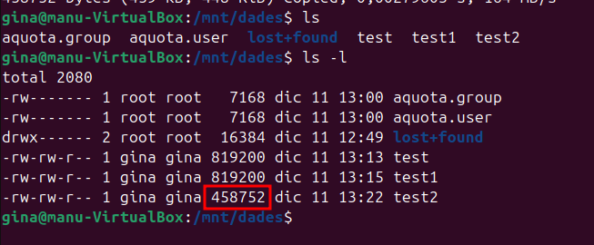

Ara, si desactivem la quota, podem crear l'arxiu sense problemes.

Finalment, si volem modificar el temps de gracia, podem fer un `edquota -t` i podrem editar-ho para tot els usuaris.

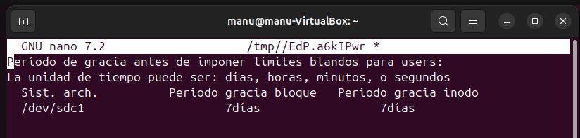