# Configuració Servidor - Client

Primerament, per a poder fer aquesta configuració, necessitarem dos màquines ubuntu, una per a fer la configuració de servidor i una altra per a la configuració de client.

Després, necessitarem crear una nova xarxa Nat, per a tenir les màquines en la mateixa.

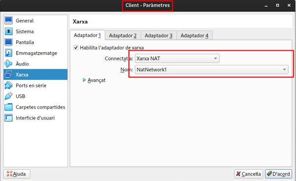

## Servidor

Una vegada iniciat, el que hem de fer és cambiar la IP a estàtica.

Fem un ping per a veure si tenim connexió.

Una vegada afegida la IP estàtica, canviarem el hostname.

Hem de canviar també al arxiu hosts a la segona IP, el nom que hi havia abans, amb el nom que li hem ficat al hostname, i després afegir una nova linea amb la IP estàtica que li hem ficat i el host, és a dir -> `hostname.domini.cat(com) hostname`, com a la següent captura.

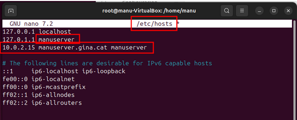

### Instal·lació LDAP

Una vegada ja hem configurat aquests arxius, fem un `apt update` per a poder instal·lar el següent paquet.

Quan el instal·lesem, li haurem de configurar una contrasenya.

Ara que ja el tenim instal·lat al nostre servidor, l'haurem de modificar, però abans fem un `slapcat` per veure la configuració inicial.

#### Configuració LDAP

Si fem un `dpkg-reconfigure` podrem configurar el LDAP com vulguem nosaltres. Aquesta serà la nostra configuració:

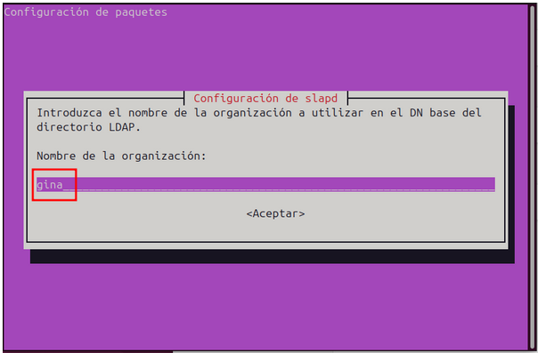

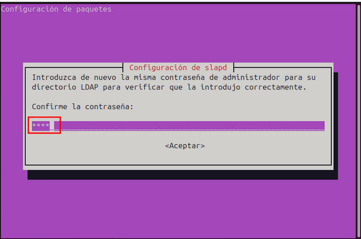

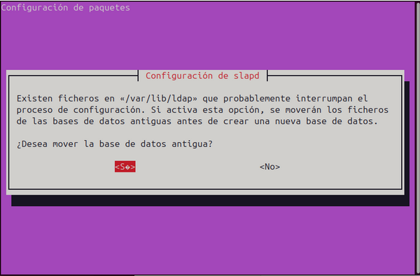

Ara ja el tenim configurat com nosaltres volem, però afegirem a part una configuració de UOs, usuaris i grups, que tenim en l'arxiu `arxius.zip`.

Descomprimim el .zip.

Modifiquem els arxius `uo.ldif`, `usu.ldif` i `grup.ldif` per a que concordin amb el nostre domini.

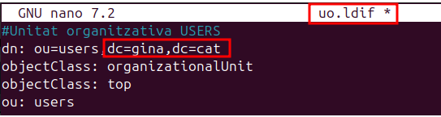

Una vegada modificats, els afegim al ldap.

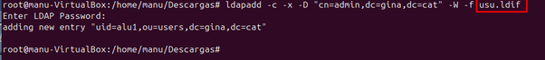

Comprovem amb un `slapcat`.

Ara ja tenim l'entorn servidor correctament modificat.

## Client

Haurem de fer el mateix que amb el servidor al principi, modificar la IP a estàtica i comprovar que podem fer-li ping al servidor.

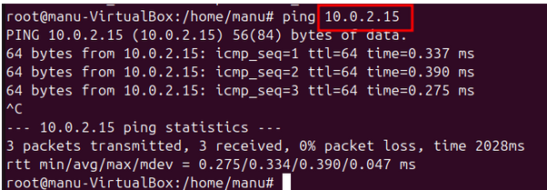

### Instal·lació LDAP

Aquí també haurem de instal·lar ldap, pero no és el mateix que en el de servidor.

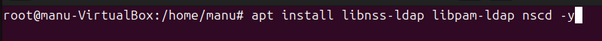

### Configuració LDAP

Una vegada instal·lat, ens apareixerà directament per a configurar el LDAP, la meva configuració es la següent.

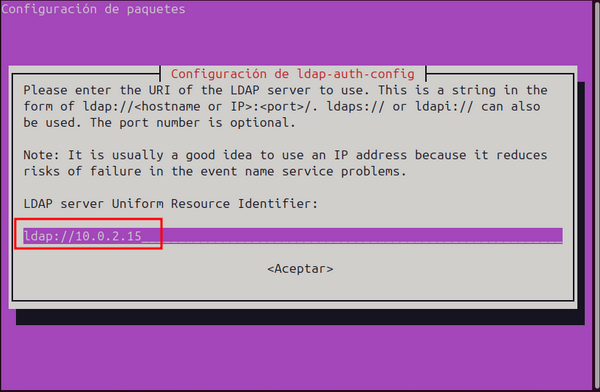

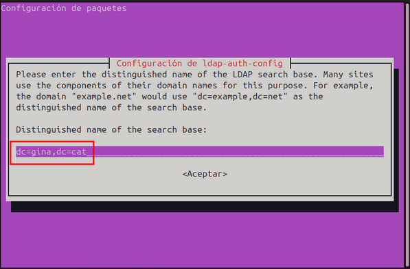

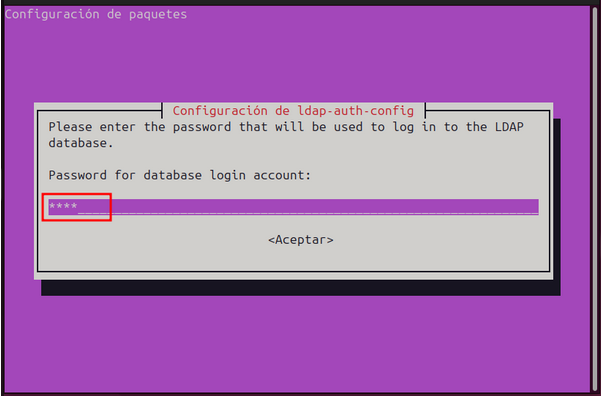

Igualment, si ens hem equivocat o trobem algún error, podem fer un `dpkg-reconfigure ldap-auth-config`.

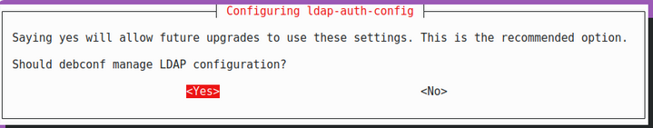

### Modificació fitxers

#### nsswitch

Hem d'afegir `ldap compat` al principi per a que primer comprovi al ldap per fer l’autenticació.

#### common-session

Hem d'afegir l'última linea que apareix al fitxer.

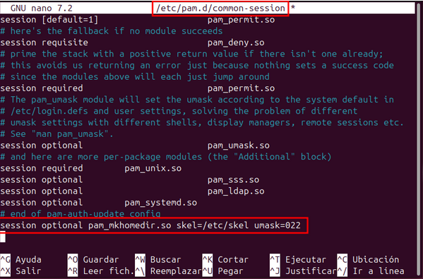

#### common-password

En aquest fitxer, on aparegui `use_authtok`, ho haurem d'eliminar.

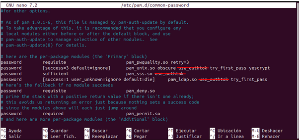

Ha de quedar així:

#### 50-ubuntu.conf

Afegim el greeter.

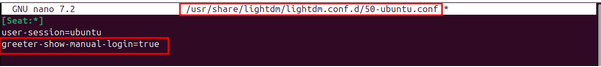

### Comprovació

Una vegada tenim tot això configurat, per a poder veure si ens hem pogut connectar al servidor, busquem un usuari que només està al servidor quan hem afegit els fitxers `.ldif`.

Comprovem que podem entrar.

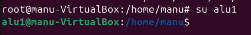

Ara, volem comprovar que puguem entrar per interfície gràfica. 

Hem d'afegir-lo i ficar la contrasenya d'aquest usuari (en aquest cas alu1).

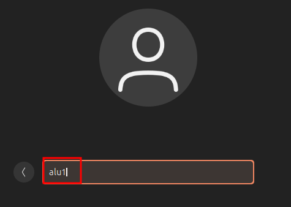

Comprovació final:

Ara ja tenim el client i el servidor configurat correctament.

# Servidor Samba

## Teoria

Un servidor Samba és per a compartir recursos, siguen fitxers, impresores, etc. Es pot compartir en clients Linux, Windows, i l'autenticació és a nivell d'usuari, que poden ser usuaris propis de Samba o usuaris de LDAP.

## Servidor

Instalem Samba

Creem carpeta i modifiquem els permisos, el grup i usuari.

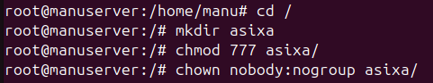

Creem 3 usuaris nous, 1 grup i afegim aquests usuaris al grup.

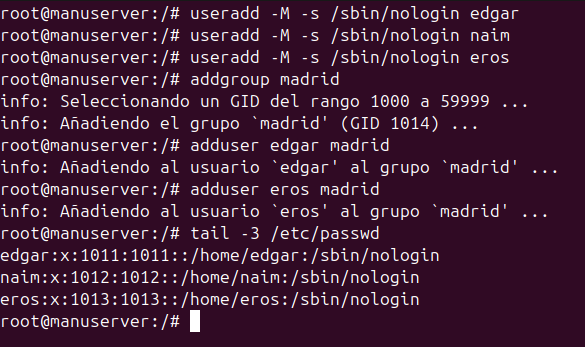

Li fiquem contrasenyes per poder entrar al client.

Hem d'afegir un recurs compartit nou al fitxer smb.conf.

Ara hem de fer un restart al servei de samba.

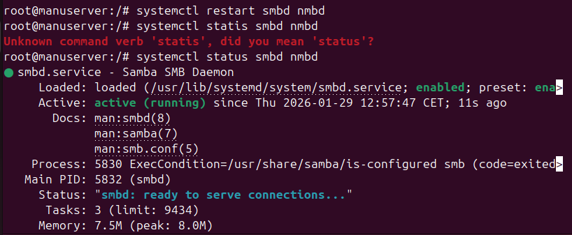

## Client

Hem de veure primerament si tenim connexió amb el servidor amb un ping.

Instalem smbclient.

Ara iniciem les proves.

Ens hem de connectar entrant a "Otras ubicaciones" i afegir "smb://ip_servidor/nom_recurscompartit/".

Ens hem connectat com anònim i hem creat una carpeta i ha funcionat, això és gràcies als permisos.

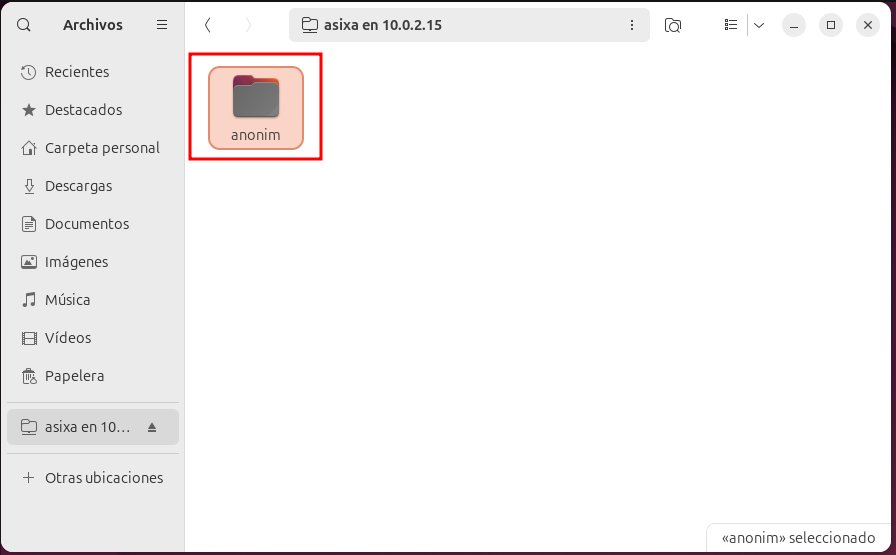

Ens connectem com naim i provem llegir i crear carpeta, tal i com hem ficat als permisos.

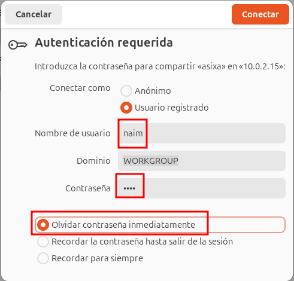

Ara ens connectem com eros, que pot llegir, pero no crear carpeta.

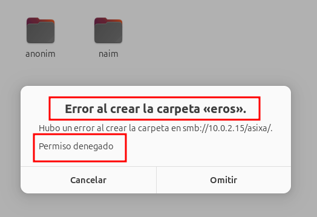

Finalment, ens connectem com edgar, que no pot accedir.

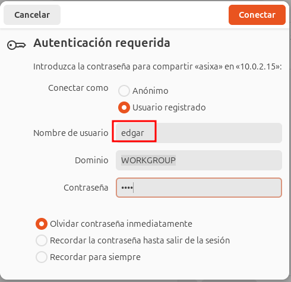

Quan li donem a connectar, no surt cap error, si no que el que fa es tornar a demanar la autenticació.

## Extra

# Servidor NFS

A nivell servidor

# Exercici LDAP

Per a aquest exercici hem de descarregar un entorn gràfic per a poder administrar LDAP.

Hi han diferents opcions per a descarregar, però jo ho faré amb `Apache Directory Studio (ADS)`.

## Instal·lació ADS

Primerament necessitem instal·lar java.

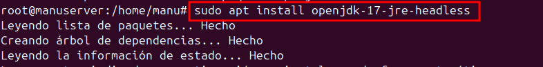

Ara podem descarregar-mos ADS de la seva pàgina web.

El descomprimim.

Movem a la carpeta `/opt/` la carpeta descomprimida.

Donem permisos d'execució.

Un pas previ que hem de fer abans d'executar, és modificar el fitxer .ini, ja que la versió de Java que utilitza és la 11 i nosaltres tenim la 17 (instal·lada previament).

Executem l'aplicació.

Ara que ja tenim l'aplicació instal·lada, hem de crear una connexió de LDAP.

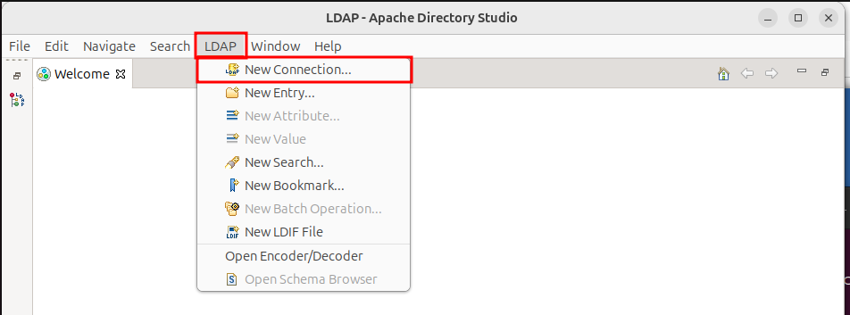

Fiquem el nom de connexió que volem i la IP del nostre server.

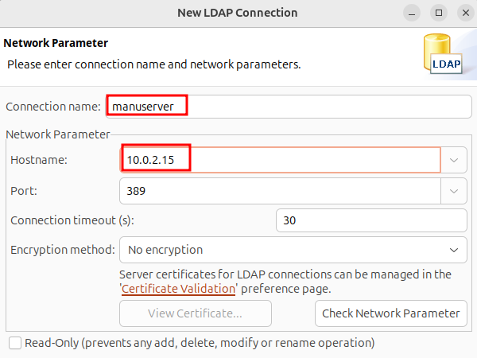

Li donem a next i ara ens demanarà el cn i dc i la contrasenya, que ja la tenim configurada anteriorment.

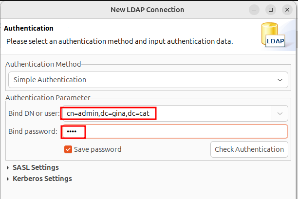

Si li donem a check authentication veurem si es correcte i li donem Finish.

Si entrem al LDAP Browser (a la esquerra), podrem veure ja el nostre servidor LDAP configurat.

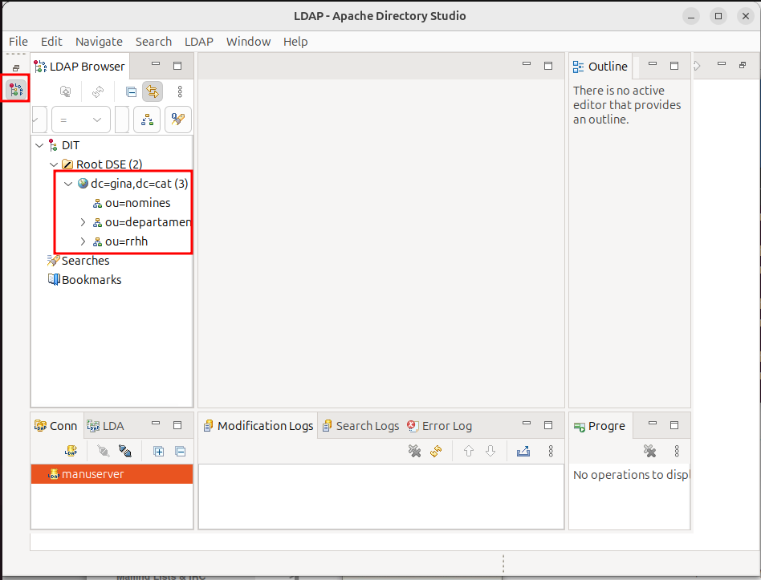

### Proves ADS

Ara procedire a crear un usuari i iniciar sessió per a mostrar el funcionament.

#### Crear usuari

Crearem una nova entrada fent-li clic dret al nostre domini.

El crearem de 0.

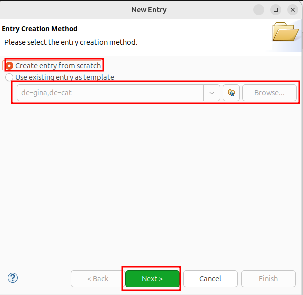

Ara ja podrem crear qualsevol objecte, afegint de la esquerra el tipus de OC que vulguem, crearem la UO.

Ara buscarem `ou` per a fer la organizationalUnit i li ficarem un nom.

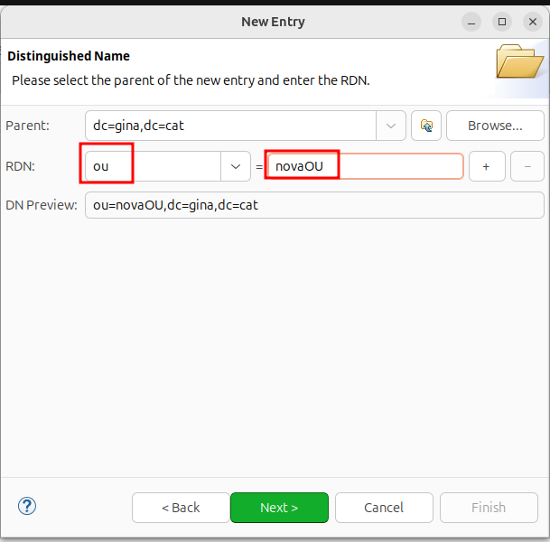

Ara que ja tenim la nova UO creada, creem un usuari.

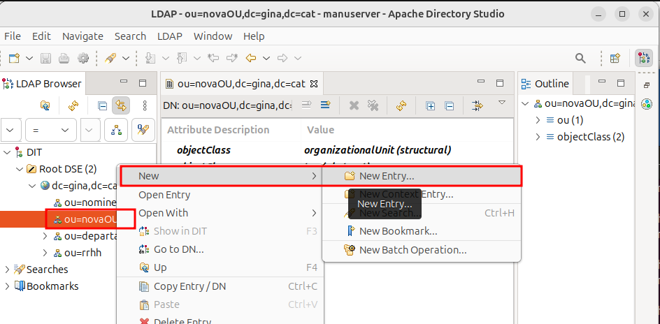

Busquem inetOrgPerson i posixAccount, que són necessaris per a que ens aparegui el usuari al client.

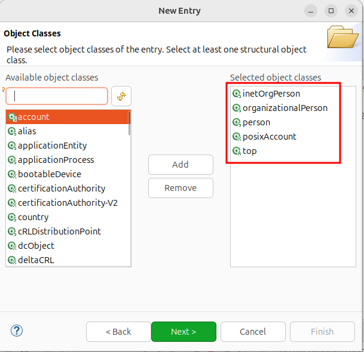

Al RDN li ficarem `uid` i li afegim el nom que volem.

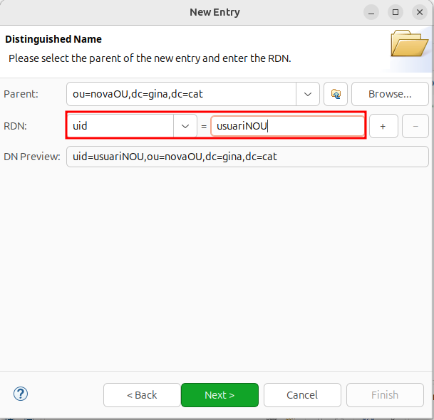

Per a afegir-li una contrasenya hem de afegir un nou atribut, fent clic dret i nou atribut.

Busquem `userPassword`.

Ara afegim la contrasenya (el meu cas, usuari), a part, podem afegir un métode de encriptació a la contrasenya si volem.

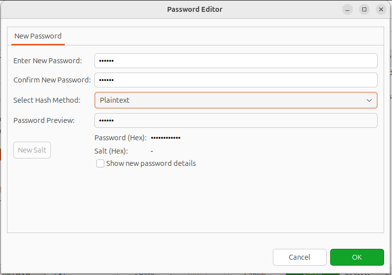

Haurém d'afegir també l'informació que ens sortia en roig.

Ara podem veure que ja tenim l'usuari creat.

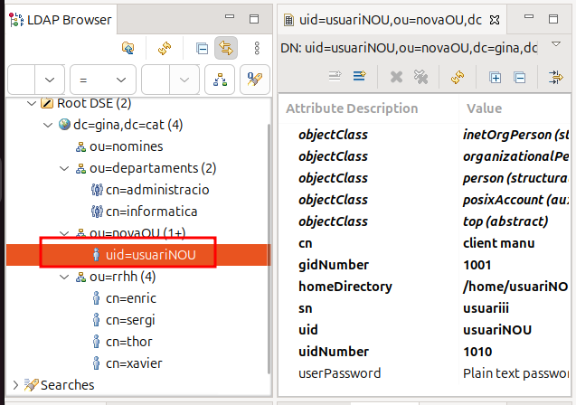

#### Inici sessió client

Iniciem el client i li donem a canviar d'usuari.

Ara li donem a que no està en la llista i afegim el nom d'usuari que li hem ficat al LDAP.

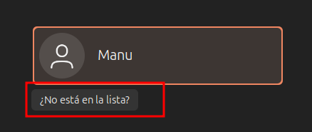

Afegim també la contrasenya i ja ens crearà l'usuari.

Ara ja podem veure a la terminal si està tot correcte.

## Fitxers ldif i comandes ldap (exercici moodle)

### Fes un dpkg-reconfigure slapd al servidor per tal de deixar la base de dades buida i només amb el domini i l’usuari admin creat. Comprova-ho amb un slapcat.

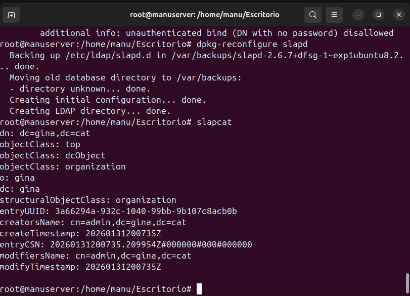

### Descarrega l'arxiu dades_pt10.ldif del moodle i amb la comanda ldapadd carrega els usuaris, grups i uos (Compte que el domini és vesper.cat, hauràs de modificar-lo pel teu)

### Fes un altre slapcat per tal de comprovar que les dades s'han carregat correctament

### 1. Crea un nou usuari directament al domini

L'afegim.

Ara el podem buscar.

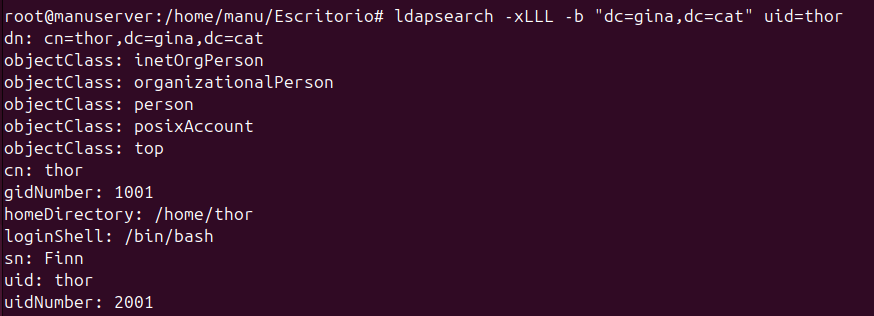

### 2. Crea una nova uo anomenada nòmines

L'afegim.

### 3. Mou l’usuari que has creat dintre de la uo nòmines

Afegim i confirmem.

### 4. Quants grups hi ha al domini vesper.cat?

Hi han 2 grups, informatica i administracio.

### 5. Afegeix l’usuari que has creat dintre d’un dels grups del domini

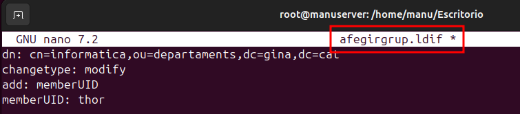

### 6. D’un sol cop: Afegeix un nou atribut opcional a l’usuari sergi, modifica el cognom de l’usuari sergi al valor Pallarés

No fiquem accents ja que no apareixerà el valor correctament.

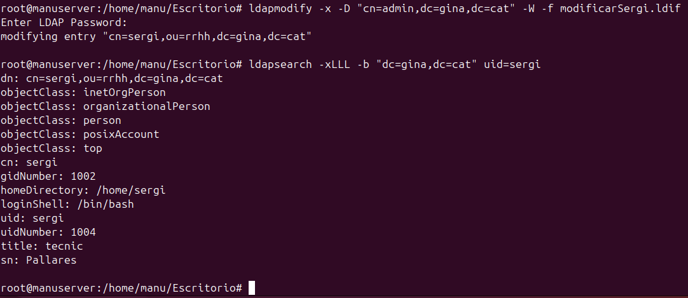

### 7. Quants usuaris hi ha dintre de la uo rrhh? Quins són?

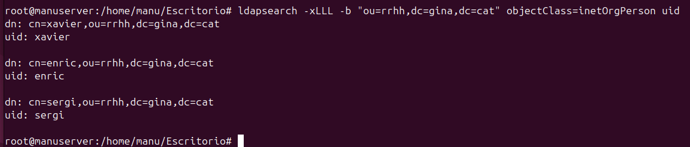

Hi han 3 usuaris, xavier, enric i sergi.

### 8. Esborra el gidNumber del grup informàtica

No el podem eliminar ja que possixGroup necessita obligatoriament aquest atribut.

### 9. Quantes uos hi ha al domini vesper.cat?

Hi han 3 UOs.

### 10. Modifica el cn de Xavier per Francesc Xavier

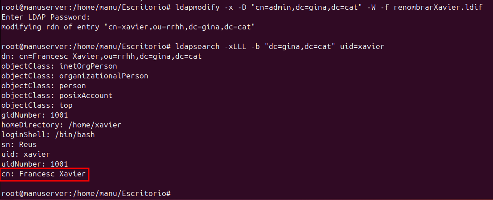

### 11. Esborra la uo nòmines

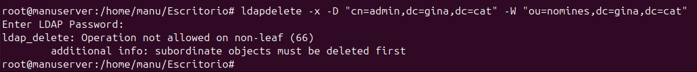

Com volem eliminar aquesta uo, pero no es pot, tal i com es veu, a causa dels usuaris que hi han afegits, eliminem aquests usuaris i tornem a provar.

Ara ja no ens apareix ni l'usuari ni el grup. 

### 12. Mostra els usuaris que tinguin com a grup principal el grup administració

Administració té la gid 1002.

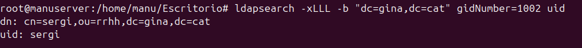

Només està l'usuari Sergi.

### 13. Quin usuari té el uidNumber 1003?

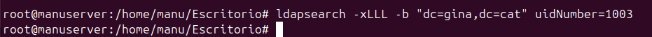

No hi ha cap en aquest uidNumber.

### 14. Mostra quins són els usuaris on el seu cognom comenci per R i el seu uidNumber sigui més gran que 1003

En aquest cas no ens apareix res, ja que en l'apartat 6 hem modificat el sn de Reus a Pallares i els altres dos tenen un uidNumber menor de 1003.

### 15. Mostra quins usuaris formen part del grup informàtica o aquells usuaris que tinguis de cognom Pallarés

El gidNumber de informàtica és 1001.

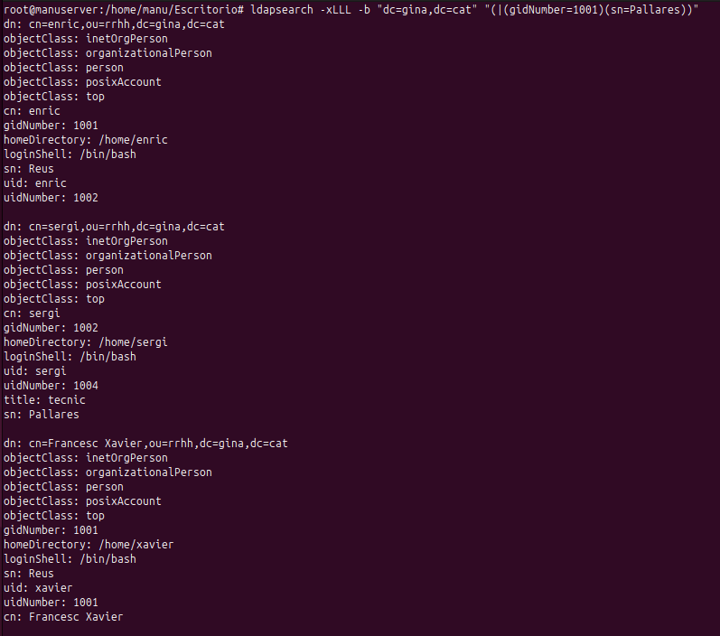

Ens apareix 3 en total, 2 del grup informàtica i 1 que el seu cognom és Pallares.