# Directoris importants

Fer teoria rendiment Monitor del sistema fer captures i explicar.

# Logs

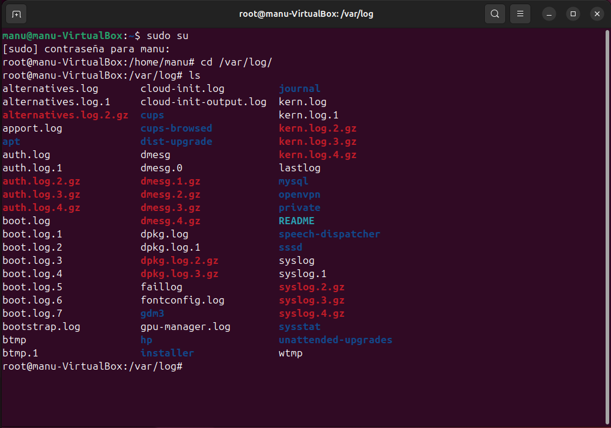

Per a veure els logs fem un cat del arxiu `syslog` i podem veure tots els registres del sistema.

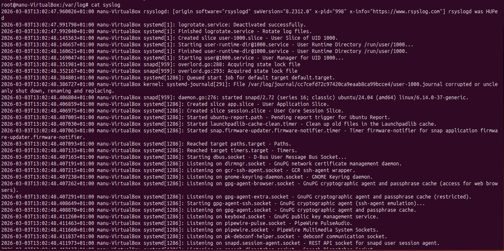

En aquest directori podem presonalitzar la rotació dels logs.

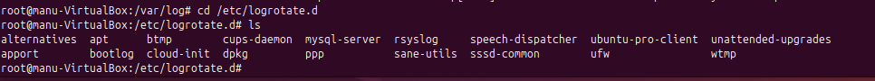

Aquest fitxer el podem modificar per personalitzar la rotació dels logs.

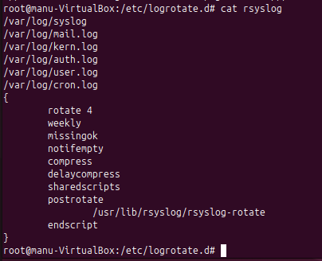

En aquest fitxer ens diu on hem de anar per modificar el fitxer default dels logs, anirem alli ara.

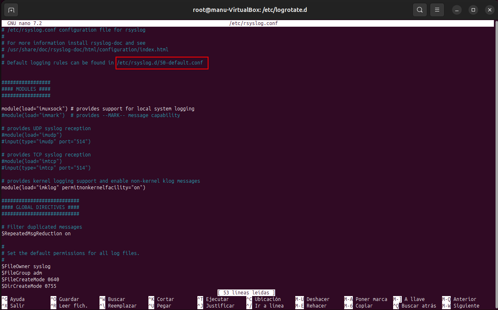

Primerament, fem una prova per veure com afecta una notificació `mail` i en quins arxius apareix.

Fem una simulació per a veure si apareix el log al moment d'enviar una notificació de mail i si després apareix al arxiu de mail.log.

En una terminal enviem la notificació amb el missatge i a l'altra obrim el syslog en directe, per a veure els canvis al moment.

Si mirem l'arxiu `mail.log`, s'ha guardat aquesta notificació al arxiu.

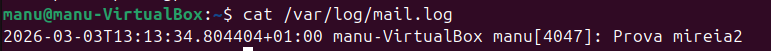

Farem una altra prova modificant el `mail`. Volem que ens guardi al `mail.log` els logs de error només, ni nivells inferiors ni superiors a aquest. Si fiquem un `*`, apareixerien tots i es guardarà com abans.

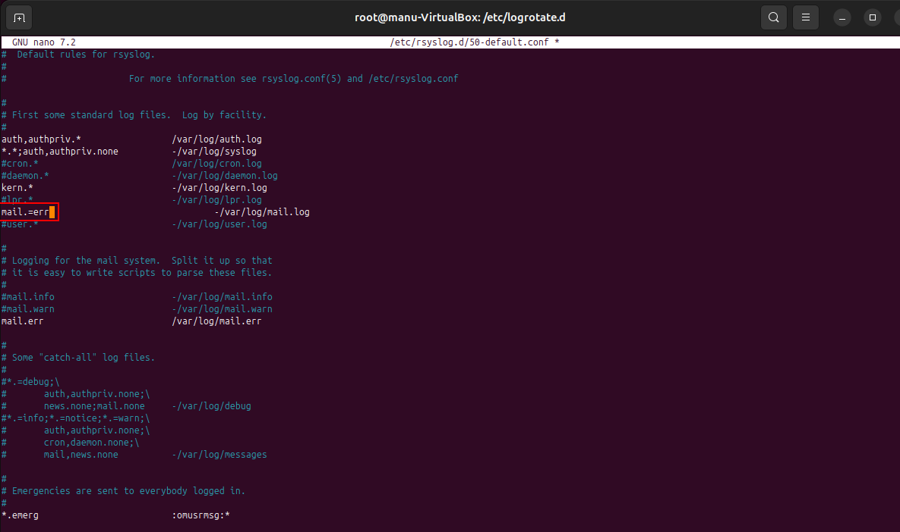

Quan el modifiquem, hem de fer un restart al servei.

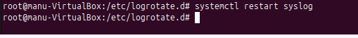

Ara tornem a fer la comanda anterior i veem que a l'arxiu `mail.log` no apareix, ja que el que enviem és un `mail.notice` i aquest no és tipus `err`.

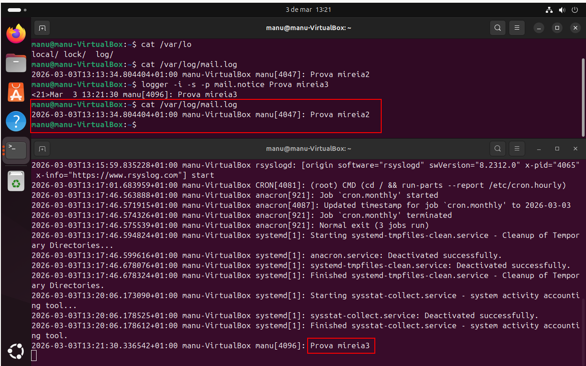

Finalment, si en comptes de un `mail.notice` fiquem `mail.err` si que ens ho guardarà al arxiu dels logs.

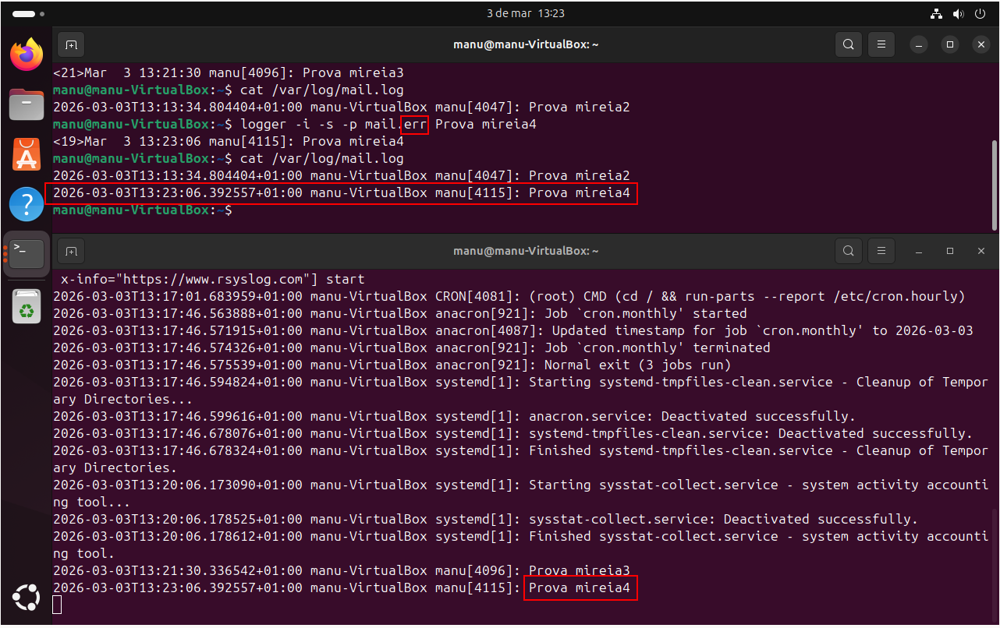

Ara modifiquem una altra vegada el tipus de logs que volem guardar de tipus `mail`. En aquest cas traem el =. Això el que farà serà guardar tots els logs de tipus err i superiors.

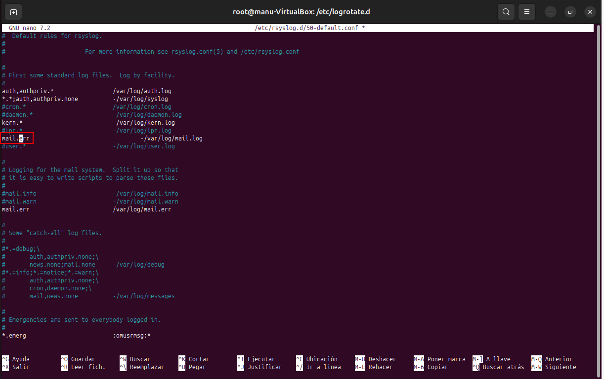

Reiniciem el servei i seguim.

Per fer una prova d'aquest funcionament, cambiem el tipus d'alerta a `crit` que és un tipus superior i veem que el guarda.

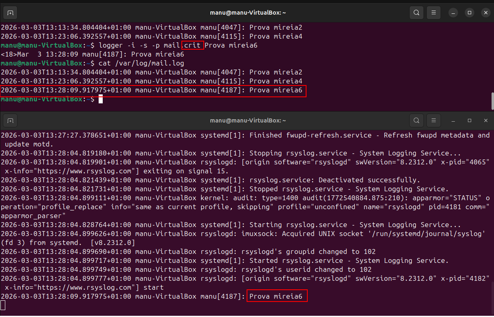

Podem crear una ruta personalitzada per guardar els logs que més ens interessa, en aquest cas, el que fem és que volem guardar tot tipus de logs que siguin `crit` i li afegim el directori on volem que es guardi i reiniciem el servei.

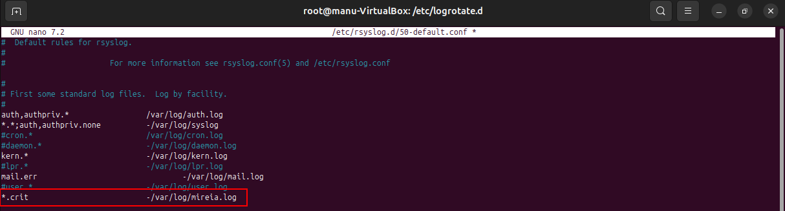

Ara enviem la notificació, en aquest cas de `cron.crit` i veem que s'ha creat un nou arxiu anomenat mireia.log, que ho hem especificat al arxiu anterior.

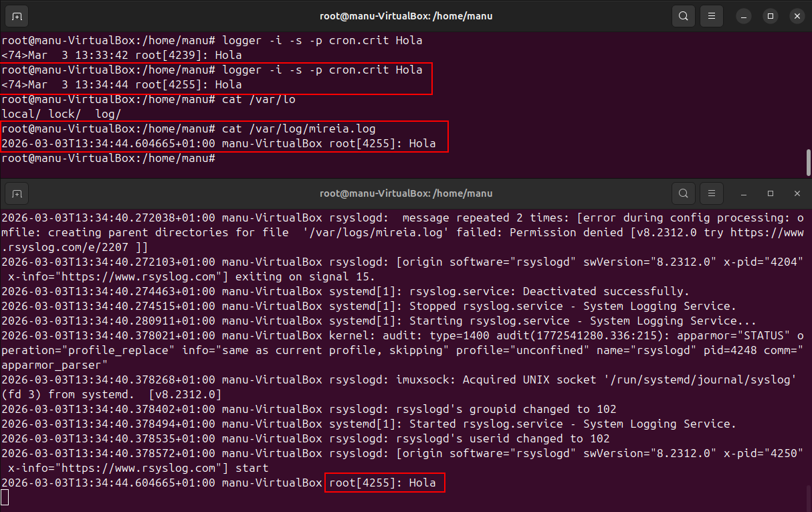

Amb aquesta comanda podem veure tots els logs de tipus `crit`.

Podem trobar entre elles els que hem fet abans.

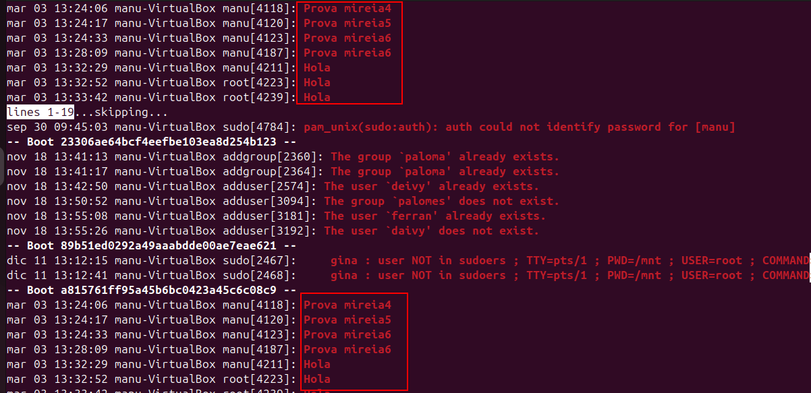

Depenent del paràmetre que li afegim, podem filtrar les búsquedes. En aquest cas, volem mirar els que hem enviat abans de tipus mail.

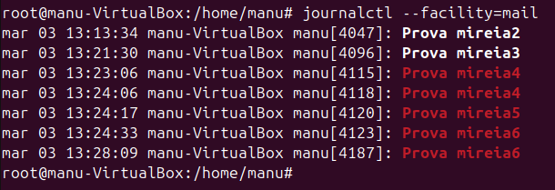

## Exercici Logs

Necessitem dos màquines ubuntu, una té que enviar els logs a l'altra màquina i guardar-ho al seu propi sistema i l'altra màquina els ha de rebre.

### Màquina Servidor

Primerament, a la màquina Servidor, que és la que ha de rebre el log i guardar-lo, hem de fer el següent:

Al fitxer rsyslog hem de descomentar les línies que es mostra, per a poder rebre els logs per UDP i/o TCP.

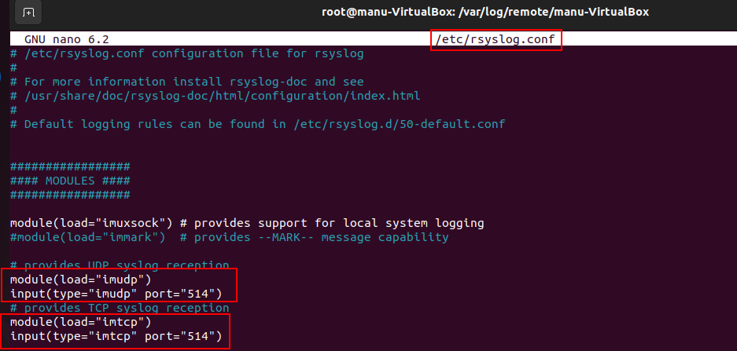

Creem un fitxer nou per a poder redireccionar tots els logs remots a una carpeta nova, que crearem també ara.

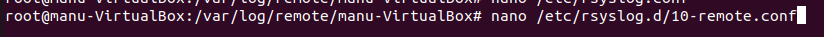

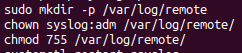

Afegim aquestes línies al fitxer i el guardem.

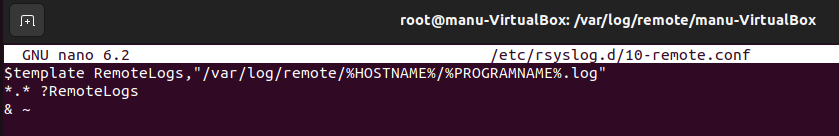

Finalment, permitim el pas de tcp i udp al firewall.

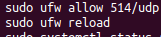

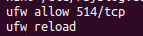

Una vegada hem fet ja aquests passos, hem de reiniciar el servei.

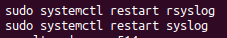

### Màquina Client

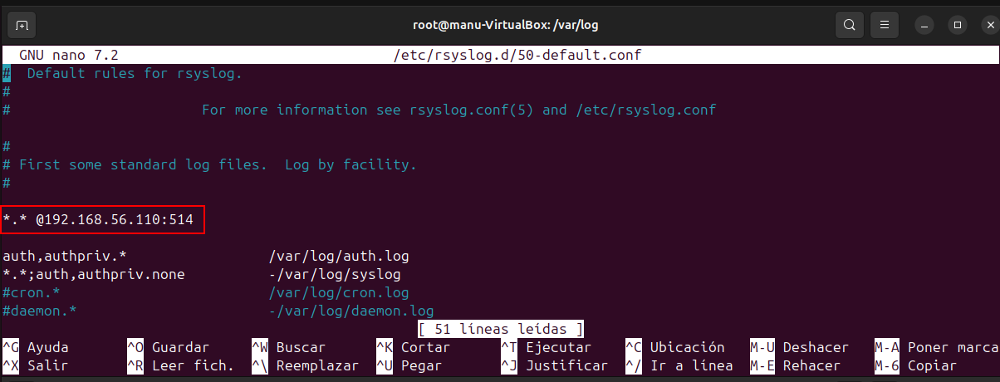